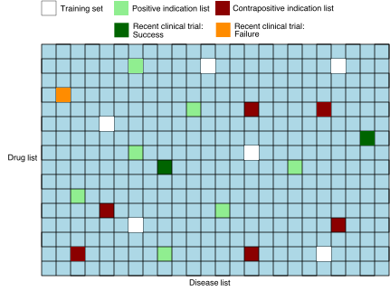

# Deep dive: Evaluation pipeline

The evaluation pipeline is a crucial component of our drug repurposing system, designed to assess the performance and reliability of our predictive models. This pipeline employs a variety of metrics and techniques to provide a comprehensive understanding of how well our models are performing in identifying potential new drug-disease associations.

In this deep dive, we'll explore the different aspects of our evaluation pipeline, including:

1. The types of evaluation metrics we use
2. How we generate negative test pairs
3. Implementation details in Kedro

## Overview of the suite

The primary use-case of our drug repurposing models is to rank millions of drug-disease pairs in order of priority. More precisely, the set of drug disease pairs consists of all combinations of drugs and diseases from curated lists and is referred to as the matrix. A secondary but important use case for drug repurposing system is diseases-specific ranking, that is, ranking a list of drugs in order of likelihood of treating a given disease. Furthermore, in order to avoid failed clinical trials, it is critical that the model does not give high scores to pairs which look like they may represent a viable treatment (hence may enter a clinical trial) but really do not (hence would fail the clinical trial). 

These different aspects of model performance are measured by three classes of evaluation metrics which are computed in very different ways.

The following table summarises the evaluation metrics that comprise the current version of our evaluation suite. 


| Full-matrix ranking | Disease specific ranking | Ground truth classification|
|--------------|-------------|----------|
| How likely are positive drug-disease pairs to appear near the top of the matrix output? | How well does the model rank drugs for a specific disease? | How accurately can the model distinguish between known positive and negative drug-disease pairs? |
| Recall@n, AUROC | Hit@k, MRR | Accuracy, F1 score |
| Computed using the full matrix | Computed using diseases in the known positive test set  | Computed using the set of known positive and negative pairs |

## Time-split validation and recent clinical trials data

Time-split validation is a technique where we divide our dataset based on a temporal cutoff, using older data for training and newer data for testing, to simulate real-world scenarios and assess our model's ability to predict future drug-disease associations.

We implement time-split validation in our pipeline by using an additional ground truth test set coming from the results of recent clinical trials. 

## The performance metrics in detail



The input to the evaluation pipeline consists of the matrix pairs dataset, with the following additional information:
- Flags for pairs in the standard ground truth positive and negative test sets 
- Separate flags  for test set pairs corresponding to results of recent clinical trials
- Treat scores for each pair 

In addition, we remove from the matrix any known positive or known negative pair that were used by the model during training.

### Full matrix ranking metrics

These metrics focus on how well the model ranks the set of pairs comprising the matrix. 

The matrix *rank* of a drug-disease pair $(d,i)$, denoted by $\text{rank}(d,i),$
refers to it's position among all matrix pairs when they sorted by treat score in descending order. 

The matrix *quantile rank* of a pair is defined as the rank of the pair divided by the total number of pairs in the matrix. This normalized measure ranges from 0 to 1, with lower values indicating higher priority in the ranking.

#### Recall@n

The *Recall@n* metric is defined as the proportion of ground truth pairs that appear among the top $n$ ranked pairs in the matrix. Mathematically, for a set of ground truth pairs $GT$, it may be written as 

$$\text{Recall@n} = \frac{|\{(d,i) \in GT : \text{rank}(d,i) \leq n\}|}{|GT|}$$

where $|\cdot|$ denotes the cardinality (size) of a set. 

We have three variations of the full matrix Recall@n metric corresponding to different choices for the ground truth set $GT$: 
1.  The *standard version* uses the standard ground truth positive test set
2.  The *clinical trials version* uses successful clinical trials
3.  The *negatives version* uses the standard ground truth negatives test set

> *Note*: The negatives version of recall@n differs from the other in that we want it to be as small as possible. 


#### AUROC (Area Under the Receiver Operating Characteristic curve)

The AUROC metric evaluates the model's ability to distinguish between positive and negative pairs across all possible ranking thresholds. 

Formally, it is defined as the area under the ROC curve (see [Wikipedia: Receiver operating characteristic](https://en.wikipedia.org/wiki/Receiver_operating_characteristic) for more details). In our case the following equivalent characterisation is more relevant, 
$$\text{AUROC} = 1 - \text{MQR} $$
where $\text{MQR}$ denotes the *mean quantile rank* among ground truth pairs $GT$. 

The equivalence stems from the fact that the AUROC is equal to the probability that a randomly chosen positive ranks higher than a randomly chosen negative. More details are given in the appendix below. 


### Disease-specific ranking metrics

These metrics focus on how well the model ranks drugs for individual diseases, particularly those diseases that appear in our ground truth positive set.

For a given disease $i$, the *disease-specific rank* $\text{rank}_i(d)$ of a drug $d$ is defined as the rank of the drug $d$ among all drugs. Note that we omit any training pairs known positives from the ranking, so that $d$ is only ranked against drugs with unknown or withheld known negative relationship with the disease $i$.

We have two versions of disease-specific ranking metrics corresponding to different choices for the set of ground truth pairs $GT$:
1.  The *standard version* uses the standard ground truth positive test set
2.  The *clinical trials version* uses successful clinical trials

#### Hit@k

The Hit@k metric measures the proportion ground truth positive pairs,  with disease specific rank not exceeding $k$. Mathematically, it is written as 
$$\text{Hit}@k = \frac{1}{|GT|} \sum_{(d,i) \in GT} \chi(\text{rank}_i(d) \leq k) $$
where $\chi(\text{rank}_i(d) \leq k)$ is equal to 1 if $\text{rank}_i(d) \leq k$ and 0 otherwise. 

#### MRR (Mean Reciprocal Rank)

MRR is the average inverse rank of the pairs in the ground truth pairs set. Mathematically, it is defined as 
$$MRR = \frac{1}{|GT|} \sum_{(d,i) \in GT}\frac{1}{\text{rank}_i(d)} $$
The MRR ranges from 0 to 1, with higher values indicating better performance.

### Ground truth classification metrics

These metrics assess the model's ability to distinguish between known positive and negative drug-disease pairs, treating the task as a binary classification problem. 

We have two versions corresponding to different choices of test dataset:
1. The *standard version* uses the standard sets of ground-truth positives (labelled as "treat") and negatives (labelled as "not treat").
2. The *clinical trials version* uses a dataset of successful recent clinical trial (labelled as "treat") and failed one (labelled as "not treat").  

We fix the threshold to 0.5, that is, the model classifies a drug-disease pair to be "treat" if the treat score is > 0.5 and otherwise "not treat". 

#### Accuracy

Accuracy is the proportion of pairs in the dataset that are correctly classified. 

#### F1 Score

The F1 score is designed to take into account class imbalances and is defined as the harmonic mean of precision and recall (see [Wikipedia: F1 score](https://en.wikipedia.org/wiki/F1_score)). 

## Kedro Implementation 

The evaluation pipeline takes as input the full matrix dataset of drug-disease pairs, along with with their treat scores. 
For each evaluation metric, this large input dataset is processed by:
- Restricting to only the pairs required for the evaluation metric
- Labelling any ground truth pairs
The processed dataset is then used to compute the evaluation metric. 

This process is summarised by the following high-level diagram:


Notably, inference is not performed within the evaluation pipeline since the treat scores are provided in the input matrix.

> *Example.* (ground truth classification metric) The full matrix dataframe is restricted to ground truth positives, which are labelled by `y=1`, and ground truth negatives which are labelled by `y=0`.   

The following diagram gives a more detailed overview of how the evaluation pipeline fits into the wider MATRIX system. 


### Parameters configuration file 

The evaluation metrics are configured in the file `parameters.yml`. Let us explain the structure of this file through two examples. 
#### Example 1 (classification metrics, clinical trials version)

```yaml
# Threshold-based classification metrics for ground truth data (clinical trials version)
evaluation.simple_classification_trials:
  evaluation_options:
    generator:
      object: matrix.datasets.pair_generator.GroundTruthTestPairs
      positive_columns: 
        - "trial_sig_better"
        - "trial_non_sig_better"
      negative_columns:
        - "trial_sig_worse"
        - "trial_non_sig_worse"
    evaluation:
      object: matrix.pipelines.evaluation.evaluation.DiscreteMetrics
      metrics:
        - object: sklearn.metrics.accuracy_score
        - object: sklearn.metrics.f1_score
      score_col_name: *score-col
      threshold: 0.5
```
- `generator` defines the dataset that is required for the metrics. 
- `GroundTruthTestPairs` is represents a dataset consisting ground truth positives and negatives.
- `positive_columns` and `negative_columns` define the ground truth sets by specifying columns in the matrix dataframe. 
- `evaluation` defines the evaluation metrics used. 

#### Example 2 (full matrix ranking metrics, standard version)

```yaml
# Full matrix ranking 
evaluation.full_matrix:
  evaluation_options:
    generator:
      object: matrix.datasets.pair_generator.FullMatrixPositives
      positive_columns: 
        - "is_known_positive"
    evaluation:
      object: matrix.pipelines.evaluation.evaluation.FullMatrixRanking 
      rank_func_lst: 
        - object:  matrix.pipelines.evaluation.named_functions.RecallAtN 
          n: 1000
        - object:  matrix.pipelines.evaluation.named_functions.RecallAtN
          n: 10000
        - object:  matrix.pipelines.evaluation.named_functions.RecallAtN
          n: 100000
        - object:  matrix.pipelines.evaluation.named_functions.RecallAtN
          n: 1000000
      quantile_func_lst: 
        - object: matrix.pipelines.evaluation.named_functions.AUROC
``` 
- `FullMatrixPositives` is the object defining the dataset containing the necessary information for the computation of the full matrix ranking metrics. This dataset consist of the ground truth positive drug-disease pairs with columns giving:
    - The matrix rank of each pair
    - The matrix quantile rank of each pair
- This is enough for the computation of the metrics since:
    - Recall@n may be computed using the ranks of the ground truth positive pairs
    - AUROC may be computed using the quantile ranks of the ground truth positive pairs  
- `positive_columns` defines the ground truth positive set by specifying columns in the matrix dataframe. 
- `rank_func_lst` specifies the list of metrics which require the rank for computation.
- `quantile_func_lst` specifies the list of metrics which require the quantile rank for computation.
 