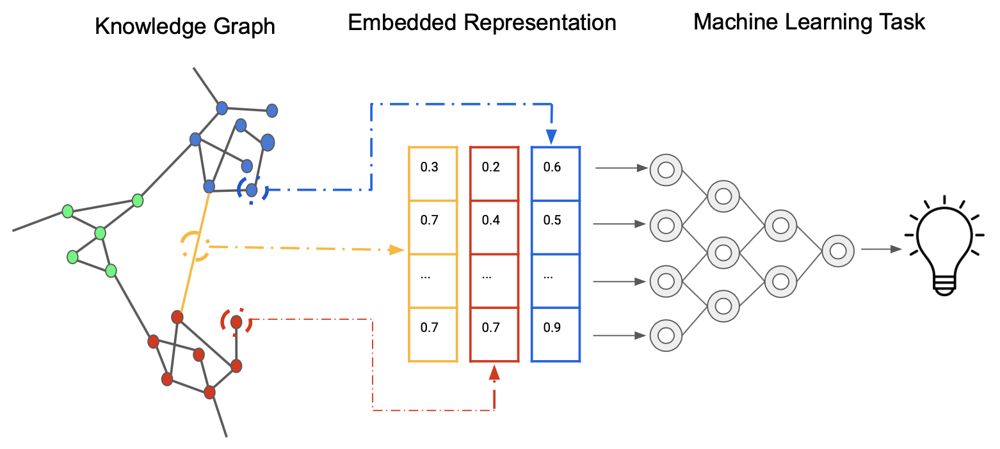

At Every Cure, we are on a mission to unlock the hidden potential of existing drugs to save lives. We believe that by looking at all the existing drugs available in pharmacies today, we can find numerous new uses for these drugs to help people live better lives.

The answers are hidden in the data somewhere. We *just* have to find them. For that, we follow a comprehensive and data-driven approach that involves ingesting and integrating numerous data sources, then leveraging machine learning models to predict new high-potential drug-disease combinations. 

Our data-driven approach can be summarized by the following image, demonstrating how we generate embeddings from a Knoweldge Graph that represent relationships between nodes (such as drugs and diseases) in a high-dimensional vector space which can then be used for machine learning based prediction. 

*Source: [Wikimedia Commons](https://commons.wikimedia.org/w/index.php?curid=106644260).*

## Leveraging Prior Knowledge

### Knowledge Graphs

Our drug repurposing pipeline begins with the construction and utilization of comprehensive and large-scale knowledge graphs. These graphs integrate diverse biomedical data sources, including drug-target interactions, protein-protein interactions, disease pathways, and clinical outcomes. For example, we might integrate data from sources such as **[DrugBank](https://en.wikipedia.org/wiki/DrugBank)**, **[ChEMBL](https://en.wikipedia.org/wiki/ChEMBL)**, **[DisGeNET](https://en.wikipedia.org/wiki/DisGeNET)**, and the **[ClinicalTrials.gov](https://en.wikipedia.org/wiki/ClinicalTrials.gov)** database. By representing this complex web of relationships in a graph structure, we can capture the intricate connections between drugs, diseases, and biological entities.

We use **[Neo4j](https://neo4j.com/)** as our graph database, which allows for efficient storage, querying, and analysis of these large-scale knowledge graphs. This foundation enables us to leverage existing biomedical knowledge and discover potential new drug-disease associations that might not be apparent through traditional analysis methods. By using graph algorithms, we can further explore the graph's structure to identify key nodes and subgraphs of interest. 

## Generation of Input Data

### Node Attribute Embeddings

To transform our knowledge graph into a format suitable for machine learning models, we employ various state-of-the-art node embedding techniques. These methods map each node (representing drugs, diseases, proteins, etc.) to a dense vector in a high-dimensional space, preserving the graph's structural and semantic information.

We experiment with several embedding algorithms, including:

- **[PubMedBERT](https://arxiv.org/pdf/2007.15779)** : Biomedical BERT model pre-trained specifically on abstracts and full texts from PubMed. Also referred to as BioMedBERT.  
-  **[OpenAI's language models](https://platform.openai.com/docs/models)**: LLM embedding models such as `text-embedding-3-small`, trained on both medical and non-medical texts.

These embeddings capture complex and semantic relationships within the graph, providing rich features for our downstream prediction tasks. 

### Dimensionality Reduction

Given the high-dimensional nature of our node embeddings, we often apply dimensionality reduction techniques to make the data more manageable and to potentially uncover latent structures. This step helps us improve computational efficiency and mitigate the [curse of dimensionality](https://en.wikipedia.org/wiki/Curse_of_dimensionality). Common methods we employ include:

- **[Principal Component Analysis (PCA)](https://en.wikipedia.org/wiki/Principal_component_analysis)**: A linear dimensionality reduction technique that projects the data into a lower-dimensional space while maximizing the variance captured by each component. 
- **[t-SNE](https://en.wikipedia.org/wiki/T-distributed_stochastic_neighbor_embedding) and [UMAP](https://umap-learn.readthedocs.io/en/latest/)**: Non-linear dimensionality reduction techniques that are particularly useful for visualization and discovering clusters within the data. These methods are effective at preserving the local and global structure of the data, also making them suitable for exploratory analysis. 

### Topological Embeddings

In addition to traditional node embeddings, we explore topological embedding methods that capture higher-order structures within our knowledge graphs. These approaches, include:

- **[GraphSAGE](https://cs.stanford.edu/people/jure/pubs/graphsage-nips17.pdf)**: An inductive representation learning algorithm that generates embeddings by sampling and aggregating features from a node's local neighborhood. This allows us to generalize to unseen nodes in the graph. 
- **[Node2Vec](https://en.wikipedia.org/wiki/Node2vec)** A random walk-based algorithm that generates embeddings by simulating random walks on the graph and applying the **[Skip-Gram model](https://arxiv.org/pdf/1301.3781)** to predict node neighborhoods. 

Topological embeddings provide additional information to our node embeddings, uncovering complex patterns in drug-disease relationships that are not captured when ignoring the higher-order structure of the graph. For example, capturing motifs or cliques in the graph can highlight biologically relevent substructures.

## Predicting Treatment Scores

### Predictions

With our enriched feature set, we train various machine learning models to predict treatment scores for drug-disease pairs. Our modeling approaches include:

- **[Random Forest](https://en.wikipedia.org/wiki/Random_forest)**: A robust ensemble method that uses bagging and feature randomness to build a collection of decision trees. It's effective in handling complex interactions and is less prone to overfitting compared to individual trees. 
- **[Gradient Boosting models (XGBoost)](https://en.wikipedia.org/wiki/XGBoost)**: Known for their accuracy and efficiency, XGBoost handles complex feature interactions well and provides control over overfitting through regularization techniques. 
- **[Deep Neural Networks (DNNs)](https://en.wikipedia.org/wiki/Deep_learning)**: Capture non-linear relationships in the data, with architectures that include dense layers, dropout for regularization, and ReLU activations. 
- Ensemble methods that combine multiple model types to improve robustness and performance. For instance, stacking different models of XGBoost can provide a more robust predictive performance. 

We use **[MLflow](https://mlflow.org/docs/latest/introduction/index.html)** to track experiments, comparing different model architectures and hyperparameters to identify the most promising approaches. This enables us to systematically monitor and refine our models, ensuring reproducibility and scalability.

## Evaluation

### Model Evaluation

Rigorous evaluation is crucial to ensure the reliability and usefulness of our predictions. Our evaluation strategy includes:

- Cross-validation techniques: Such as k-fold cross-validation to assess model generalization and avoid overfitting.
- Metrics for quantifying predictive performance and understanding the strengths and weaknesses of different models. We focus on a range of metrics to capture different aspects of model behavior, especially when dealing with imbalanced datasets. Here's a breakdown of each metric:

    - **[Sensitivity (Recall)](https://en.wikipedia.org/wiki/Sensitivity_and_specificity)**: Also known as the true positive rate, sensitivity measures the proportion of actual positives (e.g., a drug that can treat a disease)  that are correctly identified by the model.
    
    - **[Specificity](https://en.wikipedia.org/wiki/Sensitivity_and_specificity)**: This metric, also called the true negative rate, quantifies the proportion of actual negatives that are correctly identified by the model. Specificity is important when false positives need to be minimized, such as in predicting drugs that may not be useful for a disease.
    
    - **[F1 Score](https://en.wikipedia.org/wiki/F1_score)**: The F1 score is the harmonic mean of precision and recall, providing a single metric that balances both false positives and false negatives. It is useful when the class distribution is imbalanced, as it gives a balanced view of a model's performance across both types of error.
    
    - **[Mean Reciprocal Rank (MRR)](https://en.wikipedia.org/wiki/Mean_reciprocal_rank)**: This metric is often used in ranking problems, where the goal is to return a list of relevant results. MRR gives insight into how well the model ranks relevant drug-disease pairs, focusing on the rank of the first correct prediction. Higher MRR values indicate that relevant predictions appear earlier in the ranked list.
    
    - **[Hit@K](https://ieeexplore.ieee.org/document/9220143)**: This metric measures whether at least one correct item appears in the top K results returned by the model. Hit@K is particularly valuable in drug discovery, where identifying even one correct drug-disease association early in the search process can significantly impact further research.
    
    - **Recall@N**: Similar to Hit@K, Recall@N assesses how many relevant results appear within the top N predictions made by the model. This metric is useful when multiple correct predictions are needed within a specified range, making it important for ensuring the model's ability to surface several valid drug-disease pairs.
    
    - **[AUROC (Area Under the Receiver Operating Characteristic Curve)](https://en.wikipedia.org/wiki/Receiver_operating_characteristic)**: This widely used metric evaluates the trade-off between sensitivity and specificity. AUROC is particularly useful in situations where the data is imbalanced, as it provides insight into how well the model distinguishes between positive and negative cases across different thresholds. A higher AUROC indicates better model performance, with a score of 1.0 representing a perfect classifier.

- Comparison against baseline models and random predictions to measure improvement
- External validation using held-out datasets and literature-based validation of top predictions: This step is critical to ensuring that our predictions are not only statistically sound but also biologically and clinically relevant.

## Conclusion

Through this robust and data-driven pipeline, from knowledge graph construction to final model evaluation, we aim to systematically uncover new potential uses for existing drugs, accelerating the drug repurposing process and ultimately improving patient outcomes. By leveraging advanced machine learning techniques and extensive biomedical knowledge, we believe that our approach will significantly contribute to the field of drug repurposing.

## References
- [Curse of Dimensionality](https://en.wikipedia.org/wiki/Curse_of_dimensionality)
- [Principal Component Analysis (PCA)](https://en.wikipedia.org/wiki/Principal_component_analysis)
- [t-SNE](https://en.wikipedia.org/wiki/T-distributed_stochastic_neighbor_embedding)
- [UMAP](https://umap-learn.readthedocs.io/en/latest/)
- [XGBoost](https://en.wikipedia.org/wiki/XGBoost)
- [Deep Neural Networks (DNNs)](https://en.wikipedia.org/wiki/Deep_learning)
- [AUROC](https://en.wikipedia.org/wiki/Receiver_operating_characteristic)
- [DrugBank](https://en.wikipedia.org/wiki/DrugBank)
- [ChEMBL](https://en.wikipedia.org/wiki/ChEMBL)
- [DisGeNET](https://en.wikipedia.org/wiki/DisGeNET)
- [ClinicalTrials.gov](https://en.wikipedia.org/wiki/ClinicalTrials.gov)
- [Neo4j](https://neo4j.com/)
- [PubMedBERT](https://arxiv.org/pdf/2007.15779)
- [OpenAI](https://platform.openai.com/docs/models)
- [GraphSAGE](https://cs.stanford.edu/people/jure/pubs/graphsage-nips17.pdf)
- [Node2Vec](https://en.wikipedia.org/wiki/Node2vec)
- [Skip-Gram model](https://en.wikipedia.org/wiki/Word2vec)
- [Random Forest](https://en.wikipedia.org/wiki/Random_forest)
- [MLflow](https://mlflow.org/docs/latest/introduction/index.html)
- [Sensitivity (Recall)](https://en.wikipedia.org/wiki/Sensitivity_and_specificity)
- [Specificity](https://en.wikipedia.org/wiki/Sensitivity_and_specificity)
- [F1 Score](https://en.wikipedia.org/wiki/F1_score)
- [Mean Reciprocal Rank (MRR)](https://en.wikipedia.org/wiki/Mean_reciprocal_rank)
- [Hit@K](https://ieeexplore.ieee.org/document/9220143)
- [AUROC (Area Under the Receiver Operating Characteristic Curve)](https://en.wikipedia.org/wiki/Receiver_operating_characteristic)
