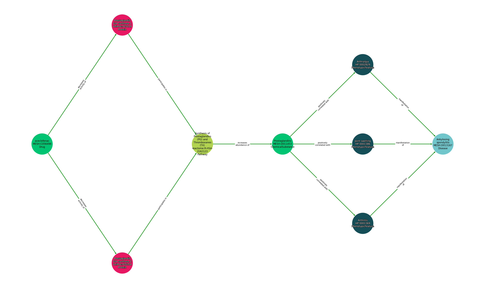

# MOA extraction pipeline

Mechanism of action (MOA) prediction models aim to predict the biological pathways by which a given drug acts on a given disease. 
The MOA extraction module is an example of a path-based approach to MOA prediction. It extracts paths in the the knowledge graph that are likely to be relevant to the MOA of a given drug-disease pair.
The MOA extraction module is loosely inspired by the [KGML-xDTD](https://academic.oup.com/gigascience/article/doi/10.1093/gigascience/giad057/7246583) MOA module which extracts paths in the KG using an adversarial actor-critic reinforcement learning algorithm. 
In contrast, we use a simpler approach of extracting paths using a supervised binary classifier. 

## Methodology

The main component of the MOA extraction system is a binary classifier that predicts whether a given path in the knowledge graph is likely to represent a mechanism of action for a given drug-disease pair. This is illustrated in the following diagram:


An example of such a binary classifier is a transformer model (encoder only) with a linear output layer. In this case, the input path needs to be embedded as a sequence of vectors. More details on the embedding process are provided in the [configuration details section](#configuration-details).

A different binary classifier is trained for each length of path. Currently our system supports 2 or 3 hop paths, so two binary classifiers are trained.

Now, fix the number of hops to be $n$. To use the binary classier to predict $n$-hop MOAs for a given drug-disease pair, we perform the following process:
1. Extract all $n$-hop paths between the drug and disease in the knowledge graph. This is achieved using a neo4j query.
2. Assign a score to each path using the binary classifier and rank accordingly.
3. Return the top-k paths as the predicted MOAs for the given drug-disease pair.

Furthermore, our system supports explicit filters to be applied to the paths extracted in step 1, for instance, remove any path containing a drug-disease edge (more on this in the [path extraction rules section](#path-extraction-rules)). The prediction process is illustrated by the following diagram:


The training dataset set for the binary classifier consists of positive (MOA) and negative (non-MOA) paths. 

1. The positive examples are extracted using the [DrugMechDB](https://sulab.github.io/DrugMechDB/) database. The process of mapping the DrugMechDB paths to the knowledge graph is non-trivial and more details are provided in the [path mapping section](#path-mapping).
2. The negative examples are generated by randomly sampled paths. More details are given in the [negative sampling section](#negative-sampling).

The training process is illustrated by the following diagram:


## Implementation

> The MOA extraction pipeline is currently only available on the branch `feature/moa-extraction`.

The following diagram illustrates the overall MOA extraction pipeline:


Currently, there are two separate pipelines which must be run in sequence:

1. **MOA entity resolution pipeline** This is run once locally. Uses a Node synonymizer to map all entities appearing in DrugMechDB to the KG. To run this pipeline on your local machine, writing to GCS storage, use the command: 
```
kedro run -p moa_entity_resolution -e  cloud
```  
2. **Main MOA extraction pipeline** Performs all other functionality. To run this pipeline on the cluster, use the command: 
```
kedro submit --username <your name> --pipeline <moa_extraction>
``` 

The main MOA extraction pipeline itself has four separate components. 

1. **Preprocessing**:
    - Generate neo4j databases for running queries in the rest of the pipeline.
    - Map paths in the DrugMechDB to the knowledge graph using the mapped DrugMechDB entities. Report the success rate.
    - Performs test/train split. 
    - Any other preprocessing task such as preparing one-hot encoders for the node categories and edge predicates. 
2. **Training**:
    - Sample negative paths. 
    - Hyperparameter search and training of the binary classifier using:
        - training portion of the positive indication paths dataset
        - full positive indication paths dataset (both test and train)
3. **Evaluation**:
    - Make MOA predictions for pairs appearing in the test set of the positive indication paths dataset.
    - Evaluate the predictions using Hit@k and Mean Reciprocal Rank (MRR) metrics.
4. **Prediction**:
    - Generates MOA predictions for a given set of drug-disease pairs.

## Configuration details

Next, we give further details about the individual components of the pipeline, including the configuration details found in `conf/base/parameters.yml` and the main objects underlying the pipeline.

### DrugMechDB database

The DrugMechDB database consists of a knowledge graph for each drug-disease indication pair. The knowledge graph includes nodes for the source drug and target disease, as well as a set of intermediate nodes. Here is an example of a DrugMechDB entry for a given drug-disease indication pair:

<!--  -->


The database takes the form of a yaml file with the following structure for each entry
```yaml
- directed: true
    graph:
        disease: *name of the disease in the indication*
        disease_mesh: *MESH Identifier for the disease (if known)*
        drug: *name of the drug in the indication*
        drug_mesh: *MESH Identifier for the drug (if known)*
        drugbank: *DrugBank Identifier for the drug (if known)*
    links:     (the edges of the path)
    -   key: *Semantics of the relationship (ALL CAPS)*
        source: *Identifier for source node in edge*
        target: *Identifier for target node in edge*
    nodes:     (the nodes in the path)
    -   id: *Identifier for the node*
        label: *Concept type for the node*
        name: *Name of the node*
    multigraph: true    (required statment for importing paths into networkx).

```

### Paths in the Knowledge Graph

A knowledge graph path is a primary notion in the MOA pipeline. We allow for the edges in the paths to have varying directionality. The following diagram represents an example of a 3-hop path according to this convention:


The `matrix.datasets.paths.KGPaths` object is our main tool for encoding lists of paths in the knowledge graph. Essentially, this object represents a list of paths as a dataframe with information about:
- Source and target node information
- Intermediate node information
- Edge predicates (*note*: in the case of multiple predicates these are stored as a comma separated string)
- Edge directionality  

The `matrix.datasets.paths.KGPathsDataset` object is a custom Kedro dataset which deals with storing and loading `KGPaths` objects.

### Path mapping

The DrugMechDB database allows us to extract a set of positive indication paths in *our* knowledge graph. 
This process is non-trivial and the particular method employed in the pipeline is defined by a strategy class pattern following the `PathMapper` abstract base class. 

#### Setwise path mapper

The setwise path mapper uses the intermediate nodes in DrugMechDB but ignores edges completely. More precisely, fix the number of hops to be $n$. Then for each drug disease pair in DrugMechDB, the following steps are performed:
1. Map the source and target nodes to our knowledge graph. If the node synonymizer is unable to map the entity, the path is discarded.
2. Extract all intermediate nodes the DrugMechDB entry. Map as many as possible of these entities to our knowledge graph.
3. Perform a neo4j query to extract all $n$-hop paths between the drug and disease nodes going through exclusively the mapped intermediate nodes.

*Note*: We map entities to our knowledge graph using pre-computed results from the node synonymizer.

To use this strategy for two-hop paths, we add the following parameters to the `path_mapping` section in `parameters.yml` (and similarly for three-hop paths):
```yaml
mapper_two_hop:
  object: matrix.pipelines.moa_extraction.path_mapping.SetwisePathMapper
  num_hops: 2
  unidirectional: false
```
The parameter `unidirectional` refers to whether to map onto unidirectional (all edges going forwards) paths only.

### Path extraction rules

The path extraction rules are used to filter the paths extracted from the knowledge graph before ranking by the binary classifier. The choice of extraction rules may be used to incorporate medical feedback. They are defined by a strategy class pattern following the `matrix.pipelines.moa_extraction.path_generators.PathGenerator` abstract base class.

#### Edge omission rules

Edge omission rules are used to omit edges with certain tags from the paths. These tags are added in the preprocessing step of the pipeline, in particular, to the following types of edges:
- `drug_disease`: edges between drug and disease nodes.
- `drug_drug`: edges between drug nodes.
- `disease_disease`: edges between disease nodes.
The sets of categories defined for nodes of drug and disease types are defined in the `tagging_options` section in `parameters.yml`.

An example of edge omission rules for three-hop paths is given below:
```yaml
three_hop:
  path_generator:
    object: matrix.pipelines.moa_extraction.path_generators.AllPathsWithRules
    edge_omission_rules:
        all: ['drug_disease', 'drug_drug']
        3: ['disease_disease']
    num_hops: 3
    unidirectional: False
```

Here, the `all` key refers to the edges omitted from all paths, and the `3` key refers to the edges omitted from three-hop paths.
The `unidirectional` parameter refers to whether to omit paths in which at least one edge is in the backwards direction.


### Path embedding

In order to input a path into the binary classifier, it needs to be embedded in numerical form. In the case of a sequence based model (e.g. a transformer model), the path is embedded as a sequence of vectors. 
The embedding method is defined by a strategy class pattern following the `matrix.pipelines.moa_extraction.path_embeddings.PathEmbeddingStrategy` abstract base class. 

#### Two-dimensional types and relations

The two-dimensional types and relations strategy embeds the path as a 2D matrix using the node category and edge predicates. Optionally, edge directions can also be added as a feature.

More precisely, consider a 2-hop path of the form 

$$
(n, r_1, a, r_2, m)
$$

where $n$ is the source drug entity, $a$ is the intermediate entity, $m$ is the target disease entity, and $r_1, r_2$ are the edges.
The embedding is then constructed as follows:

$$
\begin{bmatrix}
\texttt{category}(n) & \texttt{0} & \texttt{0} \\
 \texttt{category}(a) & \texttt{relation}(r_1) & \texttt{direction}(r_1) \\
 \texttt{category}(m) & \texttt{relation}(r_2) & \texttt{direction}(r_2)
\end{bmatrix}
$$

where $\texttt{embedding}(n)$ is the embedding of the entity $n$, $\texttt{category}(n)$ is the one-hot category embedding of the entity $n$, $\texttt{relation}(r)$ is the sum of the one-hot relation embeddings of the edge $r$ (there may be several relation types for a given edge), and $\texttt{direction}(r)$ is binary indicator of the directionality.


To use this strategy for two-hop paths, we add the following parameters to the `path_embeddings` section in `parameters.yml`:
```yaml
strategy:
  object: matrix.pipelines.moa_extraction.path_embeddings.TwoDimensionalTypesAndRelations
  is_embed_directions: true
```

> **Future work**: Additional features such as LLM embeddings of the node name could be used to improve the path embedding.

### Negative sampling

Negative knowledge graph paths are generated by random sampling. The choice of sampling method may have a significant effect on the performance and is defined by strategy class patterns following the `matrix.pipelines.moa_extraction.path_generators.PathGenerator` abstract base class.

One or more negative samplers may be added to the `negative_samplers` list in the `training.{num_hops}_hop` section in `parameters.yml`.

#### Replacement path sampler

The replacement path sampler works by replacing a given positive indication path with a random path between the same source and target nodes. It 

The rationale behind this methodology is two-fold:
1. On average, there are an extremely large number of paths between any given source and target node representing a known positive drug-disease pair. Most of these paths will not be relevant to the MOA of the drug-disease pair.
2. Certain patterns may appear in the positive paths mapped from DrugMechDB simply because they are frequent in the overall graph. This may not be reflective of the underlying mechanism of action.

The replacement path sampler may be added to the `negative_samplers` list in the `training.{num_hops}_hop` section in `parameters.yml`: 

```yaml
  training:
    two_hop:
      negative_samplers:
        - object: matrix.pipelines.moa_extraction.path_generators.ReplacementPathSampler
          num_replacement_paths: 2
          unidirectional: False
          edge_omission_rules:
            all: ['drug_disease']
          random_state: ${globals:random_state}
```
Here:
- `num_replacement_paths` is the number of negative paths to sample for each positive path.
- `unidirectional` is a boolean flagging whether to sample unidirectional paths only.
- `edge_omission_rules` is a dictionary specifying which edges to omit. In this case, we omit all edges between drug and disease nodes.
- `random_state` is the random seed used in the random sampling.

> **Future work**: It may also be useful to investigate other sampling methods, for instance, swapping out intermediate nodes with random nodes, or randomly swapping edge predicates.


## Local runs for a more accurate testing environment (optional)

While the `moa_extraction` pipeline works in the `test` environment with fabricated data, there is currently one drawback, namely that a mock path mapping strategy is utilised in place of the strategy utilised with full data.
This is due to the complexity of generating a fabricated version of DrugMechDB which generates mapped paths on a fabricated KG. 

For this reason, a local environment may be set up, which uses the full knowledge graph but a limited amount of input data. 

**Caution:** The set-up is currently highly manual and should not be considered a long-term solution. 

1. Run the `data_release` pipeline to generate a neo4j database containing the desired knowledge graph on your local machine. Using a release version with a smaller KG is recommended, for instance, `v0.2.4-rtx-only`.
2. Ensure you have the following lines in `pipelines/matrix/.env`:
    ```yaml
    # OpenAI configuration
    OPENAI_API_KEY=dummy

    # GCP configuration
    GCP_BUCKET=mtrx-us-central1-hub-dev-storage
    GCP_PROJECT_ID=mtrx-hub-dev-3of
    ```
3. Create a file `conf/local/mlflow.yml` and add the following lines:
    ```yaml
    tracking:
      disable_tracking:
        pipelines: ["moa_extraction"]
    ```
    This is to disable MLFlow tracking for the MOA extraction pipeline.
4. Create a file `conf/local/moa_extraction/parameters.yml` and add the following lines:
    ```yaml
   moa_extraction:
  gdb_two_hop:
    database: <neo4j database>
  gdb_three_hop:
    database: <neo4j database>

  path_mapping:
    mapper_two_hop: 
      max_entries: 10 # Restrict number of datapoints in DrugMechDB
    mapper_three_hop: 
      max_entries: 10 # Restrict number of datapoints in DrugMechDB

  predictions:
    num_pairs_limit: 10 # Restrict number of pairs in predictions
    ```
    This truncates the input data and ensures that queries are run against the database created in step 1.
    Here `<neo4j database>` is the database created in step 1.  
5. Create a file `conf/local/globals.yml` and add the following lines:
    ```yaml
    paths:
      integration: data/test/releases/test-release/datasets/integration
    ```
    This ensures that pipeline will only generate new neo4j databases with fabricated data. 
6. Run the test pipeline:
  ```yaml
  kedro run -p test -e test
  ```
7. You may then the `moa_extraction` pipeline on your local machine using the command:
    ```
    kedro run -p moa_extraction -e local
    ```
> **Note 1**: Do not use `ThreadRunner` with this configuration. 

> **Note 2**: Please ensure that `<neo4j database>` is not called `analytics_two_hop` or `analytics_three_hop` as the pipeline will overwrite these databases with a fabricated KG.
