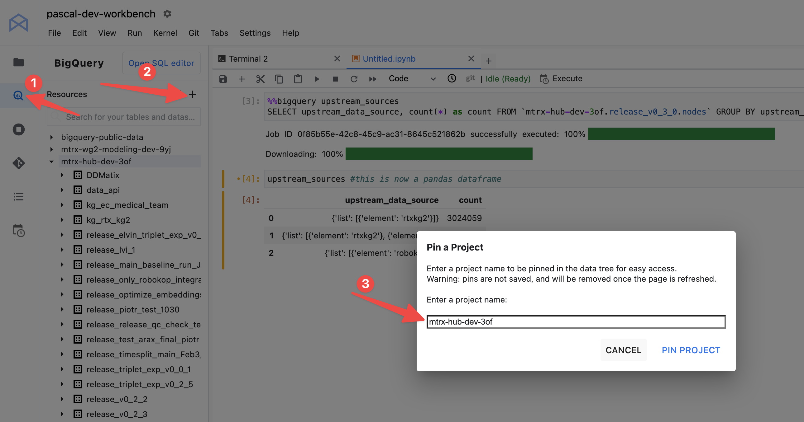

!!! example "Proposal Document"
    This document is not yet describing completed work. Thus, it is meant as a proposal document and is open for discussion.

- This doc is for those that do not want to dive fully into the
  development and contribution to the main Every Cure data integration and modelling pipelines
  but instead want to solely focus on building a good model based on our data. 
- I.e. if you yourself to be a model developer and you prefer working in notebooks and with specific datasets, this page is for you


## What we provide you
- Data
- Compute resources
- Storage
- [currently manual] A validation pipeline to test the model predictions 

## What we expect from you 

- basic knowledge of Linux, Git, Python.
- good practices on experimentation and documentation, especially when the experiment fails. We still want to learn from what did not work.
    - *note we will create a more structured process for streamlining experimentation as well as result dissemination and reporting in the future*
- basic understanding of cloud platforms like GCP or the ability to learn this or work with a colleague who is familiar with GCP


## Getting started

### Getting a workbench

<!-- TODO check the link after merging -->
1. Create a pull request to [this
   file](https://github.com/everycure-org/matrix/edit/infra/infra/deployments/wg2/workbenches.tf),
   adding your name and email to the list of users for which we create a workbench. Please
   create the PR _to the infra branch_ and not main.
2. After the PR was merged, navigate to [this
   page](https://console.cloud.google.com/vertex-ai/workbench/instances?inv=1&invt=AboxFQ&project=mtrx-wg2-modeling-dev-9yj)
   which lists all workbenches we have provisioned for you and others.
3. Click "Open Jupyterlab" to open the workbench with your name on it. Note you may not
   be able to access others' workbenches as we will work towards restricting access to avoid
   any credentials being exposed.

This workbench comes pre-installed with the correct version of java, python, uv and anything else you may need.

### Accessing the data 

You have several options:

1. Use the Google BigQuery integration in the workbench as [documented by Google here](https://cloud.google.com/vertex-ai/docs/workbench/instances/bigquery)
2. Pull the matrix repo and use the kedro catalog


#### Using Google native tooling

You can dive into all the data releases [on BigQuery](https://console.cloud.google.com/bigquery?inv=1&invt=AboxrQ&project=mtrx-hub-dev-3of&ws=!1m0). Alternatively you can navigate to [our release history page](https://docs.dev.everycure.org/releases/release_history/) and select a release you are interested in and get the BigQuery URL from there. 

Next you can simply create a cell in the notebook and run

```python
%%bigquery upstream_sources
SELECT upstream_data_source, count(*) as count FROM `mtrx-hub-dev-3of.release_v0_3_0.nodes` GROUP BY upstream_data_source
```

and the result of the query will be stored in a pandas dataframe that you can use in the rest of your notebook.

!!! warning
    Our data is very large and the BigQuery queries can take a while to run. Also pandas is not the greatest tool for the job when it comes to big data. See below for alternatives to get the full data.

<!-- add explanation on how to get it into spark -->




#### Using the matrix repo

1. clone repo
2. cd to `matrix/pipelines/matrix` and follow the [installation instructions](../onboarding/local-setup.md)
3. create a notebook in this folder and paste the below code in the first cell

<!-- TODO add 1 cell trick on how to load kedro datasets as pyspark dataframes -->
```python

```

## How it works behind the scenes

The workbench infrastructure is managed through Terraform in the `infra/deployments/wg2` directory. Here's what's set up:

### Core Components

1. **Vertex AI Workbenches**: Individual workbenches are provisioned for each data scientist through a Terraform module. Each workbench:
   - Has its own service account for authentication
   - Is connected to the shared VPC network
   - Runs a post-startup script to configure the environment

2. **Idle Instance Management**: To help manage costs, we've implemented an automated system to detect and notify about idle instances:

   - A PubSub topic `ds-workbench-machine-state-events` receives monitoring alerts
   - A Cloud Monitoring alert policy watches for low CPU utilization:
     - Triggers when CPU usage is below 10% for 3 hours
     - Sends notifications through a PubSub notification channel
   - A Cloud Function processes these alerts and may take additional actions such as shutting down or deleting unused instances
     <!-- - shuts down idle instances -->
     <!-- - alerts about the deletion of instances after 30 days of inactivity -->
     <!-- - deletes the instances (including their disk storage) after 35 days of inactivity -->

### Alert Flow

1. Cloud Monitoring continuously checks workbench VM instances for CPU utilization
2. If a VM's CPU stays below a defined threshold (currently 10% for 3 hours), an alert is triggered
3. The alert is sent to a PubSub topic via the notification channel
4. A serverless Cloud Function receives these messages and logs them for tracking

The same as above is done but for testing whether an instance has been used at all in order to create deletion alerts.

### Infrastructure as Code

All components are defined in Terraform:
- Workbenches are created through a reusable module
- Monitoring and alerting policies are defined declaratively
- The notification system uses Cloud Pub/Sub for reliable message delivery
- A Python-based Cloud Function handles the alert processing

This setup ensures we can:
- Track idle instances to optimize resource usage
- Maintain consistent workbench configurations across the team
- Scale the infrastructure as the team grows
- Keep infrastructure changes version controlled and reviewable
