*Author and point of contact: Piotr Kaniewski (piotr@everycure.org)*
# LLM Embedding (initial) Benchmark - summary

**TL;DR:**
* There is a data leakage being encoded in LLM Embeddings (see treat score distribution plots).
* PCA=100 does not affect the downstream performance of ML classifiers.
* OpenAI and PubMedBERT embeddings differ considerably in terms of distribution, variance etc. and they also differ in terms of clustering, with PubMedBERT clusters making more sense however when it comes to downstream task performance, the difference is subtle.
* The node and topological embeddings are quite similar in terms of distribution, variance etc. and when it comes to downstream task performance, the difference is also present, showing that topological enrichment does play a role.  **Note that this is when we compare Chunyus topological embeddings with our node embeddings**
* Graphsage implemented seems to act off as topological embeddings for PubMedBERT, OpenAI, Spacy, and SciSpacy look very similar to each other (giving parabolic PCA/t-SNE) which look very different from Chunyus topological embeddings.

## Setup
I examined LLM embeddings for node attributions using four different models 

* OpenAI - generic text-embedding-3-small model with concurrency 50, currently implemented in our pipeline
* PubMedBert - biomedical embedding model, used in KGML-xDTD publication
* Spacy - generic pipeline with a pretrained language model - *en_core_web_md, web data training* - this is essentially a more complex Word2Vec model with more layers of neurons
* SciSpacy - biomedical pipeline with a pretrained language model - *en_core_sci_md, biomedical data training* - this is essentially a more complex Word2Vec model with more layers of neurons. Trained on fewer data than spacy and also  less complex architecturally 

First I examined all these models on subsamples; once that was finished I re-run these models on full nodes dataframe and examined it.

## Exploratory Analysis 

### Node Attribute Embeddings 

We can see that LLM embeddings have better clusterings, with PubMedBERT clusterings being slightly less scattered than OpenAI's. 

")

")

PCA is showing that variance in OpenAI embeddings is much lower, however that doesn't necessarily mean the embeddigns are less robust as they cluster well. This is partially consistent with the histogram of embedding values which showed range of distribution of OpenAI being the smallest but that doesn't mean that it contains less information (just that the scale is different)

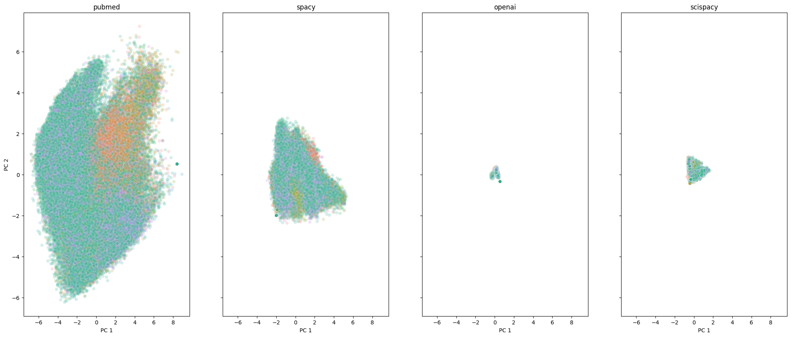

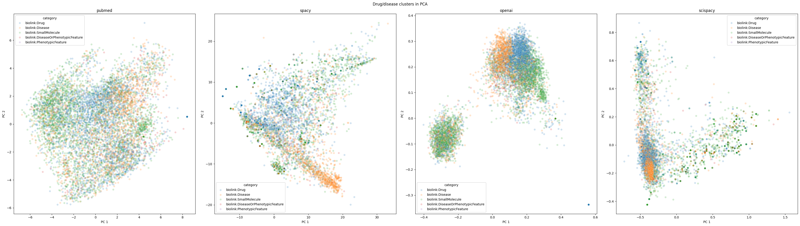

The dimensionality reduction visualisations do show that LLM seem to do better job at clustering appropriate categories together, which could be due to them having greater knowledge and more advanced architectures utilizing transformers (not the case for spacy models). Note that when you apply PCA on the full data, you get a very similar looking plot.

### Topological Embeddings comparison

I run GraphSage on the subsamples to examine how different topological embeddings. The following image represents t-SNE:

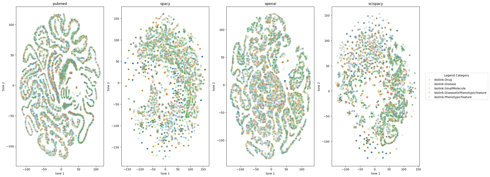

While this one represents PCA:

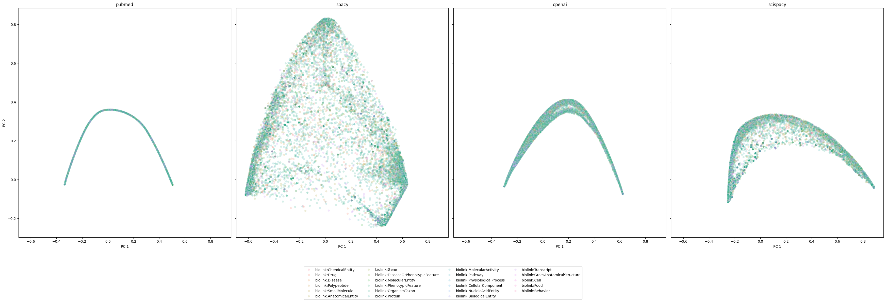

These 'wiggles' could technically make sense and show connectivity between similar groups of nodes (eg representing cardiovascular drugs) but if we compare these embeddings with Chunyu's embeddings, we can see they look quite different (image stolen from Lee)

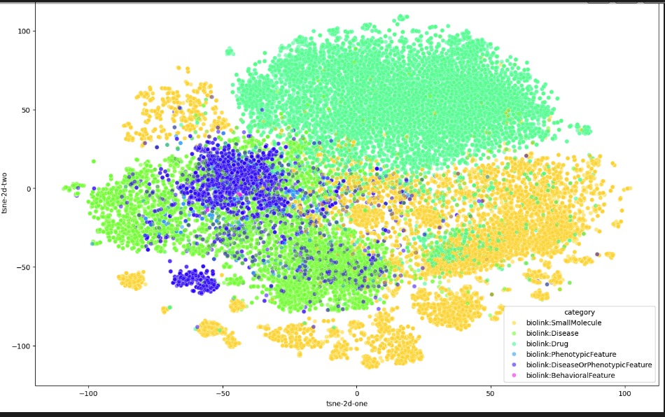

This indicates that our GraphSage produces embeddings which are quite different than Chunyus (our baseline). While we could think that our embeddings are better (it's difficult to assess what is objectively good embedding; normally it would depend on downstream performance), we can also examine how the distribution differs between topological and attribute embeddings. 

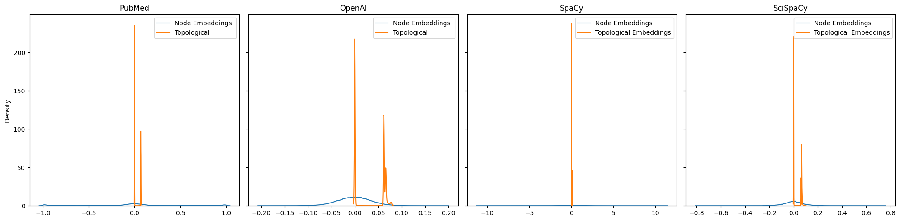

This clearly shows that while node attribute embeddings are more uniformly distributed across a relatively wide range, all topological embeddings have low variance with only two distribution peaks of values. This is the case for all node embeddings, regardless of their initial distribution. We would expect greater variety across topological embeddings with different node features. Below you can see variance distribution for respective embeddings

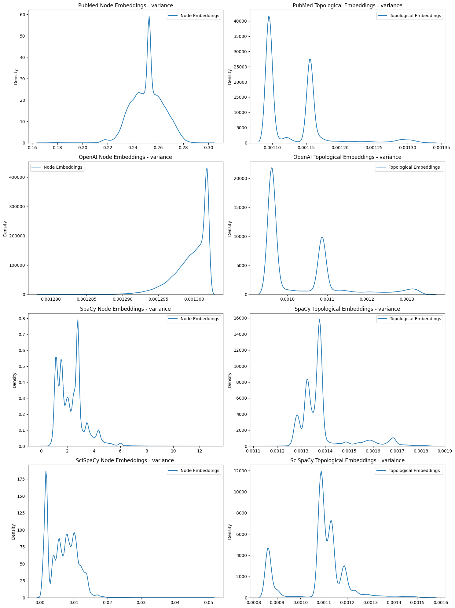

Same shown by node similarity heatmaps (showing similarity between nodes of the same embedding) - here we can see that for topological embeddings they are sometimes almost categorical in my opinion.

## Downstream performance
The exploratory data analysis does show that 1) embeddings quality and values differ quite considerably; 2) LLM embeddings do the best job at clustering the nodes but might also have some leakage present (hypothesis) 3) there might be something wrong with our graphsage. 

### Mini-classifiers - sign of potential data leakage

To examine the quality of embeddings further and (most importantly) explore potential data leakage being encoded in the embeddings, I trained a series of xgboost classifiers/ random forest classifiers on the subsample of the graph. As those classifiers are going to be trained on little data and also with no/poor enrichment from graphsage (as 1) our graphsage is probably not giving the most informative topological embeddings 2) it doesn't contain all edge information as normal rtx-kg2 graph would) we expect them to perform poorly. If they dont perform poorly, that could be a sign of data leakage.

I have used two test sets to examine the performance of those miniclassifiers on the. Both of these test sets consisted of four drug-disease pairs where one drug-disease pair was true positive. First such pair was Rasagoline-Parkinson, quite well known combination that has been known for a long time (and well associated with each toehr - if you google Rasagoline, it's described as Parkinsons drug). The following tables represent classifiers predictions for the test set where index 2 corresponds to Parkinsons-Rasagoline drug-disease pair (note that these were trained ONLY on node attribute emmbeddings and there is VERY little data used for training these classifiers)

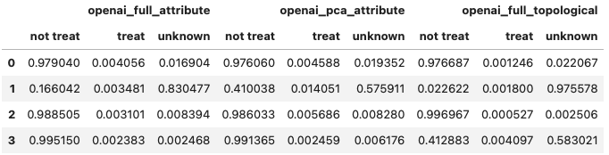
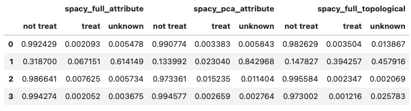

We can clearly see that despite all remaining drug-disease pairs having high not treat scores, the treat score has high unknown score and 10x higher treat score. This example does potentially show the model knowing a bit more about the rasagoline-parkinsons drug disease pair which indicates potential leakage.

The second test set had the following true postive ground truth drug-disease pair - cloxotestosterone and prostate carcinoma. Thes are not too obvious (when you google cloxotestosterone, prostate carcinoma wont be the first disease associated with it) however it might bee easy from NLP perspective as prostate and testosterone are somehow associated. The following are the scores of the models (cloxotestosterone-prostate carcinoma has id 1)

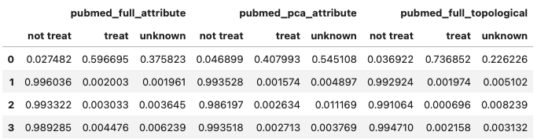
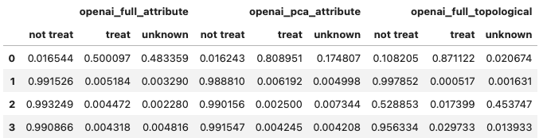
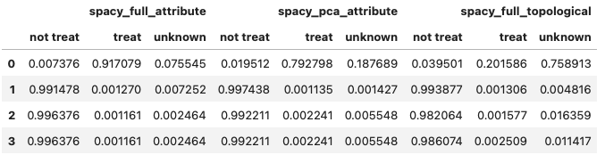

In this case, the scores are surprisingly high, especially when we bear in mind that these are just node attribute embeddings. This clearly shows that some information is encoded in those pretrained models (note that spacy and scispacy also scored relatively high but not as good as LLMs; this shows that using pre-trained models on large datasets in general might lead to data leakgae)

### Full Data Classifiers
I then trained those classifiers but this time on full data to examine the distribution of treat scores; the following distributions were obtained for treat/not treat/unknown scores for known true positives and true negatives and true negatives.

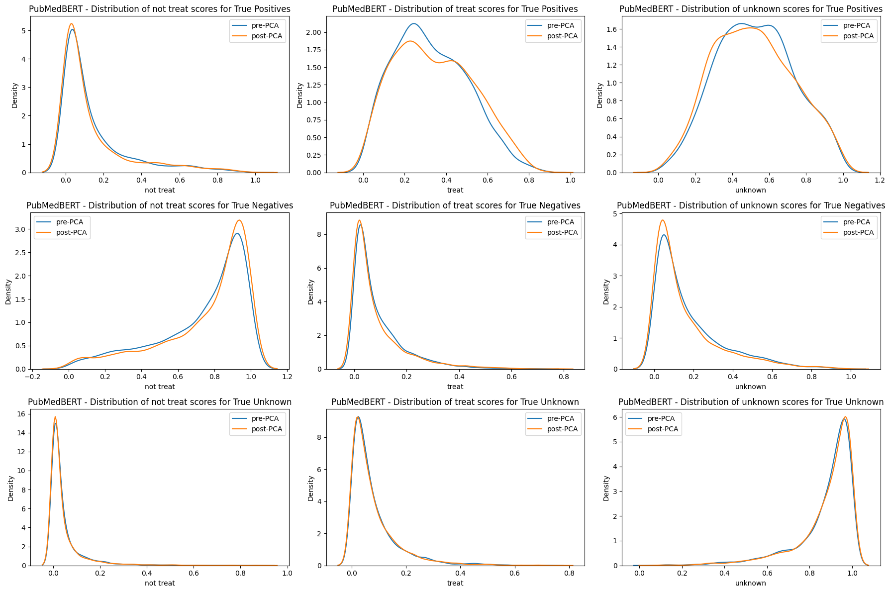
This shows again potential data leakage but also indicates that PCA transformation doesn't really lead to any information loss, which is good. Data leakage could be visible if we look at the distribution of not treat scores which peak at 1.0 for true negatives, and for true positives where the distribution is less defined, but still not completely random. The potential data leakage coming from LLMs is especially visible if we compare it to other pretrained models (here is spacy example which clearly doesnt show peaks as good)

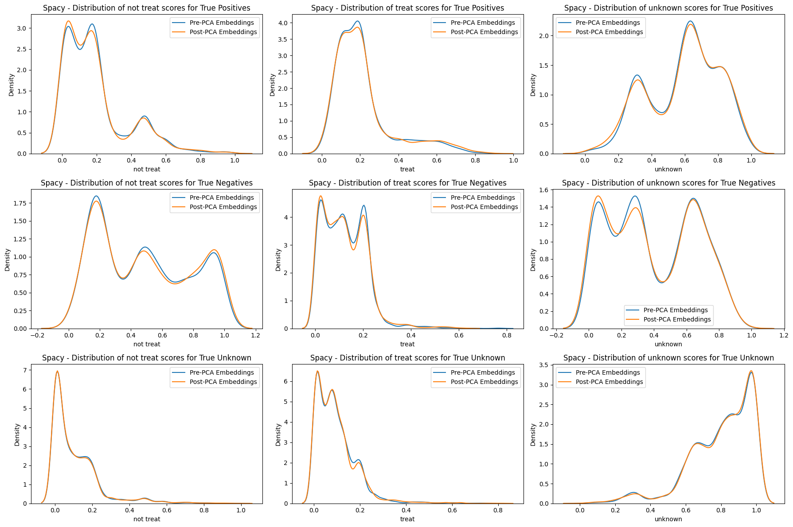

The following images shows distribution of treat/not treat/unknown treat scores for true positive, true negatives and true unknowns for PubMedBERT Attribute and Topological Embeddings (by Chunyu). We can clearly see an effect of topological enrichment as for peaks are much more defined and oriented around 1.0 values for their respective true positives. For node embeddings we can see similar behaviour only for true negatives and true unknowns, and they are never to such 'confident' extent. 

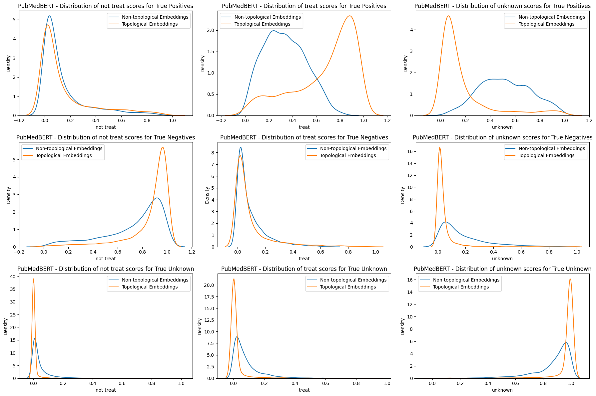

The quantitative metrics also show clear effect of topological embeddings

|               | F1 Macro      | MRR            | Hit@1 | Hit@3  | Hit@5 |
|---------------|---------------|----------------|-------|--------|-------|
| Node embeddings | 0.68        | 0.12           | 0.04  | 0.11   | 0.16  |
| Topological embeddings| 0.91   | 0.35           | 0.20  | 0.41   | 0.53  |
|---------------|---------------|----------------|-------|--------|-------|

Comparison of downstream performance on Chunyu's topological embeddings vs ours node attribute embeddings clearly shows that (thankfully) GraphSage in the publication does topologically enrich the embeddings and does lead to a much better downstream performance. Nevertheless, the embeddings still might encode the embeddings

## Conclusion & Next steps

The main conclusions are that there is very likely a data leakage being encoded in the embeddings and our GraphSage is likely not optimized towards the most informative topological embeddings. Data leakage is definitely not drastic and not 100% confirmed, as we can see clear effect of topological enrichment (when we compare Chunyus embeddings), nevertheless there is definitely large room for improvement

**GraphSage Examination** To be able to assess quality of embeddings (ignore the data leakage for now) on actual downstream performance, we need to make sure that topological enrichment with GraphSage behaves as it did for Chunyu's publication. Therefore my next step is to optimize GraphSage implemented in Neo4j (current pipeline) and see if we can optimize to to yield the same results. 

**Node2vec Examination** Node2vec is not based on LLMs and can be used to create useful graph embeddings. To examine potential data leakage (as well as other alternatives to GraphSage) we could train node2vec and see how our model performs. We need to note that node2vec doesnt utilize attribute embeddings and focuses only on graphs connectivity which has both advantages and disadvantages.

### Reference notebooks 
For more context/code see everycure-org/lab-notebooks/llm_embeddings/initial_benchmark_16092024 and follow README.md there
