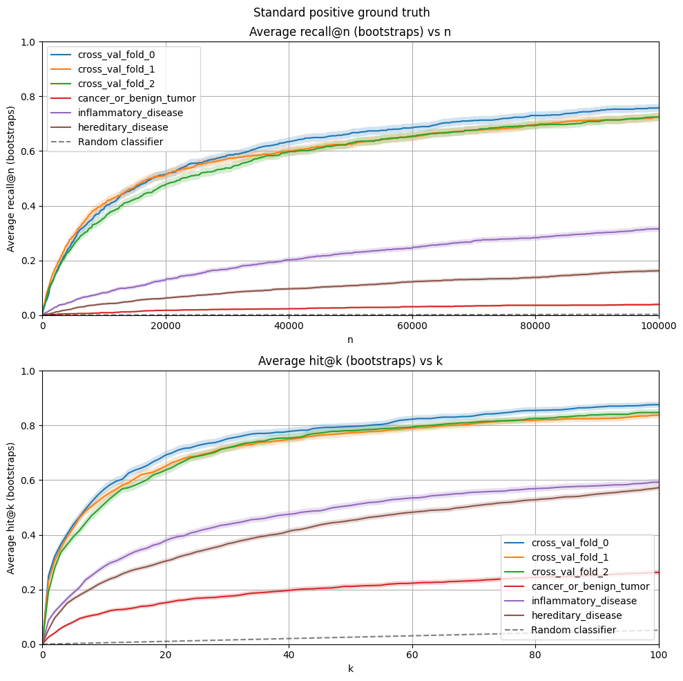
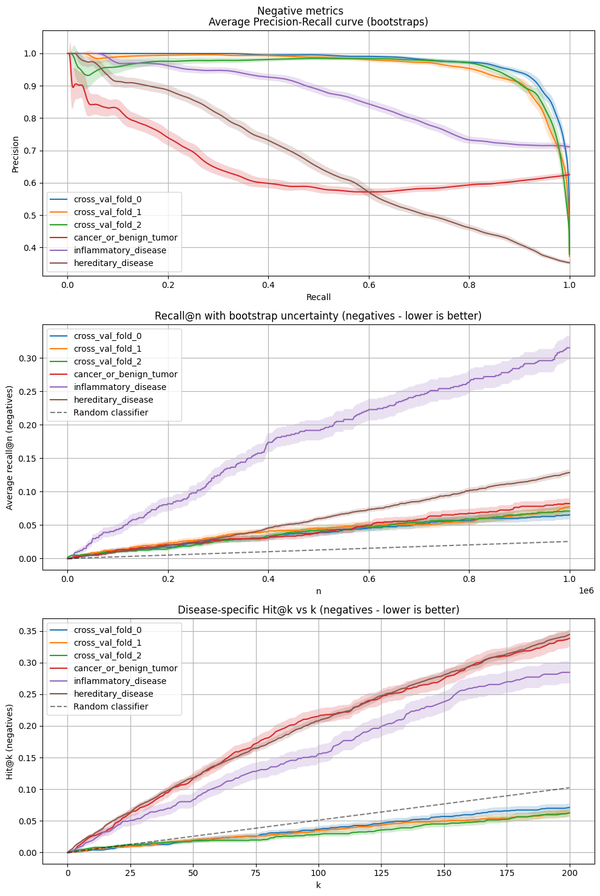
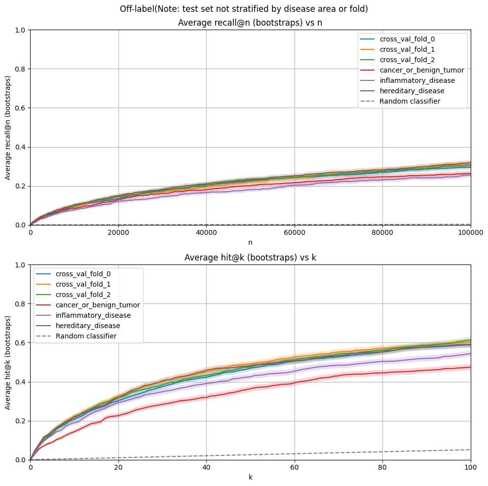

# Drug Repurposing Experiment Report

## 1. Experiment Title
Comparing random cross-validation against disease-area split

## 2. Authors / Contributors
- Nico Matentzoglu. Categorisation of disease list.
- Marcello DeLuca. Categorisation of disease list.
- Chunyu Ma. Implementation of disease split mechanism.
- Alexei Stepanenko. Preparation of plots and report. 

## 3. Summary

We implemented disease-area split for EC models trained in the MATRIX pipeline and compared against usual cross-validation with random test/train split.
- The disease area split metrics are overall lower than with random test/train split, as we would expect
- The EC model performs particularly badly on the cancer_or_benign_tumor disease area. 

## 4. Hypothesis

_Does disease-area split evaluation give additional information on the generalisation capabilities of EC models?_

## 5. Methods
- Data: Release 0.4.1: RTX KG v2.7.3. with KGML-xDTD ground truth
- Model: Node2Vec and xg_ensemble
- Procedure: The analysis was based on two MATRIX runs:
    - `v0.4.1/runs/chunyu-add-data-split-e505890d/` which used a disease-area splitter strategy that was implemented in the pipeline.
    - `v0.4.1/runs/february-2024-tier3-9d10d0ff/`
- Evaluation: We used the "experimental evaluation suite" plots.
    
## 6. Results
1. The results for ranking performance of known positives are given in the following plot. We observe that the disease area split metrics are overall lower than with random test/train split, especially for cancer_or_benign_tumor disease area. 

2. The "negative" metrics ("known negatives" vs "known positives" and "known negatives" vs "unknown") paint a similar picture:

3. The performance of the disease-area split models on off-label data, which was _not_ stratified by disease area, was much closer, indicating that the poor scores in the above two plots are really due to failure to generalise to the new disease area, rather than general poor model performance when using the disease-area training set.

In addition, we find that the overall prevalence of frequent flyers is broadly similar between the runs. See [Notebook](https://github.com/everycure-org/lab-notebooks/blob/main/alexei/9_march_pipeline%20_experiments/2_disease_split.ipynb). 

## 7. Interpretation & Learnings
- Our models perform much worse when generalising to a new disease areas, especially for cancers.
- Metrics measuring performance on contraindication were particularly bad  
- The full-matrix ranking metrics suffer much more than disease specific ranking metrics when holding out disease areas. This suggests that the hold-out diseases are _frequent losers_ that is have low average treat score. 

## 9. Conclusion & Recommendations
1. (most important) Implement disease-area split into main branch of MATRIX pipeline
2. (nice to have) Comparison of xg_ensemble vs xg_synth vs rf models with disease area split. Should occur after 1. is completed. 
3. (nice to have) Further investigation of specific disease areas such as cancer. For instance,
    - Estabilish whether the hold-out diseases are frequent losers
    - Investigate whether including some diseases from the area in the training set improves performance on the disease area

## 10. Supporting Materials
- [Notebook](https://github.com/everycure-org/lab-notebooks/blob/main/alexei/9_march_pipeline%20_experiments/2_disease_split.ipynb)
- [GitHub PR](https://github.com/everycure-org/matrix/pull/1285)
- [Link to Linear project](https://linear.app/everycure/issue/MATRIX-482/summary-report-on-disease-split-validation)
