# Matrix transformation method to reduce the prevalence of frequent flyers
18 April 2025

## 1. Experiment Title
_Matrix transformation method for reducing prevalence of frequent flyers (part II:  refined analysis)_

## 2. Authors / Contributors
Alexei Stepanenko

## 3. Hypothesis

_Does the matrix transformation effectively and robustly reduce prevalence of frequent flyers, whilst maintaining or improving ranking and classification metrics?_

## 4. Summary

Frequent flyers refers to a phenomenon whereby certain drugs or diseases have disproportionally high average treat scores and therefore dominate the top of the matrix output. 
The matrix transformation method addresses the frequent flyer problem by applying an extra layer of post-processing after the initial predictions have been made.

This experiment builds on an initial set of experiments that were run earlier in the year (see report [here](https://github.com/everycure-org/lab-notebooks/blob/main/alexei/3_frequent_flyers_eval_and_normalisation/report.md)).
Comparatively, here we employ a wider suite of evaluation metrics, (including off-label, time-split and disease-split) and applied the method to a wider set of predictions (including all the main runs from our pipeline and several rules-based models from EC subcontractor teams). 

Our main finding are as follows:
1.  The matrix transformation method effectively reduces the prevalence of frequent flyers whilst improving or maintaining most ranking and classification metrics. The main caveat is that the method tends to cause a decrease in the so-called _off-label capture rate_. 

3. We demonstrate that the matrix transformation method may be _fine-tuned_ to achieve different performance characteristics. In particular, we may reduce the drop in the off-label capture rate at the cost of less increase in drug/disease variety by modulating the "strength" of the normalising effect. 

4. The method exhibits _wide range of applicability_. We have observed a single fixed matrix transformation which may be successfully applied to a wide range of predictions. 

2. We find that the variety of drugs and diseases appearing in the off-label dataset is lower than for the standard ground truth dataset. In a sense, the off-label dataset itself contains more "frequent flyers". We hypothesise that this explains why application of the matrix transformation tends to increase ranking metrics for standard ground truth whilst decreasing them for the off-label dataset. 

5. Finally, we mention a negative/inconclusive result. A _hyperparameter optimisation strategy_ for general matrix transformations was implemented, which automatically finds a matrix transformations based on data. This attempt was outperformed by single transformation and was not pursued further

## 5. Conclusions & Recommendations

The experiment provides evidence that the matrix transformation method effectively and robustly addresses the frequent flyer problem and has highlighted a potential disadvantage to keep an eye on.   
The method has the natural advantage that is simple, interpretable and fast to compute therefore suited for fine-tuning based on feedback. 
Further method development would benefit from medical input. 

<ins>Recommendation:</ins> 
1. Implement the method in the MATRIX pipeline
2. Run a Tier 2 experiment to confirm results and tune method
3. Share with the medical team via a Tier 3 run and initiate feedback loop

Furthermore, we should continue exploring other methods of addressing the frequent flyer problem and compare them in the framework provided here.

## 6. Methods

### Evaluation with drug-entropy@n and disease-entropy@n

The success criteria of any methodology aimed at addressing the frequent flyer is as follows:

_Reduce prevalence of frequent flyers whilst maintaining or improving ranking and classification performance_

These two aspects of performance may be quantitatively measured as follows. 

#### <ins>Reduce prevalence of frequent flyers</ins>

Prevalence of drug or disease frequent flyers are measured by the __Drug-Entropy@n__ and __Disease-Entropy@n__ metrics, which directly measure the _variety of drugs and diseases appearing in the top n_. 

Both metrics are between 0 and 1, with *higher* values indicating a larger *variety* therefore a *smaller* prevalence of frequent flyers. More details are given in the deep dive below. 

More precisely, we define Drug-Entropy@n as follows. Disease-Entropy@n is defined analogously. 

>_Definition._ Let $D$ be the set of drugs of interest. Let $\text{count}_n(d)$ be the number of times drug $d \in D$ appears in the top $n$ pairs. 
>
>Then the Drug-Entropy@n score is defined at the entropy of the discrete probability distribution 
>$$p(d) = \frac{\text{count}_n(d)}{n}, \qquad d \in D.$$ 
>To ensure the metric is between 0 and 1, we set the base of the entropy to the number of unique drugs $|D|$. This is written as
>
>$$
\text{Drug-Entropy}\text{@n} = - \sum_{d \in D} p(d) \log_{|D|} p(d).
$$

A couple of instructive examples may be found in the "deep dive" section of the [report](https://github.com/everycure-org/lab-notebooks/blob/main/alexei/3_frequent_flyers_eval_and_normalisation/report.md) for the previous experiment. 

 _Intuition._ These metrics may be understood as describing the shape of the distribution that occurs when we plot the frequency that each drug/diseases appears in the top n. If there many frequent flyers, then the shape of this distribution will be very skewed and unlikely  if plotting the same distribution for $n$ randomly sampled drugs/diseases. This, by definition, leads to a low entropy for the distribution. Conversely, if there are less frequent flyer then this distribution will be flatter, leading to a higher entropy. The following figure illustrated this in the case of Drug-Entropy@3000. 

 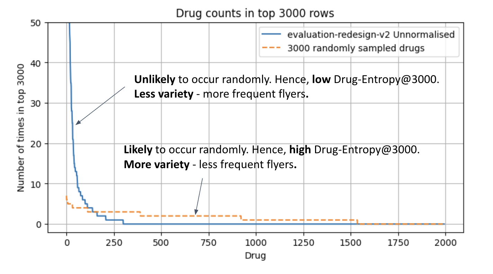

_Figure 1._ The distribution of drug frequency counts for the top 3000 predictions for the output of one of our models.

#### <ins>Improving ranking and classification performance</ins>

Reducing prevalence of frequent flyers alone is easy - we may simply shuffle the matrix pairs randomly. 
We must also ensure that ranking and classification performance is improved or maintained within tolerance.

We measure ranking and classification performance by a standard suite of evaluation metrics including:
-  Recall@n for full matrix ranking, 
-  Hit@k for disease-specific ranking and 
-  other metrics which take into account known negative pairs. 

The standard evaluation suite is reviewed in [this document](https://docs.dev.everycure.org/data_science/evaluation_deep_dive/). 

In addition to metrics based on a random test/train for the standard ground truth, we consider:
- metrics utilising known positive pairs used _off-label_,
- _disease-split_  metrics, where certain disease areas are withheld from the model during training and subsequently introduced during testing and 
- _time split metrics_, where only keep edges in the KG that are time-stamped pre-2014 and test on known positive pairs that were discovered post-2014. 

### Matrix transformation method

The key idea of the matrix transformation method is as follows:
 
 >Instead of ranking pairs by the raw treat score, rank by another quantity, called the _transformed score_, which is derived from the treat score by a fixed formula.

In the case of __ranking-based matrix transformations__, the transformed score is a quantity that balances the _drug-specific_, _disease-specific_ and _full matrix ranks_*. This is motivated by the idea that a truly good pair prediction will have a good drug-specific and disease-specific rank whereas a pair that is only ranked highly because it involves a frequent flyer drug or disease will have low drug or disease specific rank respetively.

The following figure illustrates the procedure:

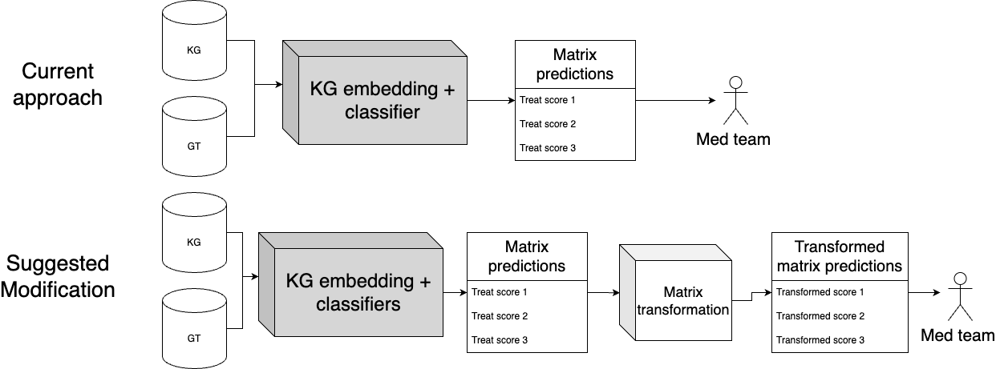

_Figure 2._ Schematic diagram illustrating the basic flow involved in the matrix transformation method.

There is a zoo of possible matrix transformations, therefore it is desirable to seek restricted families of transformations with a small number of parameters whose effect may be easily understood. We place an emphasis on the following family of transformations:

>Let $q_{\text{matrix}}$, $q_{\text{drug}}$ and $q_{\text{disease}}$ denote the full matrix, drug-specific and disease-specific quantile ranks* respectively. We consider the family of matrix transformation for which the transformed score is given for any drug-disease pair $(d, i)$ by
>
>$$
>t(d, i) = a \, q_{\text{matrix}}(d, i)^{-\gamma} + q_{\text{drug}}(d, i)^{-\gamma} + q_{\text{disease}}(d, i)^{-\gamma  },
>$$
>
> where $a\geq0$ is referred to as the _matrix weight parameter_ and $\gamma >0$ is referred to as the _decay parameter_. 

The three terms in the  above formula for $t(d,i)$ may be understood as giving "points" to a pair for having a good full-matrix, drug-specific and disease-specific rank respectively. We use the quantile rank in place of the rank in order to balance  

The two parameters may be understood as follows: 
- The decay parameter $\gamma > 0$, controls how many "points" a high ranking pair gets versus a low ranking pair. 
    - We have found that a good principle to set $\gamma$ seems to be "small enough", at least in the context we have observed. Thoughout much of the report, we fix $\gamma=0.05$. 
- The matrix weight parameter $a$ effectively controls the strength of the normalising effect provided by the transformation. In the case $a = 0$, we refer to it as _pure_ transformation, whereas when $a\to \infty$ we recover the original untransformed predictions. 
We look at the following values for $a$ in particular:
    - _Almost pure transformation._ $a$ is set to a very small value. The value $a = 0.001$ is used in this experiment. In this case, the transformed score is essentially the same as for pure transformations, except that the original untransformed ranking is used to break the tie when multiple pairs have the same drug and disease specific ranks. 
    - _Uniform_ Refers to the case that $a = 1$.
    - _Matrix weighted_ In this report, this refers to the specific case $a=3$. 

### Underlying model predictions

The matrix transformation method may be applied a-posterior for any drug-repurposing model, provided treat score predictions for the _matrix dataframe*_ of drug-disease pairs. 

The models that we consider are as follows (see also [this notebook](https://github.com/everycure-org/lab-notebooks/blob/main/alexei/8_matrix_normalisation_refined_analysis/4_almost_pure_transformation_xg_ensemble_part3.ipynb) for links to the predictions):
1. `march_tier3_rtx210` March EC Tier 3 run: node2vec + xg_ensemble on RTX KG 2.10
1. `feb_tier3_xg_ensemble` February EC Tier 3 run: node2vec + xg_ensemble on RTX KG 2.73
1. `jan_tier3_xg_ensemble` January EC Tier 3 run: node2vec + xg_ensemble on RTX KG 2.73 
1. `nov_tier3_xg_ensemble` November official run: node2vec + xg_ensemble on RTX KG 2.73
1. `xg_synth_node2vec` node2vec + xg_synth on RTX KG 2.73
1. `rf_node2vec` node2vec + random forest on RTX KG 2.73
1. `GraphSAGE_xg_ensemble` GraphSAGE + xg_ensemble on RTX KG 2.73 
1. `psev_rtx` PSEV on RTX KG 2.73 
1. `amie_robokop` AMIE+ on ROBOKOP
1. `bte_curated` Curated rule-based query on BioThingsExplorer
1. `simple_rule_based` Simple rule-based model on RTX KG 2.73 

### General matrix transformations and hyperparameter optimisation (Optional)

Before providing details of the hyperparameter strategy that was implemented, we provide details of two more general families of matrix transformations. 

#### $l^p$-based transformation

Let $(d, i)$ denote a drug-disease pair and $s(d, i)$ the corresponding treat score. 

The *$l^p$-transformed score* is defined as

$$
t(d, i) = \frac{s(d,i)}{\mu^\alpha_{p, \textrm{disease}}(i)\,\mu^\beta_{q, \textrm{drug}}(d)}
$$

where
- $\alpha$ and $\beta$ are positive exponents controlling the degree of frequent flyer normalisation, 
- for any $p>0$, the quantity $\mu_{p, \textrm{disease}}(i)$ denotes the *disease-specific* $l^p$ norm defined by 
$$\mu_{p, \textrm{disease}}(i) = \big(\frac{1}{|\text{drugs}|}\sum_{\tilde{d} \in \text{drugs}  } s(\tilde{d},i)^p \big)^{1/p}$$
- for any $q > 0$,  the quantity $\mu_{q, \textrm{drug}}(d)$ denotes the *drug-specific* $l^p$ norm defined analogously.

Note that:
- The $l^1$ norm corresponds to the *mean*
- The $l^\infty$ corresponds to the *maximum* 

#### Ranking based transformation

As before, let $q_{\text{matrix}}$, $q_{\text{drug}}$ and $q_{\text{disease}}$ denote the full matrix, drug-specific and disease-specific quantile ranks respectively.

The _rank-transformed score_ is defined as

$$
t(d, i) = w_{\text{matrix}} q_{\text{matrix}}(d, i)^{-\alpha} + w_{\text{drug}} q_{\text{drug}}(d, i)^{-\beta} + w_{\text{disease}} q_{\text{disease}}(d, i)^{-\gamma}
$$

where
-  $w_{\text{matrix}}$, $w_{\text{drug}}$, $w_{\text{disease}} \geq 0$ are the weights assigned to the matrix-wide, drug-specific and disease-specific ranks respectively
- $\alpha, \beta, \gamma >0$ are the decay parameters controlling the emphasis on the top ranks for matrix-wide, drug-specific and disease-specific rankings respectively (the larger they are, the more emphasis on the top ranks).

#### Hyperparameter optimisation

The matrix transformations contain several parameters, which we can optimise for maximum combined diversity of predictions and ranking performance. 

We consider the following objective function:

$$
\text{max}\frac{1}{J} \sum_{j = 1}^{J} \mathbb{E}_{\text{folds}}(a\text{drug-entropy}@n_j + b\text{disease-entropy}@n_j + c\text{recall}@n_j + d\text{hit}@k_j)
$$

where $J$ is the number of different values for $n$ and $k$ considered, $\text{recall}@n$ measures the full-matrix ranking performance, $\text{hit}@k$ measures the disease-specific ranking performance and $a, b, c, d$ are positive weights adding up to 1. 

This objective function is optimise using a Bayesian optimisation approach, employing the `skopt` library.

We take $J = 2$ for simplicity and consider the following values for $n$ and $k$:
- $n_1 = 30,000$, $n_2 = 5000$
- $k_1 = 300$, $k_2 = 50$

We consider two different weights:
- **Performance focused:** a = 0.05, b = 0.05, c = 0.45, d = 0.45 
- **Balanced:** a = 0.25, b = 0.25, c = 0.25, d = 0.25 

### *Some additional definitions:
- The _full matrix rank_ is the position of a pair when sorting the full matrix of possible pairs according to the treat score
- The _disease-specific rank_ is the rank of the pair when restricting to only pairs involving the same disease.  In other words, the rank of the drug against all other drugs when paired with the same disease.
- The _drug-specific rank_ is the rank of the pair when restricting to only pairs involving the same drug. 
- The _quantile rank_ is the rank divided by the total number of pairs being ranked. For example, if a pair has rank 10 out of 100 pairs, its quantile rank would be 0.1.
- The _matrix dataframe_ refers to the dataframe of all drug-disease pairs given a list of drugs and a list of diseases. 

## 7. Results

#### Prevalence of frequent flyers is reduced, with a neutral or slightly positive effect on all ranking and classification metrics except off-label full matrix Recall@n

First, we take a global look at the effect of matrix transformation. The below figure illustrates the effect of almost pure rank-based normalisation on the February Tier 3 run  `feb_tier3_xg_ensemble`.

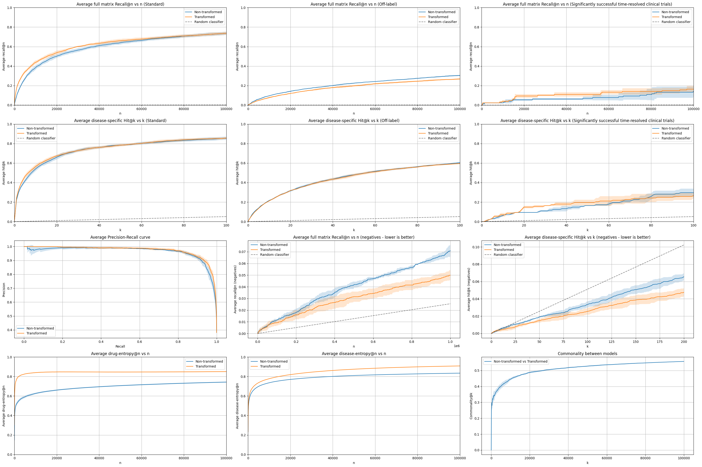

_Figure 3._ Evaluation suite results describing the effect of almost pure rank normalisation with $\gamma = 0.05$ and $\varepsilon =0.001$ on the February Tier 3 run. 

We observe the following:
- Drug-entropy is significantly increased indicating a significant decrease in the prevalence of drug frequent flyers.
- Disease-entropy is also increased but by a smaller amount.  
- Slight increase in full matrix ranking metrics for standard and time-split clinical trials data.
- Slight decrease in off-label full matrix ranking metrics. 
- Disease-specific ranking metrics stay about the same up to statistical uncertainty. 
- We observe improvement for classification and "known negatives" ranking metrics. 

We note already that a similar observations have been made when applying the method to several other models. 

#### Reduction in prevalence of drug frequent flyers is noticeable

The below figure the records the most frequently appearing drugs before and after transformation. The main takeaway is that the reduction in drug frequent flyer would likely  be noticeable to a medical reviewer. 

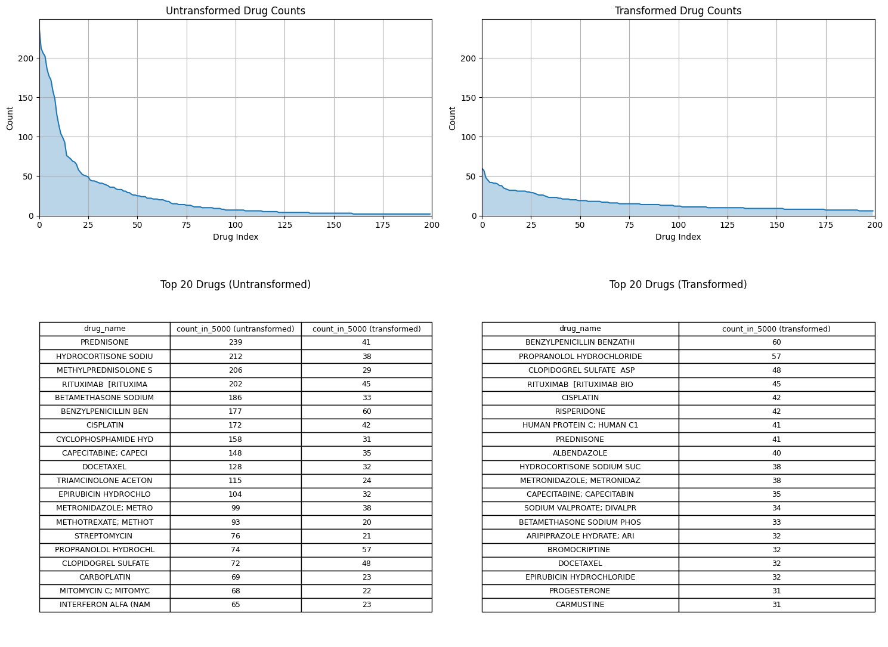

_Figure 4._ Most frequently occurring drugs before and after almost pure rank transformation with $\gamma = 0.05$ and $\varepsilon =0.001$ on the February Tier 3 run. 

#### Reduction in prevalence of disease frequent flyers likely not noticeable but bacterial infections seem to appear much less often 

For diseases, the picture looks rather different as illustrated in the below figure. We make the following observations:
- The reduction in number of frequent flyers would probably not be noticeable to a medical reviewer. 
- However, the specific diseases which are are most frequently occurring change substantially.  The medical implications of this is beyond the scope of the present report.
- We note, however, that several top bacterial infections appear much less frequently after transformation. This may reduce the  number of "anti-biotic treats bacterial infection" type pairs that are highly ranked, which is a negatively perceived pattern recently reported by the medical team.

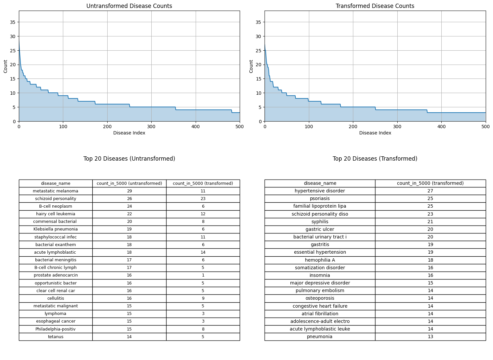

_Figure 5._ Most frequently occurring diseases before and after almost pure rank transformation with $\gamma = 0.05$ on the February Tier 3 run. 

#### Time-split and disease-split ranking metrics are also increases or maintained

Almost pure matrix transformations slightly improves or maintains the following evaluation metrics up to statistical uncertainty:
1. Time-split: where we filter edges in the KG to only those time-stamped with pre-2014 date and use post-2014 timestamped pairs as the test set.
2. Disease-split: where we withhold certain disease areas from the training set and use the pairs for that area in the test set.

_Figure 6._ Full matrix recall@n and disease-specific hit@k for time-stamped KG and disease-split ground truth. Matrix transformation: almost pure rank transformation ($\gamma = 0.05$ and $\varepsilon =0.001$). Model: node2vec + xg_ensemble on RTX 2.7.3. Note $n=30,000$ and $k = 50$. 

#### A single matrix transformation has a consistent effect across a variety of different models

Next we turn our attention to the same fixed matrix transformation applied to a variety of different models. 

We observe the following consistent behaviour with a few exceptions:
1. Increase drug and diseases entropy@n
2. Slightly increase standard recall@n and slightly decrease off-label recall@n

Another notable observation is that the decrease off-label recall@n is more significant for the latest Tier 3 run (March 2025). A difference between this Tier 3 run and previous ones is that the drug and disease lists are bigger, therefore the matrix dataframe that is at the core of the matrix transformation is bigger. We further investigate different transformations applied to this run below.

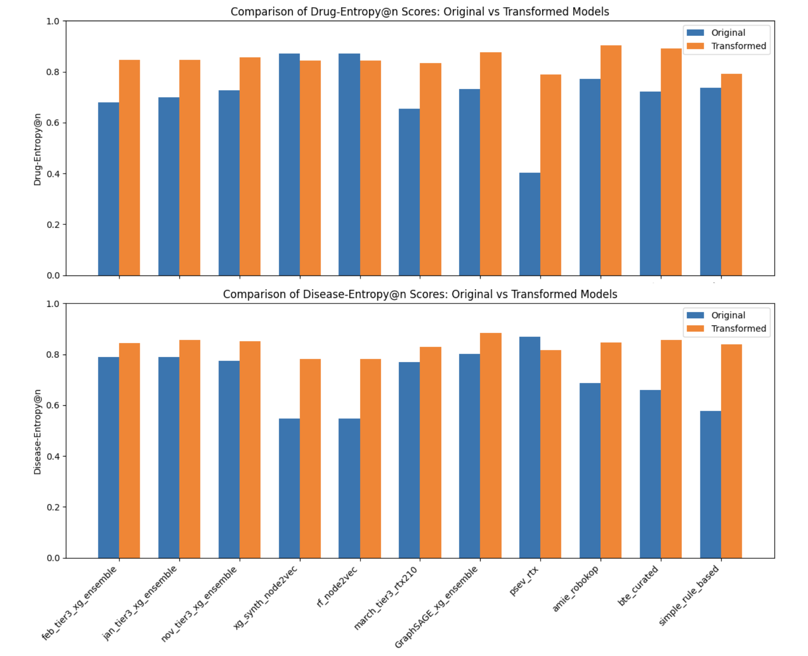

_Figure 7._ Drug and disease entropy@n before and after almost pure rank transformation ($\gamma = 0.05$ and $\varepsilon =0.001$) to a variety of models. Note $n=30,000$. 

_Figure 8._ Recall@n for standard and off-label ground truth before and after almost pure rank transformation ($\gamma = 0.05$ and $\varepsilon =0.001$) to a variety of models. Note $n=30,000$.

#### Matrix transformations may be fine-tuned to achieve different performance characteristics

Looking further into the March Tier 3 run, we find that by varying the matrix weight parameter $a$, we may:
- reduce the drop in off-label recall@n caused by the transformation, and
- further increase the gain in standard recall@n, 
- but this comes at the cost of less gain in entropy@n. 

Based on this experiment, it seems that the _uniform matrix transformation may be a better for the March Tier 3 run_. 

The effect of the matrix weight parameter $a$ on entropy@n seems particularly predictable - higher values of $a$ lead to less increase of entropy@n. 

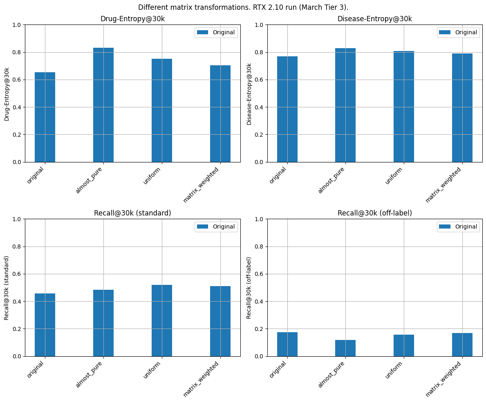

_Figure 9._ Entropy@n and Recall@n metrics for the ranking based matrix transformations with varied matrix weight parameter. Model predictions: March Tier 3 run. Decay parameter fixed to $\gamma =0.05$. 

#### Why do matrix transformations cause an increase in recall@n for standard ground truth while a decrease for off-label ground truth? 

This question is puzzling because the matrix transformation is a fixed operation that does not depend on data. In particular, this is almost certainly _not_ a form of overfitting. 

The hypothesis we propose in this report is as follows:
 
> _A primary driving factor for the increase or decrease in recall@n caused by matrix transformations is changes by how closely the drug and disease frequency distributions agree with the drug and disease frequency distributions fo the ground truth._

The below figures shows that the drug and disease frequency distribution for the off-label ground truth dataset or we may say that the off-label dataset itself has more "frequent flyers" compared to the standard ground truth. Another, description is that _the drug-entropy and disease-entropy for the off-label dataset is lower than for standard ground truth_. 

With this finding in mind, it is already less surprising that the matrix transformation method, specifically aimed at increasing entropy@n, has a worse effect on the off-label dataset. 

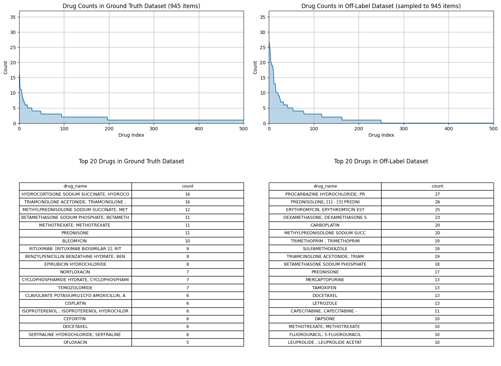

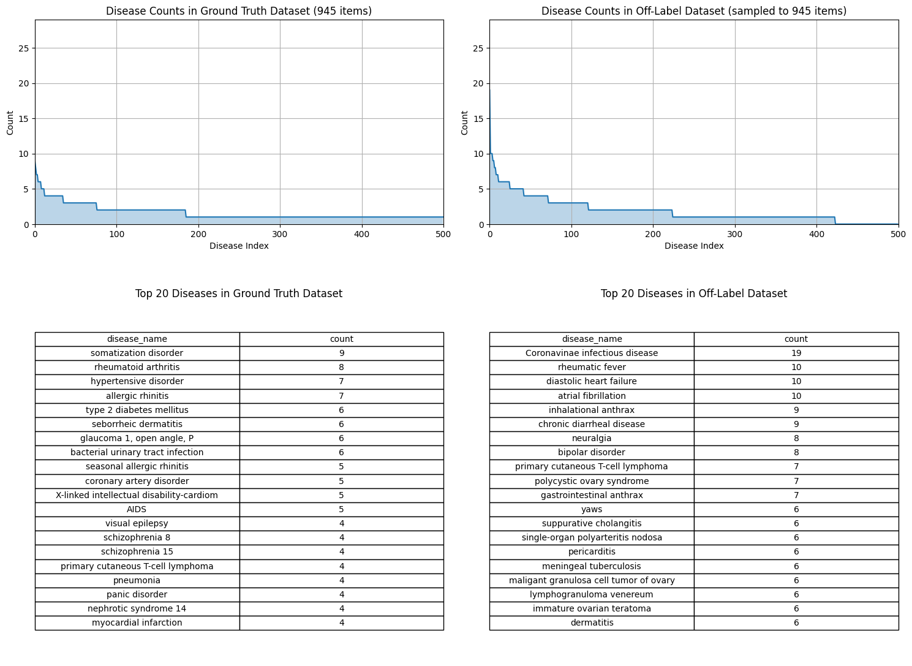

_Figure 10._ Drug and disease frequency distributions for the standard known positive and off-label pairs datasets. 

The following figure illustrates the matrix transformation shifts the drug and disease frequency distributions further away form off-label dataset compared to the standard ground truth. 

Specifically, we do the following:
- collect the top 100 most frequently occurring drugs and diseases in the top 30,000 ranked pairs (for transformed and untransformed predictions)
- compute the proportion of ground truth that involve a top 100 drug or disease (for standard and ground truth)

In other words, we measure between frequently occurring  drugs/diseases among the the top predictions and frequently occurring  drugs/diseases in ground truth. 

We observe that: 
- The drug proportion drops after transformation for both ground truths, but the drop is bigger for off-label.
- The diseases proportion increases  transformation for both ground truths, but the increases is less for off-label.

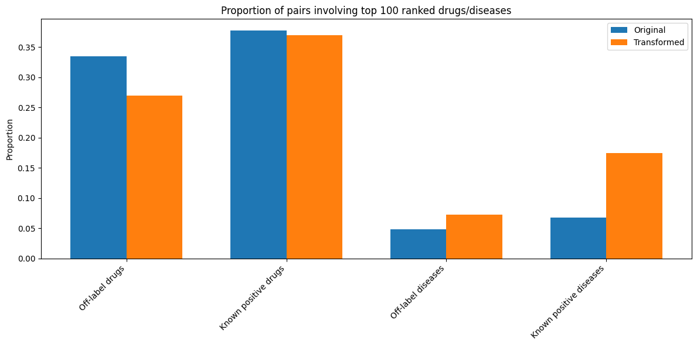

_Figure 11._  Proportion of ground truth pairs that involve a top 100 most frequently occurring drug and disease among the top 30,000 ranked pairs. 

These results are quite suggestive that a primary, possibly the main, driving factor for the increase and decrease in recall@n we observe during matrix transformation is in fact down to the change in drug and disease frequency distribution and how well it matches  up to that of the ground truth. 

#### Effect of almost pure matrix transformations stabilise for small $\gamma$

The following figure illustrates the effect on performance metrics for almost pure matrix transformation for different values of the decay parameter $\gamma$. We observe that the metrics seem to stabilise as $\gamma$ is made smaller and smaller. This is very useful as it suggest that a guiding principle for setting $\gamma$ could be: set it small enough. 

It is desirable to perform more investigation for $\gamma$ in different contexts before officially adhering to this principle. 

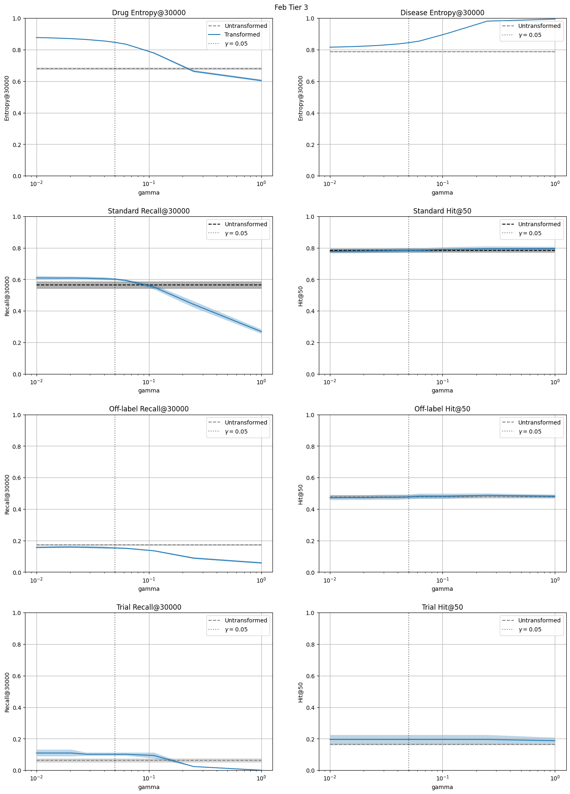

_Figure 12._  Metrics for almost pure matrix transformation for different decay parameters $\gamma$. Model: Feb Tier 3. 

#### Our hyperparameter optimisation attempt finds transformations that increase drug-entropy@n while keeping other metrics relatively fixed

The below figure illustrates the results of our investigation into hyperparameter optimisation for matrix transformation. We employed two different optimisation schemes described above and four different families of matrix transformations. See the [notebook] for more details. 

As alluded to by the subtitle, the transformations that were found seemed to only increase drug entropy. We could look into refining this in the future but the question of how to construct the objective function seems to be a subtle one: it simultaneously involves the complexities associated to non-convex optimisation problems but also should be guided directly by medical team preferences. 

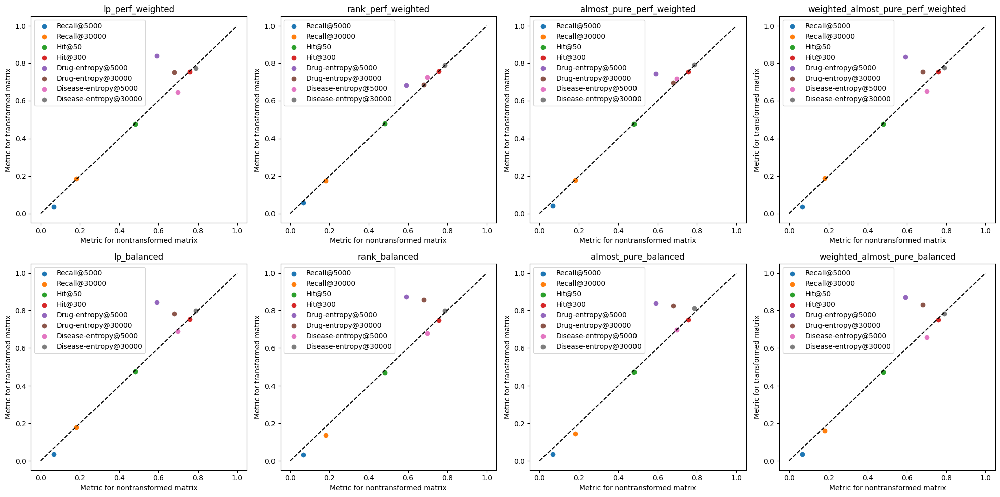

_Figure 13._  Metrics before and after optimised matrix transformations. Model: Feb Tier 3. 

## 8. Interpretation & Learnings

Let's assume for a moment that the primary driving factor for the changes in ranking and classification metrics after transformation is the extent to which the transformed drug and disease frequency distributions matches up with that of the ground truth. Indeed, while this has not been proven, our results do provide suggestive evidence in this direction. 

Then, we would conclude that ranking-based matrix transformations studied in this report change these frequency distributions, while keeping predictive power relatively unchanged. The hyperparameters of the matrix transformations determine the frequency distributions, so how should we set these hyperparameters? 

I argue that the drug and disease frequency distributions should not be set to match up with one ground truth or another, but should be set in a way which optimises its utility for the medical team. This leads us to the conclusion that the hyperparameters should be explored and tuned via medical feedback loop. 

## 9. Supporting Materials

- [Directory with notebooks and source code](https://github.com/everycure-org/lab-notebooks/tree/main/alexei/8_matrix_normalisation_refined_analysis)

- [Linear issue](https://linear.app/everycure/issue/MATRIX-574/make-final-tweaks-to-rank-normalization-method)
