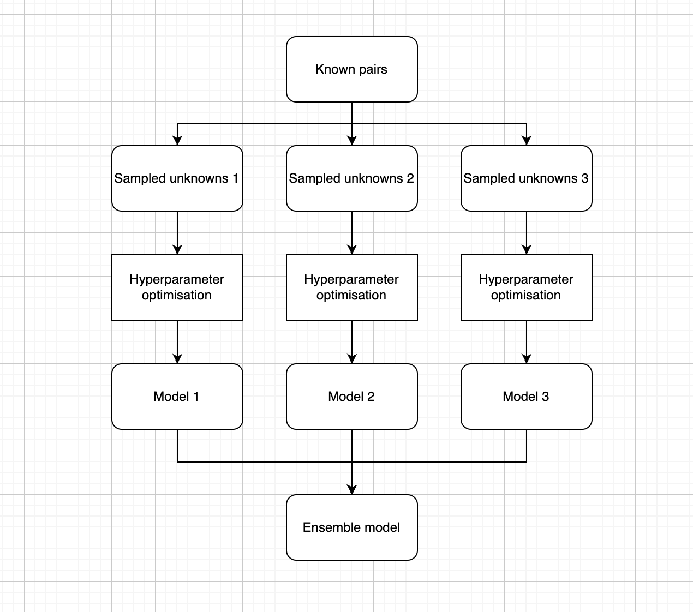
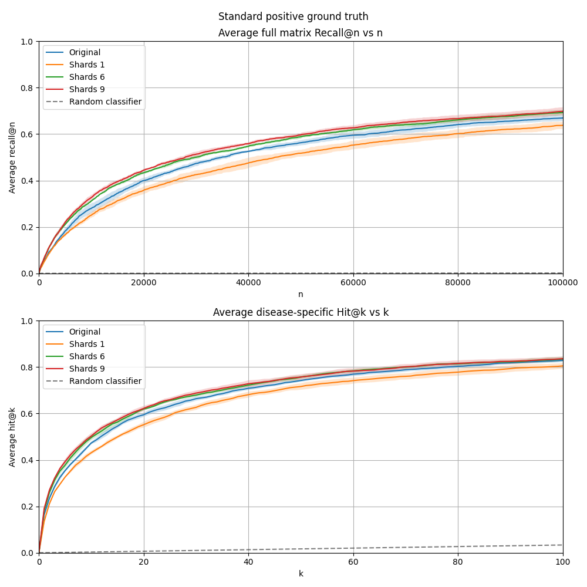
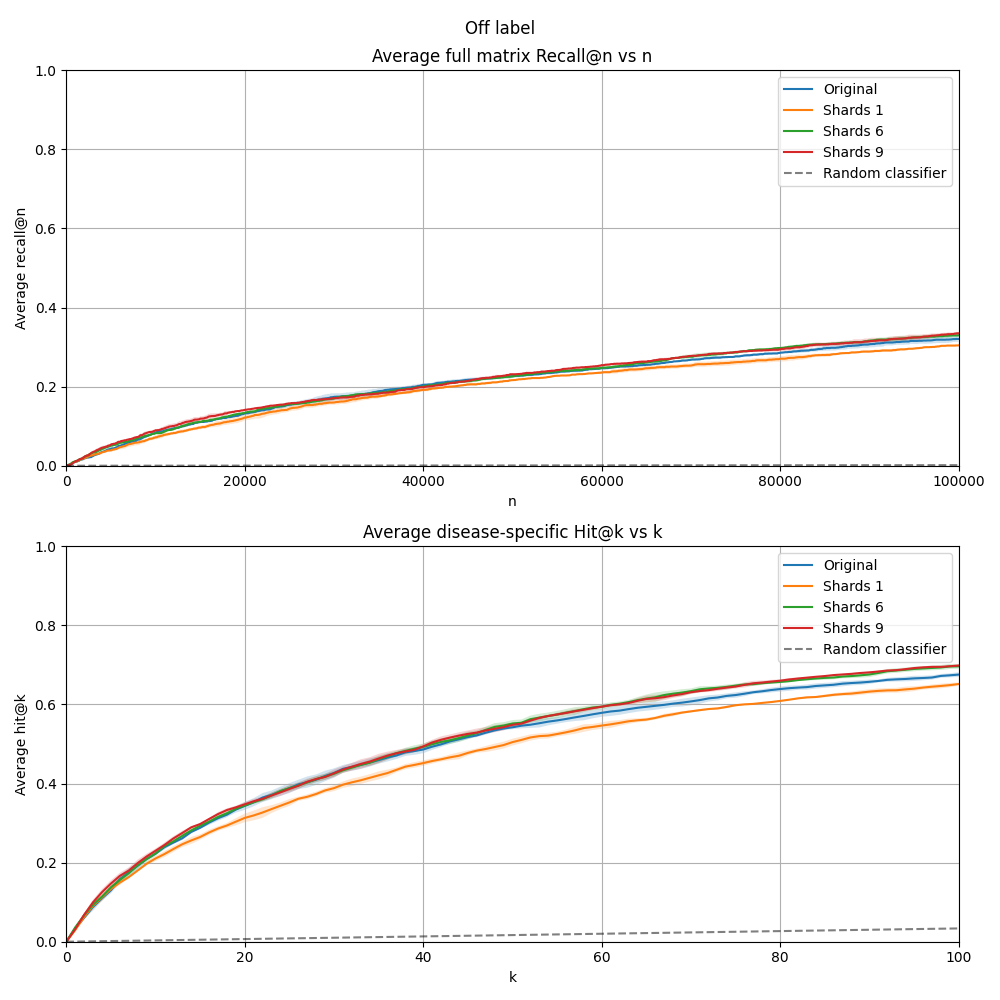
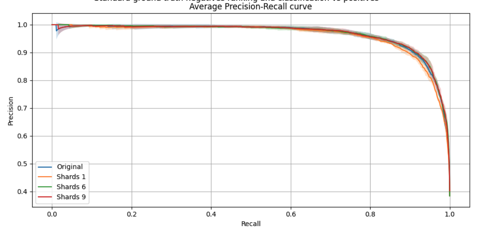
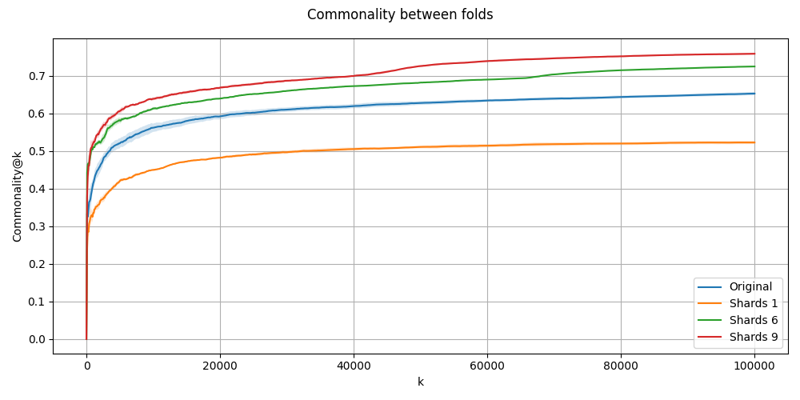

# Number of ensemble shards experiment

2 May 2025

## 1. Experiment Title
Investigating the effect of the number of ensemble shards on model performance.

## 2. Authors / Contributors
Alexei Stepanenko

## 3. Hypothesis

_How does the number of shards in the negative-resampling ensembles affect model performance?_

## 4. Summary

We find that the a larger number of shards $n$ in the ensemble model provides a small to moderate uptick in positive ranking and classification performance while keeping other metric approximately level.  Interestingly, we also observed an increase in the stability between folds as we increased the number of shards. 

The increase in performance metrics levels out as we increase $n$ more and more. Increased $n$ has higher computational cost therefore there is a diminishing returns trade-off. 

## 5. Conclusions & Recommendations

1. Increase the number of shards from 3 to 6 on main. A discussion should be had about the additional computational cost however. 
2. Perform further experiments:
    - Introduce the _quantity_ of negative sampled data as an additional variable. This variable is likely to interact non-trivially with the number of ensemble shards.
    - Change the aggregation method from mean to median. We expect that this will improve the effectiveness of the ensemble method. 

## 6. Methods

The negative-resampling ensemble method consists in resampling the "unknown" training data several times,  each time training a separate model with hyperparameter optimisation and combining those models by aggregating their scores. Currently we aggregate by taking the mean. 

The parameter indicating the number of times we resample is referred to as the number of shards $n$. The following diagram illustrates the negative-resampling ensemble method in the case that $n=3$. 

*Figure 1. Schematic diagram of the negative resampling ensemble method.*

The specifications for the model we studied in this experiment are as follows:
- Data: Release v0.4.5 (RTX v2.10)
- Embedding: Node2Vec
- Model in each shard: XGBoost classifier with replacement negative sampling (6 random pairs per known positive). 

We considered the following values for $n$: 1, 3 (default on main), 6, 9

The run details are as follows:
- $n = 1$
    - Branch: `experiment_n_shards/n_shards_1`
    - Run: `gs://mtrx-us-central1-hub-dev-storage/kedro/data/releases/v0.4.5/runs/n-shards-1-2e4df0d0/`
- $n = 3$ (default)
    - Branch: `release/v0.4.5`
    - Run: `gs://mtrx-us-central1-hub-dev-storage/kedro/data/releases/v0.4.5/runs/n-shards-1-2e4df0d0/`
- $n = 6$
    - Branch: `experiment_n_shards/n_shards_6`
    - Run: `gs://mtrx-us-central1-hub-dev-storage/kedro/data/releases/v0.4.5/runs/n-shards-1-2e4df0d0/`
- $n = 9$
    - Branch: `experiment_n_shards/n_shards_9`
    - Run: `gs://mtrx-us-central1-hub-dev-storage/kedro/data/releases/v0.4.5/runs/n-shards-1-2e4df0d0/`

## 7. Results

Note that below, the label "Original" corresponds to $n = 3$. 

**The positive ranking metrics are increased by a slight to moderate amount**

*Figure 2a. Positive ranking metrics with standard ground truth.*

*Figure 2b. Positive ranking metrics with off-label ground truth.*

**Known positive vs known negative classification metrics are increased slightly**

*Figure 3. Precision-Recall curve for positive vs negative classification.*

**The stability between folds is increased substantially**

*Figure 4. Commonality@k measuring stability between folds.*

**Other metrics stay roughly constant**

The negative recall@n metric seems like it possibly worsens (i.e. increases) slightly as $n$ is increased however the change is exceeded by statistical uncertainty. See the `output_git` in the [Analysis](https://github.com/everycure-org/lab-notebooks/tree/main/alexei/9_pipeline_experiments_2025/3_n_shards).

## 8. Interpretation & Learnings

Perhaps the most surprising finding is regarding the stability between folds. A hypothesis for why this is observed is that it comes down to reducing the dependence of the matrix scores on the negative sampling data, which is sampled using the known positive training data as reference.  We should think further about the consequences of this. 

The uptick in positive recall metrics is slightly less than I expected based on previous experiments that were performed with a simpler base model in each shard. One thing to think about is whether negative resampling ensembles may afford us to use _less_ sampled negative data, while retaining good positive ranking metrics and whether this may have positive benefits. 

## 9. Supporting Materials

- [Analysis](https://github.com/everycure-org/lab-notebooks/tree/main/alexei/9_pipeline_experiments_2025/3_n_shards) See `output_git` directory for all outputs. 
- [Linear issue](https://linear.app/everycure/issue/ECM-2/t2-experiment-how-does-changing-number-of-shards-affect-performance)