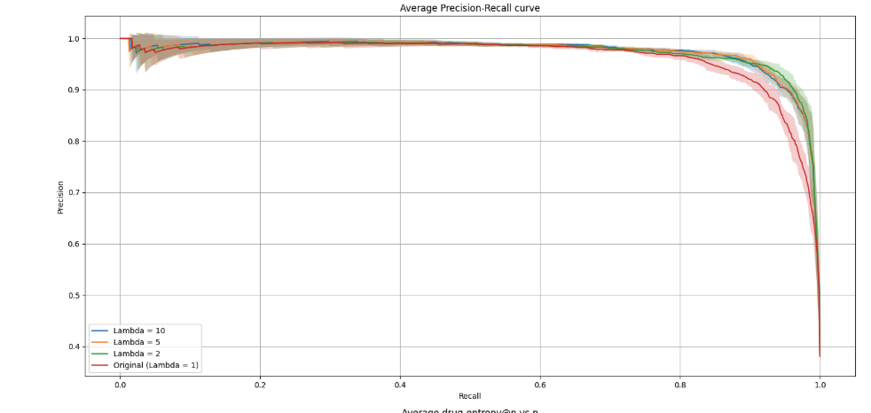
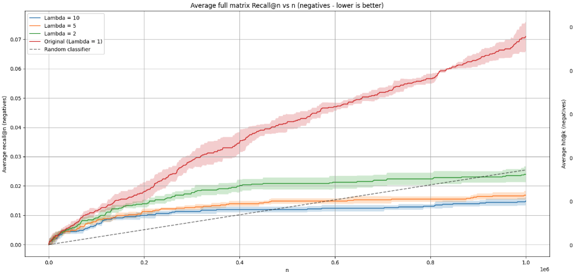
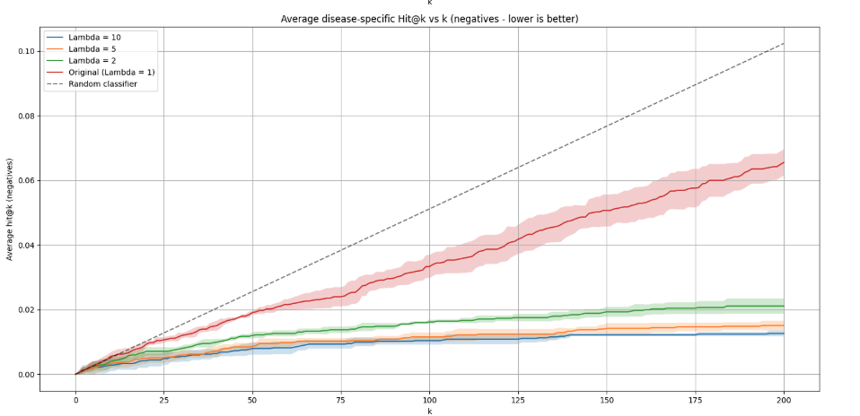
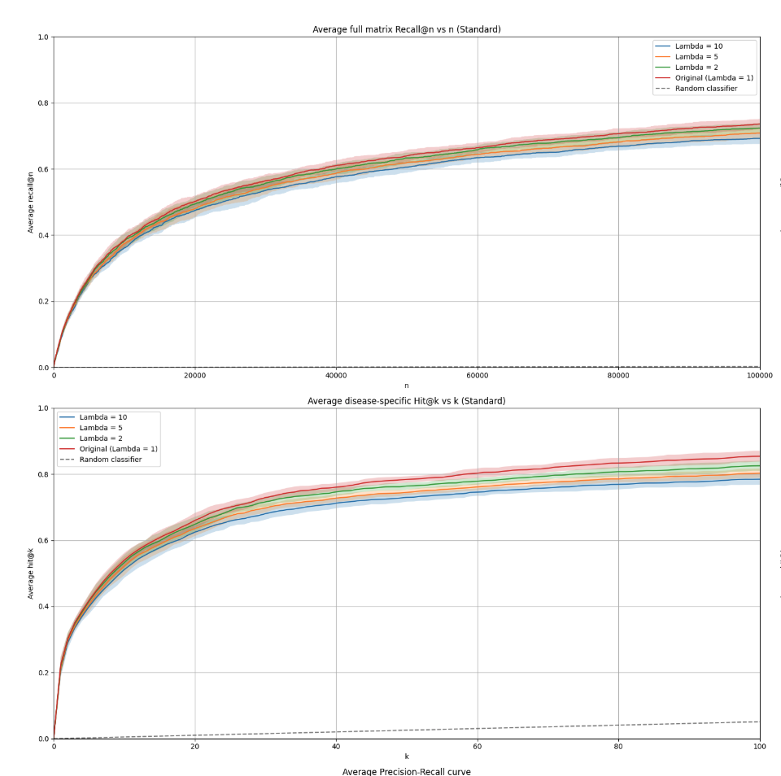
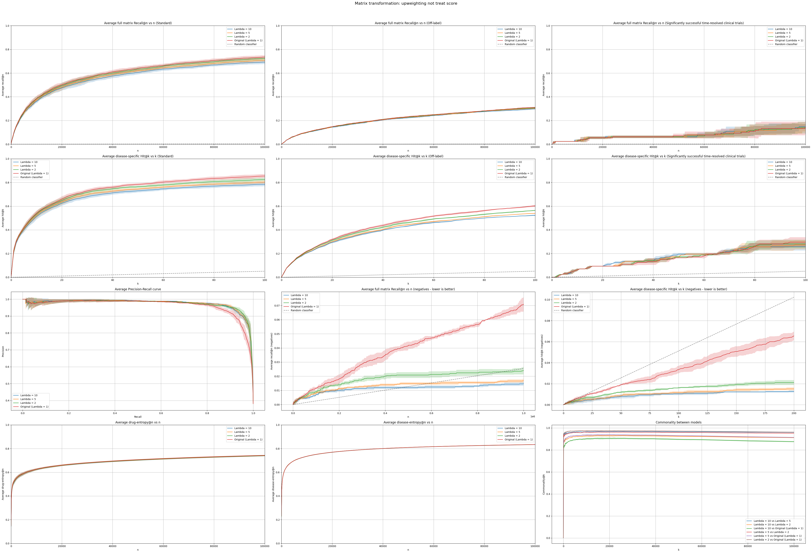

# Matrix transformations for contraindications

28 April 2025

## 1. Experiment Title
Exploring reduction of of high scoring contraindications via matrix transformations

## 2. Authors / Contributors
Alexei Stepanenko

## 3. Hypothesis

_Can the matrix transformation approach be used to reduce the number of known negative test pairs with high treat score?_

## 4. Summary

The effect on performance of applying a specific matrix transformation that effectively "boosts" the penalising effect of the not treat score is analysed. 

An improvement in negative recall@n and classification metrics is observed, indicating that we expect that the transformed scores give lower ranks to contraindication pairs on average. 
On the other hand, we observe a drop in the positive ranking metrics. The interesting thing is that the drop in positive ranking metrics is arguably modest, depending on the chosen parameters for the transformation, opening the possibility for a viable trade-off

## 5. Conclusions & Recommendations

This would likely not be a final solution to the contraindication problem but offers a method to change the "flavour" of the outputs towards less contraindications. 

Considering the simplicity of the approach, it is worth investigating it further after implementation of teh matrix transformation pipeline in the future. 

## 6. Methods

In this notebook we experiment with reducing the number of high-ranking contraindications by artificially increasing the effect of the known negative score. 

The treat score may be express as:
$$
\text{treat score} = 1 - \text{unknown score} - \text{not treat score}
$$

We will investigate the effect of the following matrix transformation:
$$
\text{transformed score} = 1 - \text{unknown score} - \Lambda\, \text{not treat score}
$$
where $\Lambda \geq 1$. 

We apply this matrix transformation to the February 2025 Tier 3 run (xg_ensemble + node2vec on RTX 2.73 (release 0.4.1)) for several values of $\Lambda$.  

## 7. Results

#### Negative full matrix recall@n, negative disease specific Hit@k and classification metrics are improved

Recall that the negative full matrix recall@n and negative disease specific Hit@k metrics the likelihood of a known test negative pair to appear in the top n or k (respectively) for full matrix or disease-specific ranking (respectively). For these metrics, smaller is generally interpreted as better. 

*Figure 1.  Negative full matrix recall@n, negative disease specific Hit@k and known positive vs known negative PRC for various values of $\Lambda$*

#### Positive full matrix recall@n and  disease specific Hit@k are decreased

The following plots are use standard ground truth pairs. We also obtain similar results for off-label pairs. 

*Figure 2.  Positive full matrix recall@n and  disease specific Hit@k for various values of $\Lambda$.*

#### Other observations

We also observe that the following:
1. The prevalence of frequent flyers is almost unaffected by application of the transformation. 
2. The commonality@k (proportion of pairs in common in top $k$) is very high considering the fluctuations in ranking metrics.  

*Figure 3. Full collection of summary plots*

## 8. Interpretation & Learnings

The mechanism by which the negative ranking metrics are improved is quite clear however the reason for decrease in positive ranking metrics is not clear, essentially given the high commonality@k values. 

One hypothesis is that this may be due to certain correlations between the treat and not treat score. This should be further investigated in future experiments. 

## 9. Supporting Materials

- [Notebook](https://github.com/everycure-org/lab-notebooks/blob/main/alexei/a_contraindications_research/1_transformation_approach_initial.ipynb)