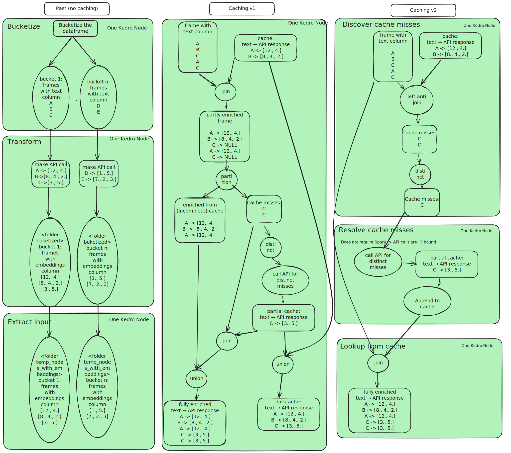

# Caching Approaches for API Based Enrichments

This document describes the current approach to optimizing data enrichment
using external APIs.

## Context

The matrix's data processing pipelines use external APIs to enrich certain
datasets. As an example, the node embeddings and node normalization steps send
data to REST APIs, and use the APIs' responses to enrich the data.

## Problem statement 

REST APIs usually have fair-use restrictions, such as the number of requests per
minute (RPM) that can be processed. Exceeding these limits typically results in
throttling: the service ignoring, sometimes even blocking, your requests for a
while. These restrictions, together with network latency cause steps in which a
large number of API calls are to be made to be slow steps. Even with zero
network latency, there is a lower bound to the duration of such steps.  We'll 
provide an example later.

The issue becomes particularly problematic when the API calls are repeated,
which is the case in the current design of the Matrix's pipelines: each
end-to-end run repeats calls to these services for the largely unchanging
datasets with millions of rows.

## Solution

Since most API calls are idempotent, simply caching the results would result in
a substantial reduction in computation time, thus saving costs.

### Current implementation

The caching strategy consists of 3 steps:

1. **Discover Cache Misses**

   - Perform a **left anti join** to identify missing entries in the cache.
   - Extract _distinct_ missing values. The reason to have distinctiveness is
     that the data to be enriched might have duplicate keys. It would be a poor
     use of time if the API has to return the same reply for identical keys.

2. **Resolve Cache Misses**

   - API calls are made only for distinct misses.
   - The results are stored in persistent storage, rather than an in-memory
     database, to save costs as the cache does not need to be queried
     constantly: the pipelines are not streaming pipelines, but batch
     pipelines.
   - The results of these lookups will be *appended* to the original cache, to
     get a cache that would not have resulted in cache misses had it been used
     from the start.

3. **Lookup from Cache**

   - A final join operation retrieves embeddings from the updated cache.

### Advantages

#### Faster pipeline execution

Caching network calls is a way to reduce computation time. Thus, it
contributes towards a goal of being able to run the end-to-end pipeline at a
higher frequency.

#### Optimized resource usage

The first and third steps are more computationally demanding than the second,
and as such are good cases for Apache Spark in the cases where we're processing
large datasets. To add some numbers here: embeddings needed to be found for 12M
strings of 100 characters each in Feb 2025.

The second step however, is a poor case for Apache Spark's distributed
computing: the process is inherently IO bound, so throwing more CPUs at the
problem won't solve it. Instead, one can typically optimize this by going for
less processes, even down to the single process level, where concurrency
techniques like threading and asynchronous IO can truly shine.

The current implementation takes that into account by separating those 3 steps
onto Kubernetes pods in Argo Workflows with different resource requirements:
whereas steps 1 and 3 can benefit from many cores, step 2 gets far less.
Each step also has different memory and possibly disk requirements, depending
on the batch size, the API responses and the volume of cache misses. With 3
separate ArgoResourceConfigs, one has this control.

#### Easier control over concurrent API calls

By having only a single process reaching out to the APIs, it becomes easier to
limit the number of concurrent API calls to not get throttled. Had this been
done with Spark, using user-defined-functions, then the number of Spark
executors (and the allocated threads) have to be taken into account as well.
With dynamic allocation (which is at the time of writing not enabled), this
becomes even trickier. It would require interprocess communication (IPC).  Note
that retry mechanisms, such as the one enabled by the [tenacity
library](https://pypi.org/project/tenacity/), alleviate the situation somewhat.
However, intelligent back-off mechanisms would still require more engineering
than a single process using semaphores and other synchronization primitives, in
combination with a retry mechanism.

### Disadvantages

#### Increased network traffic from GCS

While caching comes with an inherent increase of local network traffic, it is
offset by a decrease in external network traffic. However, this paragraph does
not focus on this part (as that is a tradeoff, typically a favorable one). No,
this is about the choice for using 3 separate pods instead of one single one (a
"fuse-node", in Matrix terminology).

As the three pods do not share a volume, nor Kedro's, nor Spark's initial
caching mechanisms can be used. These mechanisms would keep datasets obtained
over the network, e.g. those from GCS, to be stored locally between kedro
nodes/Spark jobs. At this point, we assume the cost of running with caches,
obtained from GCS is less than that of keeping a multicore machine up while
idling, waiting for network IO. Should this not be the case, an easy step to
take would be to fuse the 3 nodes, as has been done in the past. At that point
though, one may consider just creating a single kedro node and benefitting from
Spark's memory+disk caching. Such considerations are only worth it if the added
network cost outweighs the benefits of reducing resource requirements during
the second step. After an initial setup of the cache, the second step would
reduce essentially to a no-op, so that's a big win.

#### Risk of duplicate elements

This is a problem inherent to writing in parallel with concurrent workers.
While a single Spark job has mechanisms in place to ensure no two workers write
the same files, multiple concurrent jobs do not have this guarantee. As such,
this problem is present for all data-generating jobs in the Matrix project that
feature multiple workers (i.e. all of the Kedro SparkDatasets). 

There are multiple ways to tackle this:

- There are some **locking mechanisms** available for object stores, e.g.
  Google Cloud's "[Request
  Preconditions](https://cloud.google.com/storage/docs/request-preconditions)".
  The downside is that this is not built-in to Spark, so we'd be writing custom
  code.
- use of a **table format** that supports ACID transactions, like Apache
  Iceberg/Databricks Delta/Apache Hudi.
- resolving duplicates with a call to create **unique values**

The latter is the simplest (single line of code), and has been chosen. The
second option was rejected for now, as it would introduce a technology that the
core developers do not have enough experience with yet. However, its
advantages, like dataset versioning and upsert possibilities have been
highlighted, as they may prove useful in other pieces of Every Cure's
pipelines.

The downside to using the simplest approach is that over time duplicates may
end up in the cache, thus creating a situation one would not expect from a
cache (it should have unique keys). When the situation is detected, a warning
is thrown, visible in the logs. Warnings can easily be changed into Exceptions,
so that the processing would stop immediately if that is desired. However, the
chance of concurrently creating caches is considered small, just like
concurrent generation of the KG is considered a small risk.

The downside to generating a warning is that Spark will need to iterate over
the data at least twice, which for big data is to be done sparingly. In this
case, it's considered to be a small cost, since it only needs to go over a
single dataset, which isn't PiB large either. Additionally, care has been taken
to only go over it one extra time, by using a single aggregator.

## Past work

Previous iterations of the current pipeline are summarized in the graph above.
Only one other iteration has has caching implemented.

### The mapPartitions approach

The cache miss resolver step was implemented using Spark's
`mapPartitions` mechanisms. It requires a serializable callable. Objects
keeping state, like locks and database connections, cannot be used for such
purposes. The workaround is to instantiate those objects _inside_ the callable,
effectively creating them in the executor processes.

For most use cases, this won't matter: nearly all common use cases of classes
in data engineering can be written as functions, where some degree of
dependency injection is lost. However, since the function being passed to
`mapPartitions` is a parameter, one could simply create multiple functions,
each injecting its own dependency.

`mapPartitions` provides for a quick and elegant solution, since
it immediately reuses Kedro's Dataset definitions that have already been made
in the catalog for the other 2 steps in our 3-step caching mechanism. That
means we don't need to add extra catalog entries to parse a Parquet dataset
using a different engine, like Pandas, thus keeping a lighter catalog. Note
that the 2nd node (the cache miss resolver) will still use more workers if
given them. In the committed design, we have explicitly given it only a single
CPU to make best use of resources.

## Conclusion

Using a three-stage caching mechanism allows optimizing compute resources, and
reducing the time of consecutive runs substantially.

[Pandera Validation :material-skip-next:](./pandera_validation.md){ .md-button .md-button--primary }