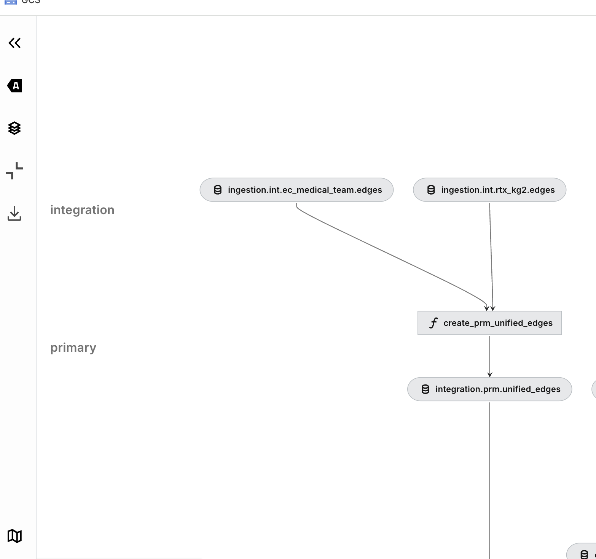

# New Data Source

This use case follows the journey of a dataset through the Kedro workflow, from raw data to its use in model training. The dataset was added by the user persona Data Scientist Dominic.

# Task

Dominic has integrated a new knowledge graph into Matrix and implemented a machine learning model for predicting drug-disease efficacy scores. We will reconstruct the steps Dominic needs to take to go from raw data to generating drug-disease predictions.

# Integrating the New Graph into the codebase

## Raw Data

Dominic has integrated a new biomedical graph, **RTX-KG2**, which is a knowledge graph consisting of node and edge data.

The data can be found at `gs://mtrx-us-central1-hub-dev-storage/data/01_RAW/KGs/rtx_kg2/v2.10.0/.` It includes two `.tsv` files (`edges_c.tsv` and `nodes_c.tsv`) and a database file (`node_synonymizer_v1.0_KG2.10.0.sqlite`) used for node synonymization process.

Dominic manually added this data to Google Cloud Storage (GCS), as there is currently no automated ingestion system. However, multiple versions of these graphs are maintained.

## Programmatic access to data

Next, let’s look at how Kedro picks up this data.

The ingestion process can be found in the following file:

`pipelines/matrix/src/matrix/pipelines/ingestion/pipeline.py`

```python
import pyspark.sql.functions as F

def create_pipeline(**kwargs) -> Pipeline:
    """Create ingestion pipeline."""
    return pipeline(
        [
            node(
                func=lambda x: x
                inputs=["ingestion.raw.rtx_kg2.nodes@spark"],
                outputs="ingestion.int.rtx_kg2.nodes",
                name="write_rtx_kg2_nodes",
                tags=["rtx_kg2"],
            ),
            node(
                func=lambda x: x,
                inputs=["ingestion.raw.rtx_kg2.edges@spark"],
                outputs="ingestion.int.rtx_kg2.edges",
                name="write_rtx_kg2_edges",
                tags=["rtx_kg2"],
            ),
        ]
    )
```

`node` object in Kedro is an arbitrary Python function performing computation.

- F.lit(): Stands for “literal” and is used to wrap a constant or fixed value in a way that it can be used as a column in PySpark DataFrame transformations.
- inputs: `ingestion.raw.rtx_kg2.nodes@spark` refers to an object defined in Kedro’s **Data Catalog.**
    - `...@spark` implies that format of the input data is a PySpark DataFrame.
- outputs: `ingestion.int.rtx_kg2.nodes` refers to an object defined in Kedro’s **Data Catalog.**
    - Absence of the `...@spark` suffix means that this dataset is not explicitly cast as PySpark DataFrame. However, if Data Catalog defines it as such, it will still be written as Spark dataframe.

`create_pipeline()` is then being called in `pipelines/matrix/src/matrix/pipeline_registry.py`

```python
from matrix.pipelines.ingestion.pipeline import (
    create_pipeline as create_ingestion_pipeline,
)

def register_pipelines() -> Dict[str, Pipeline]:
    pipelines = {}
    pipelines["ingestion"] = create_ingestion_pipeline()
    
    # more code ...
    
    return pipelines

```

⚠️ `register_pipeline()` is a special function in Kedro that defines pipelines for the entire deployment.

**Data Catalog**

[Official documentation](https://docs.kedro.org/en/stable/data/data_catalog.html)

In a Kedro project, the Data Catalog is a registry of all data sources available for use by the project. It is specified in a YAML catalog file, which maps the names of node inputs and outputs as keys in the `DataCatalog` class.

Below is an in-depth investigation into the Kedro Data Catalog:

[Data Catalog: In-depth](walkthrough_data_catalog.md)

**Example**

The node `write_rtx_kg2_nodes` reads the raw `ingestion.raw.rtx_kg2.nodes` dataset from Spark and writes it to `ingestion.int.rtx_kg2.nodes`, casting columns to literals. Variables are defined in `globals.yml`.

- **Read**: `gs://mtrx-us-central1-hub-dev-storage/kedro/data/01_raw/rtx_kg2/v2.7.3/nodes_c.tsv`
- **Write**: `gs://mtrx-us-central1-hub-dev-storage/runs/run-sept-first-node2vec-e5962a18/02_intermediate/rtx_kg2/nodes/nodes_c.tsv`

Importantly, the **version** is defined statically in the `.yml` file. On the other hand, `RUN_NAME` is pulled from enviornment variables via `run_name: ${oc.env:RUN_NAME}`. 

These environment variables are defined within `.env` file for local runs.

When ran in the cloud, the name can be specified as a part of argo workflow which gets submitted to the cluster.

```yaml

... globals.yml

data_sources:
  rtx-kg2:
    version: v2.7.3

run_name: ${oc.env:RUN_NAME}

gcs_bucket: gs://${oc.env:GCP_BUCKET}
gcp_project: ${oc.env:GCP_PROJECT_ID}

# NOTE: MLflow does not like "new options" in the mlflow.yml
# due to schema validation. Will make PR.
mlflow_artifact_root: ${gcs_bucket}/runs/${run_name}/mlflow

paths:
  # hard coded against our central data location for raw
  raw: gs://mtrx-us-central1-hub-dev-storage/kedro/data/01_raw
  int: ${gcs_bucket}/runs/${run_name}/02_intermediate
  prm: ${gcs_bucket}/runs/${run_name}/03_primary
  feat: ${gcs_bucket}/runs/${run_name}/04_feature
  model_input: ${gcs_bucket}/runs/${run_name}/05_model_input
  models: ${gcs_bucket}/runs/${run_name}/06_models
  model_output: ${gcs_bucket}/runs/${run_name}/07_model_output
  reporting: ${gcs_bucket}/runs/${run_name}/08_reporting
  
...

node(
    func=lambda x: x,
    inputs=["ingestion.raw.rtx_kg2.nodes@spark"],
    outputs="ingestion.int.rtx_kg2.nodes",
    name="write_rtx_kg2_nodes",
    tags=["rtx_kg2"],
)

...

ingestion.raw.rtx_kg2.nodes@spark:
  <<: *_spark_csv
  filepath: ${globals:paths.raw}/rtx_kg2/${globals:data_sources.rtx_kg2.version}/nodes_c.tsv
  file_format: csv
  load_args:
    sep: "\t"
    header: false
	      
	...
	
	ingestion.int.rtx_kg2.nodes:
  <<: [*_spark_parquet, *_layer_int]
  filepath: ${globals:paths.integration}/rtx_kg2/nodes

```

## As visible in Kedro-Viz




### Kedro Run

**How is this pipeline executed?**

The pipeline object is passed to Kedro’s `register_pipelines()` function, where it becomes exposed to commands like `kedro run -e local -p ingestion`. This command triggers the execution of the pipeline locally, in the `local` environment, on the local machine.

## Summary 

Dominic has successfully integrated a new knowledge graph into the codebase, and added appropriate nodes to data catalog. The new pipeline can be now viewed in Kedro-Viz, and executed to produce node embeddings.

Now, we will look at how this pipeline can be executed.

# Execution

`Matrix` pipelines were intended as environment-agnostic, and can be executed locally or in the cloud.
In this section, we will look at how to execute those pipelines in both environments.
It should be added that most pipelines rely on additional services being present (eg. MLFlow, Neo4j) and will most likely fail if triggered directly, via `kedro run`.

## Local
### via Makefile & Docker

To execute this pipeline locally, Data Scientist Dominic would follow steps similar to the ones outlined in the [Local Setup guide](../../first_steps/local-setup.md)

However, this pipeline does not have dependencies on any external services, such as Neo4j or MLFlow. Therefore, it can be executed directly via the `kedro` CLI interface.

```bash
kedro run -e cloud -p ingestion
```

This will use data catalog from `cloud` environment, and trigger `ingestion` pipeline, and should result in data being generated in GCS. However, execution of the pipeline will happen locally.

## Cloud
### Argo Workflows

The primary mechanism through which we execute our pipelines is Argo Workflows. Our kedro pipeline is translated into an Argo Workflow template that contains the tasks to execute, their lineage, and there resource requests.

Matrix uses Jinja2 templating to generate a dynamic argo template as per user request, which is being submitted to the K8s cluster.

Argo schema is generated using custom function `kedro experiment run -- ...`, that parametrizes it with use-case specific requests.

The `experiment run` command does the following:

1. Retrieve the run name.
2. Verify that dependencies - `gcloud`, `kubectl` are installed.
3. Build docker image from the current state of the pipeline, and tag it with user name. 
4. Generate Argo Workflow template, parametrizing it according to the run specs.
5. Ensure K8s namespace is available.
6. Apply the Argo Workflow Template, and deploy it to Argo / K8s `kubectl apply -f templates/argo-workflow-template.yml`
7. Submit workflow to Argo.

See `pipelines/matrix/src/matrix/cli_commands/experiment.py` for more details.