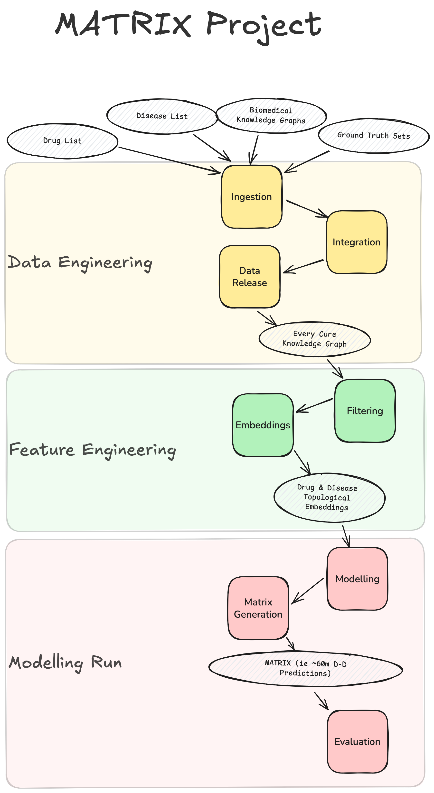

# Matrix Pipeline

The Matrix pipeline is Every Cure's core data science pipeline for drug repurposing predictions. It utilizes Biomedical Knowledge Graphs and Machine Learning to identify most promising candidates for drug repurposing. Below you can find a schematic representation of the pipeline

At a high level, it's composed of three stages:

1. **Data Engineering Stage** - this is where data sources such as multiple biomedical knowledge graphs get ingested, integrated, and released as a unified biomedical KG. It includes ingestion, integration, and release steps of KGs as well as supplementary datasets for inference/testing.

2. **Feature Engineering Stage** - this is where take the unified biomedical KG, apply custom filters for optimized performance, and generate topological embeddings from the knowledge graph which can be then used as input for ML models. 

3. **Modelling Stage** - this is where we train and evaluate ML models to predict drug-disease treatment relationships. Here, we produce our matrix - a comprehensive "all-vs-all" prediction matrix containing treatment probability scores for every possible drug-disease combination in our system.

The pipeline enables systematic drug repurposing by scoring the potential of drugs to treat diseases based on patterns learned from biomedical knowledge graphs and known drug-disease relationships.

For an in-depth understanding of each pipeline stage and modular steps, please see the [pipeline documentation](../../pipeline/index.md) - this is where we describe our methods and code in more detail. All of the steps described above are reflected in our kedro pipeline which you will learn more about in the next section.

[Learn about our tech stack :material-skip-next:](./tech_stack.md){ .md-button .md-button--primary }
