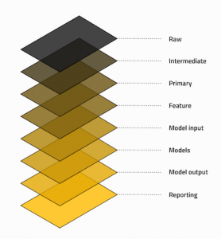

Our drug repurposing pipeline relies on many libraries and components but some of the most critical ones are:

* **Python** - Our primary programming language, used throughout the codebase for data processing, analysis and machine learning
* **Docker** - Containerization platform that ensures consistent environments across development and production
* **uv** - Modern Python package installer and resolver that we use instead of pip for faster, more reliable dependency management
* **Java Virtual Machines** - Required for Apache Spark operations which we use for distributed data processing
* **gcloud SDK** - Google Cloud Platform tools that enable interaction with our cloud infrastructure and services
* **Argo Workflows** - Kubernetes-native workflow engine that orchestrates our pipeline execution in production
* **Kubernetes** - Container orchestration platform where our pipeline runs in production environments

!!! Google Cloud
    Our platform leverages Google Cloud Platform as Cloud provider. Many parts of the onboarding deep-dive guide or documentation will depend on or refer to GCP - these will be marked appropriately.

Whilst it's not essential to understand each part of the stack to contribute or run the pipeline, we encourage everyone to learn more about these useful technologies. 

## Pipeline framework: Kedro

The most essential library for our pipeline is [Kedro](https://kedro.org) which is used as our data pipelining framework. It provides crucial structure and modularity to our codebase, enabling reproducible data science workflows and making our pipeline maintainable and scalable.

!!! info
    Kedro is an open-source framework to write modular data science code. We recommend
    checking out the [Kedro documentation](https://docs.kedro.org/en/stable/) website as well as deep-dive into kedro and custom extensions we produced in the [deep dive section](../deep_dive/kedro_extensions.md).
    
Below is a 5 minutes intro video to Kedro:

<iframe width="800" height="480" src="https://www.youtube.com/embed/PdNkECqvI58?si=_luhLzYsI3F7dQ2w&amp;start=70" title="YouTube video player" frameborder="0" allow="accelerometer; autoplay; clipboard-write; encrypted-media; gyroscope; picture-in-picture; web-share" referrerpolicy="strict-origin-when-cross-origin" allowfullscreen></iframe>

As mentioned in the video, kedro is a rather light framework, that comes with the following [key concepts](https://docs.kedro.org/en/stable/get_started/kedro_concepts.html#):

1. __Project template__: Standard directory structure to streamline project layout, i.e., configuration, data, and pipelines.
1. __Data catalog__: A lightweight abstraction for datasets, abstracting references to the file system, in a compact configuration file.
1. __Pipelines__: A `pipeline` object abstraction, that leverages `nodes` that plug into `datasets` as defined by the data catalog[^1].
1. __Environments__: [Environments](https://docs.kedro.org/en/stable/configuration/configuration_basics.html#configuration-environments) allow for codifying the execution environment of the pipeline.
1. __Visualization__: Out-of-the-box pipeline visualization based directly on the source code.

Our core pipelines' kedro project directory can be found in `pipelines/matrix` directory with an associated `README.md` with instructions.

[^1]: Kedro allows for fine-grained control over pipeline execution, through the [kedro run](https://docs.kedro.org/en/stable/nodes_and_pipelines/run_a_pipeline.html) command.

<!--
FUTURE: Commented this out for the time being, we may want to add this back in, but need to clearly explain how we structure our catalog (pipeline centric) vs. how kedro normally does it (layers)

### Data layer convention

Data used by our pipeline is registered in the _data catalog_. To add additional structure to the catalog items, we organise our data according to the following convention:

1. __Raw__: Data as received directly from the source, no pre-processing performed.
2. __Intermediate__: Data with simple cleaning steps applied, e.g., correct typing and column names.
3. __Primary__: Golden datasets, usually obtained by merging _intermediate_ datasets.
4. __Feature__: Primary dataset enriched with features inferred from the data, e.g., enriching an `age` column given a `date-of-birth` column.
5. __Model input__: Dataset transformed for usage by a model.
6. __Models__: Materialized models, often in the form of a pickle.
7. __Model output__: Dataset containing column where model predictions are run.
8. __Reporting__: Any datasets that provide reporting, e.g., convergence plots.

!!! tip
    We name entries in our catalog according to the following format:

    `<pipeline>.<layer>.<name>`

-->

[Let's understand now how kedro fits our repo structure :material-skip-next:](./repo_structure.md){ .md-button .md-button--primary }
