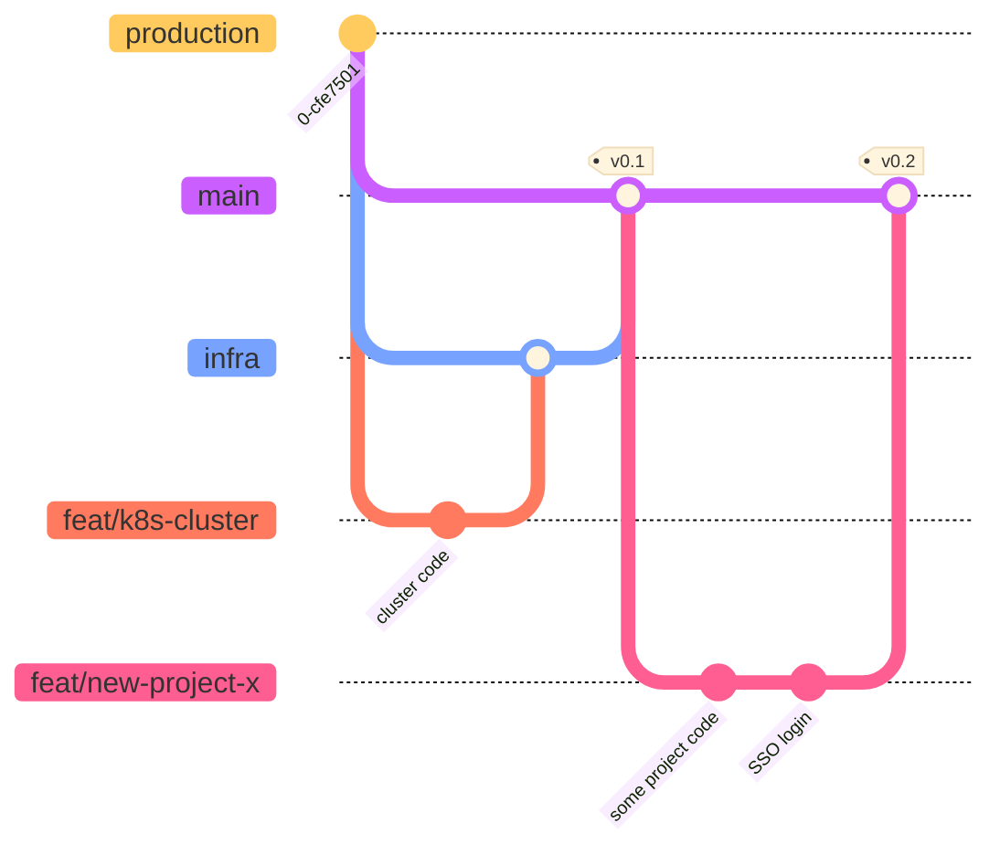

# Contribution Standards

## Formatting and Style

We install various style and formatting enforcers in our `pre-commit` command which is configured in `.pre-commit-config.yaml` in the root of the repository. These include `ruff` for python and `terraform` standards. 

!!! tip
    Definitely recommend installing `ruff` into VSCode and make use of the automatic formatting, imports handling etc. [Extension link](https://marketplace.visualstudio.com/items?itemName=charliermarsh.ruff)

## Documentation

- All documentation is stored in the `docs` folder. To avoid duplication, if we want to store the same information somewhere else (e.g. as a README.md) we should use symbolic links (`ln`) to reference these documents from other parts of the repository. This makes the documentation easily discoverable when browsing the code in an IDE. For example, to link a `README.md`:
    
    ```
    ln -s docs/data/datasets.md pipelines/src/matrix/datasets/readme.md
    ```
    

## Version Control and Branching

- **Branch Naming Convention**: Use clear and descriptive branch names such as `feat/abc` for new features or `dev/abc` for developer centric work. This helps in identifying the purpose of each branch at a glance. Common prefixes are `dev/<person-name>`, `feat/feature-name` or `fix/fix-description`
- **Early Feedback with Pull Requests**: Create Pull Requests (PRs) as drafts. This allows team members to provide early feedback and iterate quickly. Example workflow:
    
    ```
    git checkout -b feat/new-feature
    git push origin feat/new-feature
    ```
    
    Then, create a draft PR on GitHub for initial feedback.
    
- **GitHub Releases**: We use [GitHub Releases](https://docs.github.com/en/repositories/releasing-projects-on-github/about-releases) to manage and track software releases. This includes using semantic versioning to tag branches:
    
    ```
    git tag -a v1.0.0 -m "Initial release"
    git push origin v1.0.0
    
    ```

- **Special branches**: We have 2 *special* branches: `main` and `infra`. The main branch is used as is commonly done on GitHub. the `infra` branch on the other hand is used to deploy our infrastructure. Both are protected but `infra` may be operated on by our devops engineers to adjust parameters more quickly without sending many PRs. The flow across branches is visualized below. 


    
## Code Review

Code review is a crucial part of our collaborative development process and a fantastic opportunity for mutual learning and growth. We believe that every code review is a chance to:

- Share knowledge and best practices across the team
- Learn new approaches and techniques from colleagues
- Improve code quality through constructive feedback
- Build a stronger, more cohesive engineering culture

We encourage reviewers to:
- Ask questions about implementation choices to understand different perspectives
- Share alternative approaches that might be helpful
- Point out clever solutions that they learned from
- Take time to understand the context and goals of the changes

Similarly, we encourage code authors to:
- Explain their thought process and design decisions
- Be open to suggestions and alternative viewpoints
- Use the review process as an opportunity to mentor others
- View feedback as a chance to improve and learn

To facilitate efficient reviews:
- Please assign reviewers to your PRs
- Being assigned means that you are expected to review the PR, if you cannot due to workload, please let the author know so they can find someone else

!!! note
    We have only one matrix core-maintainers group which is responsible for reviewing
    PRs. Each PR gets auto assigned to 1 person but the creator of a PR is still expected
    to manually assign someone who knows the codebase and can give proper feedback.
    However, independent of what contribution, at least 1 core maintainer needs to
    approve a PR before it can be merged.
    
    !!! tip
    Remember, code review is not about finding fault - it's about learning from each
    other and collectively improving our codebase. That said, if you spot a bug 🐛,
    please point it out 🙃.

## Core Maintainers

[This group](https://github.com/orgs/everycure-org/teams/core-maintainers/) is used to manage the matrix core maintainers. Please request access and let the team know if you need to be added. This enables you to approve PRs for the matrix monorepo.

## Project Organization

- **Monorepo Approach**: We use a [monorepo](https://monorepo.tools/#what-is-a-monorepo) for MATRIX. This helps in maintaining a single repository for all parts, facilitating easier dependency management, and consistent development practices. It also encourages us all to look left and right and work together as a larger team rather than working in silos. If you want to understand the reason [why we went for this](https://monorepo.tools/#why-a-monorepo), the two links in this paragraph should give you an idea. 
- **Makefile for Automation**: Use a `Makefile`s to streamline common development tasks, such as setting up the environment, running tests, and deploying code. Example Makefile:
    
    ```
    setup:
        pip install -r requirements.txt
    
    test:
        pytest tests/
    
    run:
        kedro run
    ```
    

## Tools and Libraries

- **Pydantic and FastAPI**: For API creation, we use [Pydantic](https://pydantic-docs.helpmanual.io/) for data validation and settings management, and [FastAPI](https://fastapi.tiangolo.com/) for building fast, reliable, and high-performance APIs. Example usage of FastAPI and Pydantic:
    
    ```python
    from fastapi import FastAPI
    from pydantic import BaseModel
    
    app = FastAPI()
    
    class Item(BaseModel):
        name: str
        price: float
        is_offer: bool = None
    
    @app.post("/items/")
    async def create_item(item: Item):
        return item
    
    ```

- **Pandera**: We (intend) to use [pandera](https://pandera.readthedocs.io/en/stable) for data validation of datasets in our pipeline. We currently still use a proprietary library ("data fabricator") but will remove this before going open source. Follow [this issue](https://github.com/everycure-org/matrix/issues/213) for more.
    

## Rules on using AI to write code

We encourage the use of AI to write code. However, we ask that you follow these guidelines:

- Add the following headers/comments to each file / function that mainly or exclusively written by AI:
    ```python
    # NOTE: This file was partially generated using AI assistance.
    <!-- NOTE: This file was partially generated using AI assistance. -->
    // NOTE: This file was partially generated using AI assistance.
    ```

    Please add the comments _above_ a function or class or at the top of the file. Use in-line comments as we primarily want this as part of the codebase, not as part of the documentation.


## Infrastructure Development

- We use Terraform Cloud to codify our infrastructure. We have a central [`core`](https://github.com/everycure-org/core) inside our organization where we define all org-level infrastructure (such as creating GCP projects and adjusting quotas)