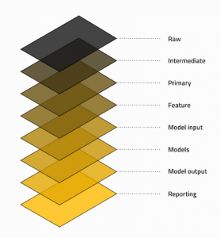

# Onboarding

Welcome to the Matrix onboarding guide! This document provide an introduction to the codebase, and guide you through the process of setting up your local environment.

## Preliminaries

The Matrix project contains a pipeline and auxiliary services designed to identify drug-disease pair candidates for drug-repurposing.

Moreover, the codebase contains the defintion of the infrastructure to run the pipeline on Google Cloud.

## Pre-requisites

This pages assumes basic knowledge of:

- Docker
- Docker-compose
- Python
- YAML

### Docker

Make sure you have [docker](https://www.docker.com/) and [docker-compose](https://docs.docker.com/compose/) installed. Docker can be downloaded directly from the from the [following page](https://docs.docker.com/desktop/install/mac-install/). Once installed, proceed with the following command:

```bash
brew install docker-compose
```

> 💡 The default settings of Docker have rather low resources configured, you might want to increase those in Docker desktop.

### Java

Our pipeline uses Spark for distributed computations, which requires Java under the hood.
```
brew install openjdk@11
```

> 🆘 Don't forget to link your Java installation using the instructions prompted after the downloaded.

## Local setup

Our codebase features code that allows for fully localized execution of the pipeline and its' auxiliary services using `docker-compose`. The deployment consists of two files that can be [merged](https://docs.docker.com/compose/multiple-compose-files/merge/) depending on the intended use, i.e.,

1. The base `docker-compose` file defines the runtime services, i.e.,
    - Neo4J graph database
    - [Mockserver](https://www.mock-server.com/) implementing a OpenAI compatible GenAI API
        - This allows for running the full pipeline e2e without a provider token
2. The `docker-compose.test` file adds in the pipeline container for integration testing
    - This file is used by our CI/CD setup and can be ignored for local development.


After completing the installation, run the following command from the `deployments/compose` directory to bring up the services.

```bash
docker-compose up
```

> Alternatively, you can add the `-d` flag at the end of the command to run in the background.

To validate whether the setup is running, navigate to [localhost](http://localhost:7474/) in your browser, this will open the Neo4J dashboard. Use `neo4j` and `admin` as the username and password combination sign in.

## Kedro

> 🔎 Kedro is an open-source framework to write modular data science code. We recommend checking out the [introduction video](https://docs.kedro.org/en/stable/introduction/index.html).

We're using [Kedro](https://kedro.org/) as our data pipelining framework. Kedro is a rather light framework, that comes with the following [key concepts](https://docs.kedro.org/en/stable/get_started/kedro_concepts.html#):

1. __Project template__: Standard directory structure to streamline project layout, i.e., configuration, data, and pipelines.
2. __Data catalog__: A lightweight abstraction for datasets, abstracting references to the file system, in a compact configuration file.
3. __Pipelines__: A `pipeline` object abstraction, that leverages `nodes` that plug into `datasets` as defined by the data catalog[^1].
4. __Vizualiation__: Out-of-the-box pipeline visualization based directly on the source code.

[^1]: Kedro allows for fine-grained control over pipeline execution, through the [kedro run](https://docs.kedro.org/en/stable/nodes_and_pipelines/run_a_pipeline.html) command.

### Data layer convention

Data used by our pipeline is registered in the _data catalog_. To add additional structure to the catalog items, we organise our data according to the following convention:

1. __Raw__: Data as received directly from the source, no pre-processing performed.
2. __Intermediate__: Data with simple cleaning steps applied, e.g., correct typing and column names.
3. __Primary__: Golden datasets, usually obtained by merging _intermediate_ datasets.
4. __Feature__: Primary dataset enriched with features inferred from the data, e.g., enriching an `age` column given a `date-of-birth` column.
5. __Model input__: Dataset transformed for usage by a model.
6. __Models__: Materialized models, often in the form of a pickle.
7. __Model output__: Dataset containing column where model predictions are ran.
8. __Reporting__: Any datasets that provide reporting, e.g., convergence plots.

> 💡 We name entries in our catalog according to the following format:
>
>  `<pipeline>.<layer>.<name>`



### Data fabrication

> 🔎 For more information regarding the fabricator, navigate to `pipelines/matrix/packages/data_fabricator`.

Our pipeline operates on large datasets, as a result the pipeline may take several hours the complete. Unfortunately, large iteration time leads to decreased developer productivity. For this reason, we've established a data fabricator to enable test runs on synthetic data.

To seamlessly run the same codebase on both the fabricated and the production data, we leverage [Kedro configuration environments](https://docs.kedro.org/en/stable/configuration/configuration_basics.html#configuration-environments).

The situation is depicted below, in the `base` environment our pipeline will plug into the datasets as produced by our fabricator pipeline, whereas the `prod` environment plugs into the production system.

```bash
# Pipeline uses the base, i.e., local setup by default.
kedro run -p fabricator
kedro run

# To leverage the production datasets
kedro run --env prod
```


### Dependency injection

At the end of the day, data science code is very configuration heavy, and is therefore often flooded with constants. Consider the following example:

```python
def train_model(
    data: pd.DataFrame,
    features: List[str],
    target_col_name: str = "y"
) -> sklearn.base.BaseEstimator:

    # Initialise the classifier
    estimator = xgboost.XGBClassifier(tree_method="hist")

    # Index data
    mask = data["split"].eq("TRAIN")
    X_train = data.loc[mask, features]
    y_train = data.loc[mask, target_col_name]

    # Fit estimator
    return estimator.fit(X_train.values, y_train.values)
```

While the code above is easily generalizable, its highly coupled to the `xgboost.XGBClassifier` object. We leverage the [dependency injection](https://www.geeksforgeeks.org/dependency-injectiondi-design-pattern/) pattern to declare the `xgboost.XGBClassifier` as configuration, and pass it into the function as opposed to constructing it within. See the example below:

```yaml
# Contents of the parameter file, were indicating that
# `estimator` should be an object of the type `sklearn.base.BaseEstimator`
# that should be instantiated with the `tree_method` construction arg.
estimator:
    object: sklearn.base.BaseEstimator
    tree_method: hist
```

```python
# inject_object() recorgnizes configuration in the above format,
# and ensures that the decorated function receives the instantiated 
# objects.
from refit.v1.core.inject import inject_object

@inject_object()
def train_model(
    data: pd.DataFrame,
    features: List[str],
    estimator: sklearn.base.BaseEstimator, # Estimator is now an argument
    target_col_name: str = "y",
) -> sklearn.base.BaseEstimator:

    # Index data
    mask = data["split"].eq("TRAIN")
    X_train = data.loc[mask, features]
    y_train = data.loc[mask, target_col_name]

    # Fit estimator
    return estimator.fit(X_train.values, y_train.values)
```

```python
def create_pipeline(**kwargs) -> Pipeline:
    return pipeline(
        [
            node(
                func=train_model,
                inputs=[
                    ...
                    "params:estimator", # Pass in the parameter
                    ...
                ],
                ...
            ),
            ...
        ]
```

The dependency injection pattern is an excellent technique to clean configuration heavy code, and ensure maximum re-usability.

### Dynamic pipelines

> 🔎 Dynamic pipelining is a rather new concept in Kedro. We recommend checking out the [Dynamic Pipelines](https://getindata.com/blog/kedro-dynamic-pipelines/) blogpost. This pipelining strategy heavily relies on Kedro's [dataset factories](https://docs.kedro.org/en/stable/data/kedro_dataset_factories.html) feature.

Given the experimental nature of our project, we aim to produce different model flavours. For instance, a model with static hyper-parameters, a model that is hyper-parameter tuned, and an ensemble of hyper-parameter tuned models, etc.

Dynamic pipelines in Kedro allow us to do exactly this. We're defining a single pipeline skeleton, which is instantiated multiple times, with different parameters.

## Pipeline

### Overview

Roughly speaking, our pipeline consists of five logical stages, i.e., ingestion, integration, embedding, modelling, and evaluation.


#### Ingestion

The ingestion pipeline aims to ingest all the downstream data in BigQuery, our data warehouse of choice. Data from different sources is assigned metadata for lineage tracking.

> To date our pipeline only ingests data from the RTX-KG2 source.

#### Integration

The integration stage aims to produce our internal knowledge-graph, in [biolink](https://biolink.github.io/biolink-model/) format. As we ingest data from different sources, entity resolution becomes a prevalent topic. The integration step consolidates entities across sources to avoid data duplication in the knowledge graph.

> To data, this step is missing as we're only ingesting data from a single source.

#### Embeddings

Embeddings are vectorized representations of the entities in our knowledge graph. These are currently computed using two steps:

1. GenAI model is used to compute individual node embeddings
2. GraphSage embedding algorithm is ran on the node embeddings to produce topological embeddings

> Our graph database, i.e., Neo4J comes with out-of-the-box functionality to compute both node and topological embeddings in-situ. The Kedro pipeline orchestrates the computation of these.


#### Evaluation

The evaluation pipeline computes various metrics in order to assess the performance of the models trained in the previous stages. 

Currently, we have the following evaluation methods. 

1. *Threshold-based classification metrics for ground truth data*. Measures how well the model classifies ground truth positive and negatives using threshold-based metrics such as accuracy and F1-score.
2. *Threshold-independent metrics for ground truth data*. Measures how well the model classifies ground truth positive and negatives using threshold-independent metrics such as AUROC.
3. *All vs. all ranking with all drugs x test diseases matrix.*. Gives information on all drugs vs all disease ranking performance of models by using threshold-independent metrics such as AUROC and synthesised negatives. The construction of the synthesised negatives are based on a matrix of drug-disease pairs for a given list of all drugs and the list of disease appearing in the ground-truth positive test set. 
4. *Disease-specific ranking*. Measures the performance of the model at ranking drugs for a fixed disease using metrics such as Hit@k and mean reciprocal rank (MRR). 


