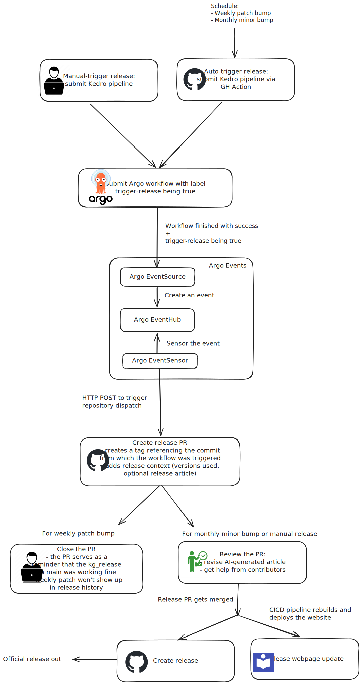

## Overview
The workflow automates the release process of a data-release/kg-release pipeline, allowing for both manual and scheduled triggers. It ensures seamless integration with GitHub Actions and Argo workflows while managing versioning and release updates efficiently.

## Triggering Mechanisms
There are two ways to trigger a release:

1. Manual Trigger

   A person manually triggers a pipeline encompassing the data-release pipeline by running a kedro CLI command from their local machine. You can find more information in [this runbook](../runbooks/01_releases.md)
2. Auto-Trigger via [GitHub Actions](https://github.com/everycure-org/matrix/blob/main/.github/workflows/submit-kedro-pipeline.yml)

   The release is automatically triggered based on a schedule:

   - Weekly: the "patch" version is increased (aka a "patch bump")
   - Monthly: the "minor" version is increased (aka a "minor bump")

## Workflow Execution
Regardless of the trigger type, the process follows these steps:

1. **Submit Argo Workflow**
   - The [Argo workflow](https://github.com/everycure-org/matrix/blob/main/pipelines/matrix/templates/argo_wf_spec.tmpl) is rendered and submitted.
2. **Argo Events Creation and Routing**
   - Once the workflow is finished, [Argo EventSource](https://github.com/everycure-org/matrix/blob/main/infra/argo/applications/data-release/templates/BuildDataReleaseEventSource.yaml) creates a data-release event.
   - [Argo EventBus](https://github.com/everycure-org/matrix/blob/main/infra/argo/applications/data-release/templates/DeployEventbus.yaml) manages and routes the event.
3. **Trigger Repository Dispatch**
   - [Argo EventSensor](https://github.com/everycure-org/matrix/blob/main/infra/argo/applications/data-release/templates/BuildDataReleaseSensorWithReleaseVersion.yaml) listens for the event and sends an HTTP POST request to trigger the repository dispatch.

## Creating the Release Pull Request
Once the repository dispatch is triggered:

- A **release PR** is created via [GitHub Actions](https://github.com/everycure-org/matrix/blob/main/.github/workflows/create-release-pr.yml).
- The GitHub action executes:
  - **Tagging**: A tag referencing the commit from which the workflow was triggered.
  - **Generating release context**, including release context json file and an optional release article, which are added to the PR.
  - **Deploying the KG dashboard**: The [KG dashboard](https://data.dev.everycure.org/versions/latest/evidence/) is deployed with the new release version.

## PR Handling

- **For Weekly Patch Bumps**:
  - The PR is closed: it only serves as a reminder that the `kg_release` pipeline on the main branch was working fine.
  - Weekly patches do not appear in the [Release History](../../releases/release_history.md) since the release context json file is not merged into `main`.

- **For Monthly Minor Bumps & Manual Releases**:
  - The PR is reviewed: the AI-generated article is revised.
  - Once approved, the PR is merged.

## Creating a Release

Once the release PR is merged:
- The **official release** is created in GitHub via [GitHub Actions](https://github.com/everycure-org/matrix/blob/main/.github/workflows/create-post-pr-release.yml).
- The **CI/CD pipeline rebuilds and deploys the website** to update the [release webpage](https://docs.dev.everycure.org/releases/).

## Additional Resources
- [Create a Release](../runbooks/01_releases.md)
