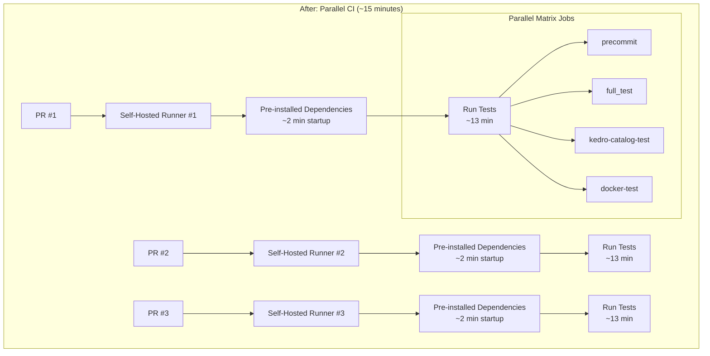

# ADR: CI Optimization with GitHub Actions Self-Hosted Runners

**Status**: Accepted  
**Date**: 2025-09-03  
**Deciders**: Team AI Platform
**Technical Story**: [AIP-517] - Optimize CI process to reduce runtime from 50 minutes to 15 minutes

## Context and Problem Statement

Our CI/CD pipeline was experiencing significant performance bottlenecks that were impacting development velocity:

- **Sequential CI Execution**: CI jobs were running sequentially, with each PR waiting for previous PR's CI to complete
- **Long CI Duration**: Each matrix-ci run took approximately 30 minutes to complete
- **Queue Accumulation**: With multiple PRs, CI wait times could extend to almost 2 hours
- **Resource Inefficiency**: GitHub-hosted runners required downloading and installing dependencies on every run
- **Development Friction**: Long CI times were blocking PR merges and slowing development cycles

The root cause was a combination of:

1. Sequential execution model where CI jobs queued behind each other
2. Cold-start overhead on GitHub-hosted runners (Python setup, dependency installation, Docker setup)
3. Limited concurrency with shared GitHub-hosted runner pools

## Decision

We decided to implement GitHub Actions self-hosted runners on our GKE cluster using Actions Runner Controller (ARC) with the following architecture:

### 1. Auto-Scaling Self-Hosted Runners

- Deploy ephemeral runners (one pod per job) for reliability
- Auto-scale from 0 to 50 runners based on GitHub Actions queue
- Use e2-standard-8 instances (8 vCPUs, 32GB RAM) for right-sizing

### 2. Custom Runner Images

- Build custom GitHub runner images with pre-installed dependencies:
  - Python 3.11 via pyenv
  - Java OpenJDK 17
  - Build tools (make, gcc, development libraries)
  - Docker-in-Docker support
- Host images in Google Artifact Registry for fast startup

### 3. Parallel CI Architecture

- Enable parallel execution of CI jobs across multiple runners
- Remove sequential dependencies between PR CI runs
- Implement matrix strategy for parallel test execution within jobs

## CI Flow Comparison

```mermaid
graph TD
    subgraph "Before: Sequential CI (30-120 minutes)"
        PR1[PR #1] --> GH1[GitHub Hosted Runner]
        GH1 --> Install1[Install Dependencies<br/>~5 min]
        Install1 --> Test1[Run Tests<br/>~25 min]
        Test1 --> PR2[PR #2 Queued]
        PR2 --> GH2[GitHub Hosted Runner]
        GH2 --> Install2[Install Dependencies<br/>~5 min]
        Install2 --> Test2[Run Tests<br/>~25 min]
        Test2 --> PR3[PR #3 Queued]
        PR3 --> GH3[GitHub Hosted Runner]
        GH3 --> Install3[Install Dependencies<br/>~5 min]
        Install3 --> Test3[Run Tests<br/>~25 min]
    end
```

## Consequences

### Positive

✅ **Performance Gains**:

- **50% reduction in CI time**: From 30 minutes to ~15 minutes per CI run
- **Parallel execution**: Multiple PRs can run CI simultaneously without queuing
- **Fast startup**: Pre-installed dependencies eliminate cold-start overhead

✅ **Development Velocity**:

- No more 2-hour CI queues during peak development periods
- Faster feedback loops for developers
- Reduced PR merge bottlenecks

✅ **Cost Optimization**:

- Scale-to-zero when no jobs are queued (0 runners idle cost)
- Right-sized instances (e2-standard-8) for optimal price/performance
- Reduced overall GitHub Actions minutes consumption

✅ **Reliability & Security**:

- Ephemeral runners (fresh pod per job) prevent cross-contamination
- Docker-in-Docker support maintains full Docker capabilities
- Dedicated node pools with proper taints and tolerations

### Negative

⚠️ **Operational Overhead**:

- Additional infrastructure to maintain (ARC controller, runner images)
- More complex troubleshooting compared to GitHub-hosted runners
- Need to manage custom runner image updates

⚠️ **Resource Management**:

- Need to monitor and tune auto-scaling parameters
- Potential for resource over-provisioning during peak usage
- Docker storage management in ephemeral environments

⚠️ **Limitations**:

- Docker Compose compatibility issues (workaround: use `docker run`)
- Dependency on GKE cluster availability
- Custom image maintenance burden

### Technical Debt

🔧 **Monitoring & Observability**:

- Need comprehensive monitoring of runner health and performance
- Cost tracking and optimization analysis
- Performance metrics collection for continuous improvement

🔧 **Documentation & Training**:

- Updated deployment and maintenance procedures

## Implementation Details

### Key Components

1. **Actions Runner Controller (ARC)**: Kubernetes operator managing runner lifecycle
2. **Custom Runner Images**: Pre-built images with dependencies hosted in Artifact Registry
3. **ArgoCD Applications**: Infrastructure-as-code deployment via GitOps
4. **Auto-scaling Configuration**: 0-50 runners, 30s scale-up, 60s scale-down grace periods

### Configuration Files

- `/infra/argo/app-of-apps/templates/gha-runner-scale-set.yaml` - ArgoCD application
- `/infra/github-runner-image/Dockerfile` - Custom runner image
- `/.github/workflows/build_and_upload_image_for_github_runner_set_k8s.yml` - Image build pipeline

### Usage

Replace `runs-on: ubuntu-latest` with `runs-on: gha-runner-scale-set` in GitHub Actions workflows.

## Success Metrics

### Target Goals (Achieved ✅)

- **CI Duration**: Reduce from 30 minutes to 15 minutes ✅
- **Parallel Execution**: Enable simultaneous CI runs for multiple PRs ✅
- **Queue Elimination**: Remove 2-hour CI wait times during peak periods ✅

### Ongoing Metrics to Monitor

- Average CI completion time
- Runner utilization rates
- Cost per CI run
- Developer satisfaction with CI performance

## Future Considerations

1. **Enhanced Caching**: Implement persistent storage for Docker layer caching
2. **Runner Pool Optimization**: Fine-tune auto-scaling parameters based on usage patterns
3. **Multi-Architecture Support**: Consider ARM64 runners for cost optimization
4. **Integration Testing**: Explore dedicated runners for integration test workloads

## References

- [GitHub Actions Self-Hosted Runners Documentation](../github_runner/github_arc_controller.md)
- [Actions Runner Controller](https://github.com/actions/actions-runner-controller)
- [GitHub Actions Queue Management](https://docs.github.com/en/actions/hosting-your-own-runners/managing-self-hosted-runners/autoscaling-with-self-hosted-runners)

---

_This ADR represents a significant infrastructure investment that successfully achieved our performance goals while maintaining security and cost efficiency._
