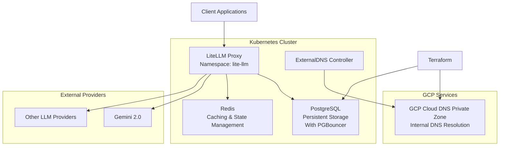

Architecture Decision Record: Adding LiteLLM to Matrix Infrastructure Kubernetes Stack
Date: 04-09-2025
Status: Proposed
Author: Platform Engineering Team

# Context

The MATRIX platform at EveryCure requires a robust LLM gateway to manage multiple AI model providers efficiently. As we expand our AI-driven drug repurposing capabilities using Gemini 2.0 and other LLM providers, we need a unified interface that provides:

- Consistent API interface across multiple LLM providers
- Cost tracking and budget management
- Rate limiting and load balancing
- Caching for improved performance and cost reduction
- Audit logging and compliance
- High availability and scalability

Our current infrastructure runs in MATRIX project and we need a solution that integrates seamlessly with our existing Kubernetes stack and have the ability to lift and shift to another project later down the line.

# Decision

We will deploy LiteLLM Proxy Server as our LLM gateway within our matrix infrastructure Kubernetes stack with the following components:

LiteLLM Proxy deployed via Helm chart
PostgreSQL for persistent storage and user management with PGBouncer for Connection pooling. (Patroni to be set up later when we need Active/Passive Failover and HA)
Redis for caching and distributed state management.
We will create a new **Cloud DNS Private Zone** for internal DNS Resolution.
We will use **ExternalDNS** controller to tie A Records to services.

# Implementation Details

1. **LiteLLM Configuration**: We will deploy it through Helm chart via ArgoCD in a namespace called `lite-llm`
2. **PostgreSQL**: Deployment of an in-cluster database in a different namespace. Database users and tables to be managed through Terraform.
3. **Redis**: In-cluster Deployment caching in a different namespace.

# Alternatives Considered

## Service Mesh

**Nginx**: Too basic for service mesh requirements (primarily an ingress controller and works best at the L7 Layer)
**Envoy**: Requires manual configuration, lacks control plane
**Cilium**: While performant with eBPF, less mature and more complicated.
**Kong + Custom Plugin**: More complex, requires custom development
**Custom Solution**: High maintenance, long development time

## DNS Resolution (Load Balancer vs other)

A key decision needed to be made was whether to use a GCP Private Load Balancer or not. Our current networking layer already fulfils present L7 and L4 requirements; we can introduce a Private Load Balancer later if/when needs evolve.

# Architecture Diagram

