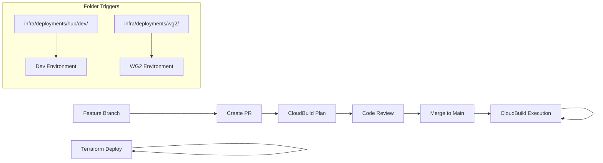
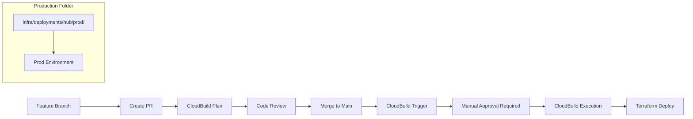
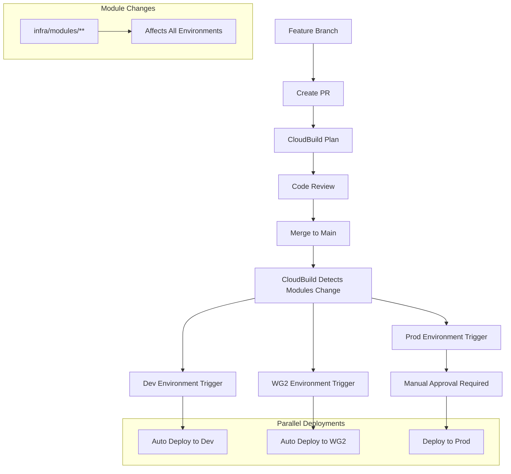

## Context

The Matrix project infrastructure deployment strategy has evolved to use a **main-only deployment workflow** where all infrastructure changes are deployed directly from the `main` branch. This differs from the data pipeline release process which still used different branches (`infra` branch for dev and `infra-prod-debug` for prod enviroment).

## Decision

We have implemented a main-only infrastructure deployment strategy with the following characteristics:

### Core Principles

1. **Single Source of Truth**: The `main` branch represents the current deployed state of all infrastructure.
1. **Continuous Deployment**: Infrastructure changes triggers a build in GCP Cloud when merged to `main`. GCP CloudBuild checks the changes in the respective folder and then decides if it should apply the build to the enviroment.
1. **Environment Parity**: Both development and production environments deploy from the same `main` branch.
1. **GitOps Integration**: ArgoCD watches the `main` branch for Kubernetes application updates for both prod and dev enviroment.

### Implementation Details

#### Deployment Configuration

All infrastructure deployments are configured to use the `main` branch:

```hcl
# infra/deployments/hub/dev/env.hcl & infra/deployments/hub/prod/env.hcl
locals {
  repo_revision = "main"
  github_branch_to_run_on = "main"
}
```

#### GCP CloudBuild Integration

Infrastructure changes are deployed via GCP CloudBuild which:

- **Triggers on all branches**: Plans are generated for any branch push
- **Applies only on main**: Actual infrastructure changes (`terragrunt apply`) only execute when `BRANCH_NAME = "main"`

<!-- - **Shows plans for feature branches**: Non-main branches display the plan output without applying changes (NEEDS TO BE DONE IN THE FUTURE!) -->

- **Manual approval for production**: Production deployments require manual approval before applying changes.
- **Folder-based deployment**: Changes in specific folders trigger deployments for corresponding environments:
  - `infra/deployments/hub/dev/` → Development environment
  - `infra/deployments/hub/prod/` → Production environment
  - `infra/deployments/wg2/` → Workgroup 2 environment
  - `infra/modules/**` → Triggers CloudBuild Apply in all enviroment irrespective of the changes in the underlying folders.

```bash
# CloudBuild logic
if [ "$BRANCH_NAME" = "main" ]; then
  echo "Condition met (Branch=main). Running 'terragrunt apply'..."
  terragrunt run-all apply --terragrunt-non-interactive plan.tfplan
else
  echo "Skipping apply: Branch is '$BRANCH_NAME', not 'main'. Showing plan instead."
  terragrunt run-all show plan.tfplan --no-color
fi
```

```hcl
# Production environment requires manual approval
module "cloudbuild" {
  # ...other configuration...
  require_manual_approval = true  # Only set for production
}
```

#### ArgoCD Configuration

Kubernetes applications are deployed via ArgoCD which:

- Monitors the `main` branch for changes.
- Automatically syncs applications when infrastructure definitions change.
- Uses the "app of apps" pattern bootstrapped from Terraform.

```yaml
# ArgoCD Application Configuration
spec:
  source:
    targetRevision: main  # Always deploys from main
  syncPolicy:
    automated:
      prune: true
      allowEmpty: true
```

## Workflow Process

### 1. Development Environment Workflow



### 2. Production Environment Workflow



### 3. Modules Changes Workflow (All Environments)



### 4. Deployment Process Steps

1. **Create Feature Branch**: Developers create feature branches for infrastructure changes.

<!-- 2. **Generate Plans**: CloudBuild automatically generates Terraform plans for review (FUTURE WORK!) -->

2. **Code Review**: Infrastructure changes are reviewed via Pull Request process
1. **Merge to Main**: Approved changes are merged to the `main` branch
1. **Folder-based Triggering**: CloudBuild detects changes in specific deployment folders
1. **Modules Changes**: Changes in `infra/modules/**` trigger deployments across all environments
1. **Manual Approval (Production Only)**: Production deployments pause for manual approval
1. **Terraform Apply**: CloudBuild applies infrastructure changes via Terragrunt

### 5. Change Validation

- **Plan Review**: All infrastructure changes must be reviewed as Terraform plans in PRs. This should be manually executed by the developer and pasted in the PR description.
- **Automated Testing**: Pre-commit hooks ensure code quality and formatting.
- **Approval Process**: Infrastructure changes require approval from core-members (should be platform team members).
- **Folder-based Changes**: CloudBuild triggers deployments based on changed folders:
  - Changes in `infra/deployments/hub/dev/` only affect development environment
  - Changes in `infra/deployments/hub/prod/` only affect production environment (with manual approval)
  - Changes in `infra/deployments/wg2/` only affect workgroup 2 environment
  - Changes in `infra/modules/**` trigger deployments in **all environments** (with production still requiring manual approval)

### 6. Environment-Specific Deployment

#### Development & WG2 Environments

- **Automatic Deployment**: Changes are applied immediately after merge to main
- **No Manual Approval**: Deployments proceed automatically for faster iteration
- **Modules Impact**: When `infra/modules/**` changes, both dev and WG2 deploy automatically

#### Production Environment

- **Manual Approval Gate**: All production deployments require explicit manual approval
- **Additional Review**: Production changes undergo additional scrutiny before deployment
- **Controlled Timing**: Deployments can be scheduled during maintenance windows
- **Modules Impact**: When `infra/modules/**` changes, production still requires manual approval before deployment

### 7. Rollback Strategy

Since infrastructure deployments are continuous from `main`:

- **Git Revert**: Use `git revert` to rollback problematic changes
- **Hotfix Branches**: Critical fixes can be fast-tracked through the same process
- **Environment Isolation**: Issues in one environment don't affect others due to folder-based deployment
- **State Management**: Terraform state is managed centrally with proper locking
- **Production Safeguards**: Manual approval gate provides additional protection for production rollbacks

## Benefits

### 1. Simplified Workflow

- **No Branch Management**: Eliminates complexity of managing infrastructure release branches
- **Faster Iteration**: Reduces time between development and deployment
- **Clear State**: Main branch always reflects current deployed infrastructure

### 2. Consistency Across Environments

- **Environment Parity**: Dev and prod deploy from the same source code
- **Reduced Drift**: Minimizes configuration differences between environments
- **Unified Process**: Single workflow for all infrastructure changes
- **Selective Deployment**: Folder-based changes ensure only affected environments are updated

### 3. Production Safety

- **Manual Approval Gate**: Prevents accidental production deployments
- **Environment Isolation**: Development changes don't automatically affect production
- **Controlled Timing**: Production deployments can be scheduled appropriately

### 3. Integration with Data Pipeline Process

- **Clear Separation**: Infrastructure deployment separate from data pipeline releases
- **Independent Cadence**: Infrastructure can evolve independently of data releases
- **Stable Platform**: Provides stable foundation for data pipeline experiments

## Comparison with Data Pipeline Release Process

| Aspect                  | Infrastructure (Main-Only)            | Data Pipelines (Release Branches)         |
| ----------------------- | ------------------------------------- | ----------------------------------------- |
| **Branching**           | Feature branches → main               | Release branches (e.g., `release/v0.6.1`) |
| **Deployment Trigger**  | Merge to main + folder changes        | Scheduled/manual release process          |
| **Environment Control** | Folder-based + manual approval (prod) | Unified release across environments       |
| **Versioning**          | Git commit SHA                        | Semantic versioning (v0.6.1)              |
| **Rollback**            | Git revert                            | Version downgrade                         |
| **Cadence**             | Continuous (with approval gates)      | Weekly patch, monthly minor               |

## Best Practices

### 1. Infrastructure Changes

- **Small, Incremental Changes**: Make small, focused infrastructure changes
- **Test in Development**: Read the Terraform Plan Carefully.
- **Documentation**: Update documentation alongside infrastructure changes.
- **Resource Naming**: Use consistent naming conventions across environments.

### 2. Code Review Guidelines

- **Plan Review**: Always review Terraform plans in PR descriptions
- **Impact Assessment**: Consider impact on running workloads
- **Security Review**: Ensure changes follow security best practices
- **Documentation**: Include rationale for infrastructure changes

### 3. Emergency Procedures

- **Hotfix Process**: Use fast-track PR process for critical infrastructure fixes. Things normally breaks when doing `terraform apply` so nothing to worry about.
- **Environment-Specific Fixes**: Target fixes to specific environments using folder-based deployment.
- **Communication**: Notify team of emergency infrastructure changes.
- **Post-Incident**: Document and review emergency changes after resolution.

## Security Considerations

- **Branch Protection**: Main branch requires PR approval and status checks.
- **Service Account Permissions**: CloudBuild does not use least-privilege service accounts. It has `roles/Owner` rights!
- **Secret Management**: Secrets are encrypted with git-crypt and stored in Google Secret Manager.
- **Audit Trail**: All infrastructure changes are tracked through Git history.

## Monitoring and Alerting

- **Slack Notifications**: CloudBuild sends deployment status to Slack channels.
- **Build Failures**: Failed deployments trigger immediate alerts.
- **Drift Detection**: Regular validation of infrastructure state.
- **Resource Monitoring**: Track infrastructure costs and resource usage.

## Migration Notes

This main-only approach was introduced to:

- Replace GitHub Actions with GCP CloudBuild for open-sourcing preparation.
- Simplify infrastructure deployment workflow.
- Align with GitOps best practices.
- Provide stable platform for evolving data pipeline requirements.
- Single branch = Single Source of truth.

## Additional Resources

- [GCP CloudBuild Documentation](../../../../infra/modules/components/cloudbuild/README.md)
- [ArgoCD Configuration](../index.md#argocd)
- [Infrastructure Overview](../index.md)
- [Release Process for Data Pipelines](../runbooks/01_releases.md)
