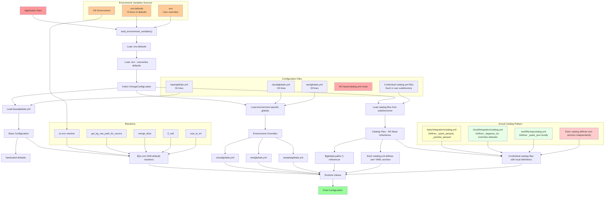
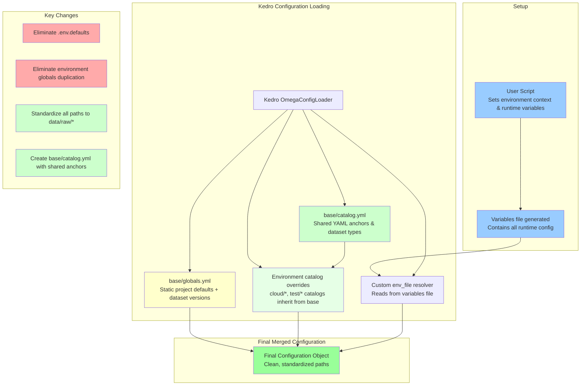

## Status

Draft

# Context

As the MATRIX project has grown in the number of datasets it consumes from different sources, and the with the goal to open-source it, the initially thought design for the variable resolution of the environment that determines the pipeline run and datasets sources, has become too complex. As we have introduced a public bucket alongside `dev` and `prod` bucket, switching between the three has proved that there is tight coupling between environments (base, cloud, and test). We aim to reduce the cognitive load and manual intervention that is needed to avoid human error.

In the past, we had different needs when creating datasets and storing them in the GCP bucket and hence it has led to having different folder structure (`data/kedro/01_raw/<datasets>`, `data/01_raw/<datasets>`, `data/01_raw/KG/<datasets>`). Having different folder structure has made it harder to have a unified datasets resolver and causes a lot of confusion. We would now like to standardize it.

## Current Environment Resolution Structure

### Current Issues Illustrated

1. **Multiple Override Layers**: Configuration flows through 4+ layers (.env.defaults → .env → base/globals → env-specific globals)
2. **Redundant Definitions**: Same values defined in multiple places (e.g., GCS buckets in .env.defaults, base/globals.yml, and cloud/globals.yml)
3. **Complex Resolution**: Custom resolvers handle environment variable fallbacks with hardcoded defaults
4. **Tight Coupling**: Environment-specific globals duplicate base configurations
5. **Inconsistent Path Structures**: Multiple folder patterns for raw data storage
6. **No Catalog Inheritance**: Each of the 3 catalog.yml files defines its own YAML anchors (_spark_parquet, _bigquery_ds, etc.) independently, leading to massive duplication.
7. **Environment-Specific Catalog Overrides**: Cloud and test environments completely redefine catalog datasets rather than inheriting from base.

# Decision

## Environment Variable Resolution

We will create a user script that would contain all of the env needed to run the project and would be our single source of truth. Only the versions of the datasets would be in the `global.yml` file. It would allow the user to easily switch between different environment without having the need to manually enter the environment variable into the `.env` file or rely on the `.env.defaults`.

## Datasets Standardization

We will move all of our datasets into a single folder structure `data/raw` for raw data and update the variables to point to the correct folders.

## Proposed Future State

### Benefits of Proposed Structure

1. **Single Source of Truth**: All configuration defaults in `base/globals.yml`
2. **User Script**: Simple environment selection without manual `.env` editing
3. **Minimal Environment Variables**: Only secrets and deployment-specific values
4. **Standardized Paths**: Consistent `data/raw/*` structure across all datasets
5. **Reduced Complexity**: Fewer override layers and resolution paths
6. **Catalog Inheritance**: edit the `ingestion/base/catalog.yml` with proper shared YAML anchors that the 2 catalog files can inherit from, eliminating massive duplication.
7. **Separation of concerns**: Globals file would be limited to just having the versions number and fully owned by the team responsible.

## Implementation Changes Required

1. Create User Environment Script.
2. Remove Variables from `globals.yml`.
3. Create the variable_resolver.
4. Modify base/catalog.yml with Shared Anchors and use the variable_resolver
5. Write proper unit tests.
6. Make sure that the test catalog doesn't write to dev or prod buckets.
7. Update Child Catalogs to Use Inheritance.
8. Standardize All Paths by moving the files to the decided folder structure.
9. Modify the variable file to point to the new location.

## Nice to have feature

1) Adding checksum to verify that the config file has not changed depending on the environment. This would be before running the workflow and also on-cloud.
2) Refactor the `settings.py` file to remove the dynamic mapping to the variable file as well.

## Consequences

This approach would eliminate:
- `.env.defaults` file (73 lines)
- Environment variable duplication across globals files
- Manual `.env` file editing
- individual YAML anchor definitions in catalog files and keep the ones that is absolutely needed.

This would remove the cognitive load on the developer and greatly reduce human errors.