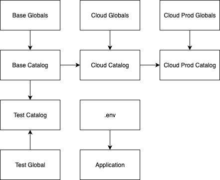

Status
------
In Review

# Context

As the MATRIX project has grown in the number of datasets it consumes from different sources, and the with the goal to open-source it, it is evident that the initially thought design for the variable resolution of the environment that determines the pipeline run and datasets sources, has become too complex. As we have introduced a public bucket alongside `dev` and `prod` bucket, switching between the three has proved that there is tight coupling between environments (base, cloud, and test). We aim to reduce the cognitive load and manual intervention that is needed to avoid human error.

In the past, we had different needs when creating datasets and storing them in the GCP bucket and hence it has led to having different folder structure (`data/kedro/01_raw/<datasets>`, `data/01_raw/<datasets>`, `data/01_raw/KG/<datasets>`). Having different folder structure has made it harder to have a unified datasets resolver and causes a lot of confusion. We would now like to standardize it.

## Current Environment Resolution Structure

### Current Issues Illustrated

1. **Multiple Override Layers**: Configuration flows through 4+ layers (.env.defaults → .env → base/globals → env-specific globals)
2. **Redundant Definitions**: Same values defined in multiple places (e.g., GCS buckets in .env.defaults, base/globals.yml, and cloud/globals.yml)
3. **Complex Resolution**: Custom resolvers handle environment variable fallbacks with hardcoded defaults
4. **Tight Coupling**: Environment-specific globals duplicate base configurations
5. **Inconsistent Path Structures**: Multiple folder patterns for raw data storage
6. **No Catalog Inheritance**: Each of the 3 catalog.yml files defines its own YAML anchors (_spark_parquet, _bigquery_ds, etc.) independently, leading to massive duplication.
7. **Environment-Specific Catalog Overrides**: Cloud and test environments completely redefine catalog datasets rather than inheriting from base.

# Decision

## Creation of a new `--env` for production

We will create a new catalog file for production environment called `cloud-prod`. This way we will have a dedicated catalog for production. We will then move towards removing the `.env` and `.env.defaults` and move all variables that don't change and are not personal to `globals.yml`. `cloud` would default to using dev as it's source.

## Modification and separation of globals and catalog files

Each Catalog file and it's global will be used to resolve it's own environment. This way we could directly use dev (`cloud/catalog.yml` and `cloud/globals.yml`) in production without duplicating the variables. Keeping it clean and concise.

## Datasets Standardization

We will move all of our datasets into a single folder structure `data/raw` for raw data and update the variables to point to the correct folders.

## Proposed Future State

### Benefits of Proposed Structure

1. **Single Source of Truth**: All configuration for cloud (dev) defaults in `cloud/globals.yml`. This will act as the starting point for production without duplicating.
2. **Creation of production catalog and global YAML file**: This will contain the variables and information required for production to work.
3. **Minimal Environment Variables**: Only secrets and deployment-specific values will remain in the `.env`
4. **Standardized Paths**: Consistent `data/raw/*` structure across all datasets.
5. **Reduced Complexity**: No overrides, just importing another env if needed. variables will be isolated to it's own env, and should pass through `catalog.yaml` respectively.
6. **Separation of concerns**: Globals file would be limited to just having the versions number and variables fully owned by the team responsible. No references should be there unless utterly necessary.
7. **Allow catalogs to inherit from other catalogs**: This way we would not need to define dev variables again for production.

## Implementation Changes Required

1. Create production `/cloud-prod/catalog.yml` and `/cloud-prod/globals.yml`.
2. Remove Variables from `.env` and move it to `globals.yml`.
3. Modify the cloud catalog file and make appropriate changes.
4. Modify `run.py` to use `cloud` catalog and global as an input to production catalog.
5. Write proper unit tests.
6. Make sure that the test catalog doesn't write to dev or prod buckets.
7. Update child catalogs to use inheritance.
8. Standardize all Paths by moving the files to the decided folder structure.

## Consequences

This approach would eliminate:
- `.env.defaults` file (73 lines)
- Environment variable duplication across globals files
- Manual `.env` file editing
- Individual variable definitions in globals files. No reference in global.
- Each environment will have statement related to it's own work. dev will have all dev configuration and prod will have it's own. Achieving Separation of concerns

This would remove the cognitive load on the developer and greatly reduce human errors.