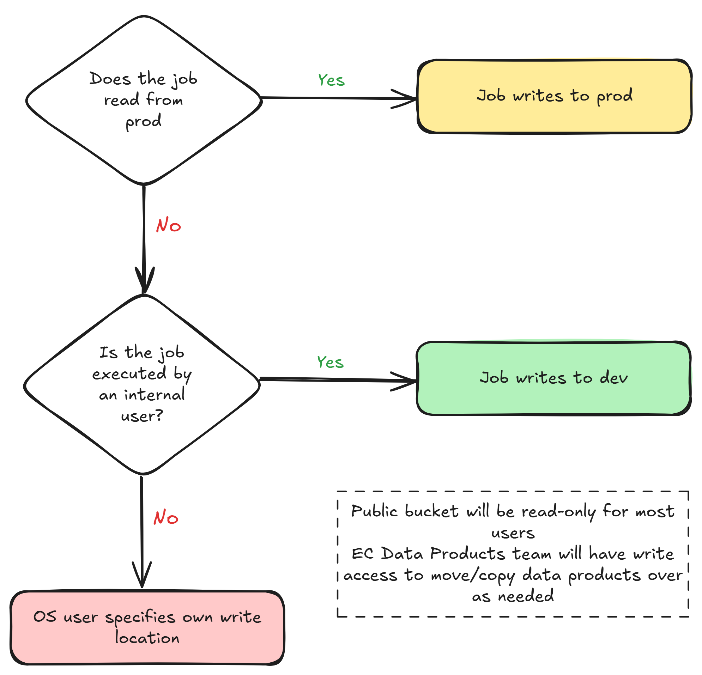

# Data Storage Setup for Open Sourcing

## Context

A core goal of Every Cure and the MATRIX project is the open sourcing of the data as well as the code we use to generate it. We previously set up infrastructure to [secure private datasets](secure-private-datasets.md). Conversely we also need to ensure that we make public data assets accessible to open source contributors alongside our codebase so that they are able to run the pipeline e2e locally. This focument outlines how we setup our data storage buckets and what data products will be stored in each bucket. 

## Decision

### Storage bucket content

|Storage bucket|Data assets stored|Accessible by|
| ------------- | ------------- | ------------- |
|`Public`|Upstream open sourced KGs (e.g., RTX-KG2, ROBOKOP)   EC Drugs list, EC Disease list, EC Indications list   EC KG releases (periodic releases, final output only)| Open source contributors (read-only)   EC and subcontractors|
|`Dev`|All EC KG releases and intermediate files used for QC|EC and subcontractors|
|`Prod`|Proprietary KGs (e.g., SPOKE, Embiology) Proprietary datasets (e.g., DrugBank)|EC and subcontractors (as needed)|

### Permissions logic

 

## Benefits

This setup has the following benefits:

- Open source contributors are served a relatively clean list of data products to work with, especially as we expect them to be less familiar with the various files we use.
- Team Data Products are able to run the weekly patch releases of the Every Cure KG to ensure integrity of the data release pipeline and QC intermediate files, while shielding open source contributors from the volume of files
- Open source contributors are served periodic updates of the integrated Every Cure KG, and have the flexibility to run our pipeline on raw KGs or KG releases

## Implications

- Every Cure KG pipeline must read from `public` (and sometimes `dev`) buckets and write to `dev` by default
- Periodic KG release to the `public` bucket instead of `dev` can be automated. In the meantime, releases can be manually copied across to `public`

