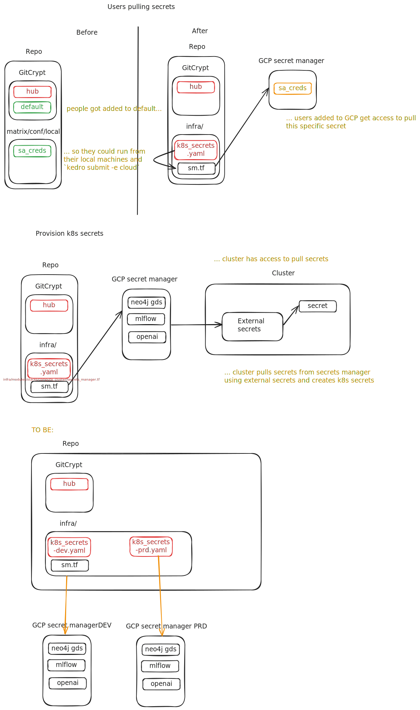

## Status

Under review

## Context

At the time of writing, Every Cure (EC) and its subcontractors ("subs")
are using a single Google Project under which all of the
infrastructure, like the container storage (GCS), the object store, and
the Kubernetes service, is hosted. Several other services, like Google
Cloud Secret Manager are also hosted here.

This Google Project is called "mtrx-hub-dev", with an id
_mtrx-hub-dev-3of_. As the name suggests, it is a development
environment, which is commonly associated with a place where developers
add new features before being deployed to a production environment,
possibly through staged deployments.

The majority of this set of services is managed using Terraform and Terragrunt,
two popular Infrastructure as Code (IaC) tools. These tools work by looking at
the state of the [infra
branch](https://github.com/everycure-org/matrix/tree/infra) of the matrix
project and deploy the changes from the repo's top-level infra folder.

Once these services have been deployed, ArgoCD comes into play, where the [app
of apps](https://argo-cd.readthedocs.io/en/latest/operator-manual/cluster-bootstrapping/#app-of-apps-pattern)
pattern is used to declaratively bootstrap other apps.

As part of this environment, EC is hosting data that is public in nature:
anyone can find the information online, the info is free of charge and
unrestricted by licenses.

### Problems

- Datasets that aren't public in nature, which we'll label as sensitive or
  private from here on, will need to be added to Every Cure's set of assets,
  while protecting it with some form of access control so that it can only be
  read by Every Cure staff.
- The state of the infrastructure is coupled to the state of the processing
  code, in the sense that the IaC codebase defines different node pools, while
  the workloads define their resource requirements that should fit on these node
   pools. As an example, some kubernetes pods are sized for processing certain
  datasets. As the processing code evolves, sometimes changes in the pod
  configuration are entered which might break the option of processing data.

### User context

### Approach

We'll mirror the current "dev" environment using a second Google project.

#### Rationale

Data (and logs) are made available to users under the following (non-exhaustive
list of) services:

- GCS (uses Google SSO)
- BigQuery (uses Google SSO)
- MlFlow (uses Google SSO)
- Argo Workflows (uses Google SSO)
- ArgoCD (uses Google SSO)
- Neo4j (username, password)

For the latter, access to unauthorized staff should be prohibited, so that they
cannot read logs, nor trigger workflows. That is, the URL
`https://argo.platform.dev.everycure.org/workflows/` should be hosted
separately so that people without access cannot even see the logs.

Considering these services, it's easier to restrict access using the Google
Cloud authentication flow using SSO, rather than on per-app level.

- Do we need a separate K8s cluster for this?

  PRO:

   - making changes to the K8s cluster, like adding nodes, redimensioning them,
     becomes less impacting, as long as people understand that the dev environment
     might show breaking infra. As a result, you can deploy with confidence to prod.

     :warning: if subcontractors, who were meant not to work on prod (because
	that's where we have the private data), start complaining that services are
	sometimes not operational, then there should be even a 2nd non-prod
	environment. Dev should be for making changes to infra and pipelines. This is
	[deemed acceptable](https://github.com/everycure-org/matrix/pull/1189/files#r1967251696).

   Permission management: a group of users would be granted permission to the prod
   cluster. If there were only one cluster, that group of users would need to be
   granted permissions to different namespaces. Additionally, certain cluster
   roles, like those for Argo Events require cross-namespace permissions. With
   multiple functionally equivalent namespaces (like argo-workflows-prod and
   argo-workflows-dev) this division is made harder.  all kinds of objects
   (namespaces, services like Argo, cluster roles) would not need to have suffixes
   (or similar)
 
  CON:

  - 2nd infra to manage.
    - Counterargument: it’s with modules in Terraform. Overall cognitive load is considered low.

- Should we use multiple Google Projects?
  
  PRO

  - Quotas are [usually](https://cloud.google.com/docs/quotas/view-manage)
    linked to Google Project IDs (there are a few linked to the
    organization-level), meaning there’s less chance of hitting quota limits.

  CON:

  - it might slow down development.
    - COUNTERARGUMENT: switching k8s context is a single command, as is
      switching a Google Project. Can be in the Makefile.

   For the same reason as above in what services the data must be made available,
   and the separate Kubernetes cluster considerations, it is _easier_ to continue
   with a second Google Project.  Additionally, this facilitates billing, as one
   would otherwise need to resort to tags and labels.
   
   For Neo4J (and possibly other services where there is no OAuth flow using your
   GC credentials), credentials (username, password) are typically stored in a
   secrets vault, like Google Cloud Secret Manager, under _the same_ keys as they would
   be in other environments. This has the advantage that storing such secrets from
   Terraform is easy, as well as retrieving these programmatically, since users do
   not need to know different secret names.
   This will be done by setting up a new git-crypt scope, that would encrypt the
   _k8s_secrets_prd.yaml_. It would be decrypted in the CICD pipeline and its
   contents pushed to the external secrets service of the prod account. See image below.

 

- Should authorization be granted through Google project ids?
  It seems so, as it makes it easier for granting access to MLFlow and Neo4J.

- Shall we have infra-dev and infra-prod branches?  Yes, because we’re using
  ArgoCD and we want to avoid having a commit in the infra folder affecting both
  environments.

  Proposal: move infra, both the Terraform/Terragrunt parts, as well as ArgoCD,
  to its own repo, _matrix-infra_.  

  This would create less friction, as we'd need 2 infra branches for ArgoCD
  now, and the current "merge main to infra, then infra to main" sequence is
  already distracting from the main goal of having something simply deployed.

  Out of scope: whether there should be dev and prod branches for non-infra
  related development, such as triggering a release in the production
  environment. 

  Rationale: has nothing to do with the private data being stored and the
  solutions discussed so far.

- If this is about dataset protection, what is the impact if it gets used by
  unauthorized people?

  Depends on the contractual arrangements. Possibilities: loss of funding,
  lawsuit, reputation damage.

- What costs can be incurred?

  An extra cluster costs about 4500$/month, based on the current consumption in
  the current cluster during the weekend.

- Is the MVP clear? What are the Minimum Acceptance Criteria?
  The following is a list of the acceptance criteria as laid out initially. The list is not exhaustive.

  > iii) Completion Criteria
  > A mirrored environment available under *.platform.everycure.org which has executed a pipeline run E2E successfully and is set to replace the existing dev environment for data release runs. 
  > argo/mlflow.platform.dev.everycure.org
  > argo/mlflow.platform.everycure.org

- How will this be used?

  The idea is that a selection of Every Cure staff gets access to the
  “production” environment (i.e. the Google Cloud project). There, they can
  inspect the protected datasets, together with the doubled public datasets.

- Does the public data need to be duplicated, in order to facilitate using
  environment-agnostic code? Or de we add environment checks and modify
  pipeline?

  Duplicating the data makes for easier management, as no exceptions need to be
  made. A downside is that it comes with an extra storage cost for the ingested
  data and that the public datasets in both envs may grow out of sync, though
  that can be solved with cross-bucket repliccation

  As decided in PR 1189, production workloads will read public data from dev,
  and private data from prod.

- Should we create a different yml in the env folder, e.g. cloud-prod?

  It has been decided in PR 1189 not to do so: the private datasets will be
  added to the existing catalog.yml files. The way it should be working then is
  that environment variables or CLI flags will be used to enable/disable the
  inclusion and processing of the private datasets, which is highly similar to
  the current process of selectively disabling/enabling datasets by commenting
  them out from the `DYNAMIC_PIPELINES_MAPPING` in the _settings.py_ file.

- Who is the handful of people that needs access to this private data?

  engineering@everycure.org (sic Pascal)

## Decision

We create a Google Project for prod (it already exists) and redeploy the
currently existing infrastructure there.  We add a catalog entry for the
private datasets in an already existing conf/cloud folder.

