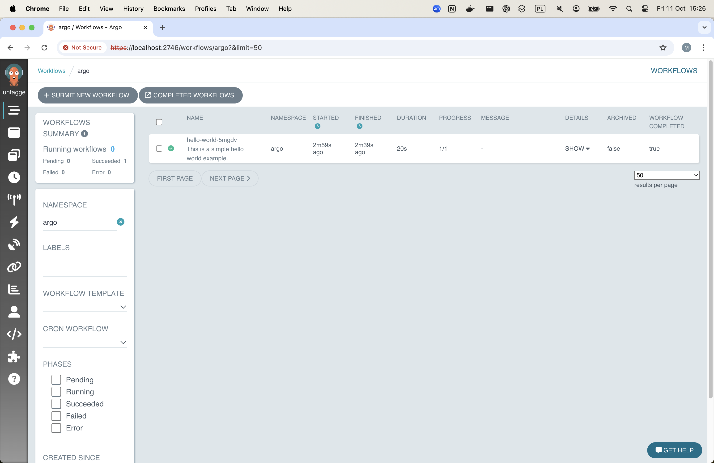
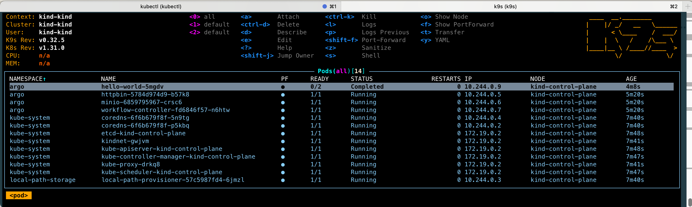

# Running Argo Workflows locally [ in progress ]

This document describes how to run Argo Workflows locally. This local setup is useful for validating workflow templates. Of course mounted secrets from the cloud k8s will not work here but it ensures the template structure is valid. 

!!! info
    For simple argo template validation `argo lint` can also be used. 
Read more about our Argo toolchain [here](glossary.md).

# Tasks

To set up Argo Workflows locally, we need to provision a local Kubernetes cluster using `kind`. We'll create an appropriate namespace on that cluster, deploy Argo, and then push our Workflow Template to it. Throughout this process, we'll use `kubectl` and `k9s` to interact with and monitor the cluster.

## Deploying a local kubernetes cluster

We will deploy a  local cluster using `kind`. Kind will create the containers in local Docker.

We can retrieve local clusters, and create clusters locally again.

**Creating the cluster**

```bash
if ! kind get clusters | grep -q "^kind$"; then
    kind create cluster
fi
```

Kind also updates your local kubeconfig file (usually located at ~/.kube/config) to add a context and configuration for the new cluster. This is what kubectl uses to interact with the cluster. The kubeconfig entry specifies the API endpoint of the cluster and contains credentials for accessing it. However, this file only contains configuration information and doesn’t store the actual cluster data or state.

This will result in creation of cluster, consisting only of `kind-control-place` docker container. Importantly, all nods will be ran *within that container*

## Deploying a Local Cluster

We'll deploy a local cluster using `kind`, which creates containers in local Docker. We can retrieve existing local clusters or create new ones as needed.

### Creating the Cluster

```bash
if ! kind get clusters | grep -q "^kind$"; then
    kind create cluster
fi
```

Kind updates your local kubeconfig file (typically at `~/.kube/config`) with context and configuration for the new cluster. This file, used by kubectl to interact with the cluster, contains the API endpoint and access credentials. Note that it only stores configuration, not actual cluster data or state.

The resulting cluster consists of a single `kind-control-plane` Docker container, with all nodes running within this container.

### Configuring kubectl

Set `kubectl` to use the newly created cluster:

```bash
CURRENT_CONTEXT=$(kubectl config current-context)
if [ "$CURRENT_CONTEXT" != "kind-kind" ]; then
    kubectl config use-context kind-kind
fi
```

Confirm the cluster exists:

```bash
kubectl cluster-info
```

Expected output:
```
Kubernetes control plane is running at https://127.0.0.1:49808
CoreDNS is running at https://127.0.0.1:49808/api/v1/namespaces/kube-system/services/kube-dns:dns/proxy

To further debug and diagnose cluster problems, use 'kubectl cluster-info dump'.
```

### Creating a Namespace

Create a namespace for Argo Workflows within the Kubernetes cluster:

```bash
if ! kubectl get namespace argo &>/dev/null; then
    kubectl create namespace argo
fi
```

kubectl will use the default cluster (set in the previous step).

### Deploying Argo Workflows

Install Argo Workflows in the cluster:

```bash
kubectl apply -n argo -f https://raw.githubusercontent.com/argoproj/argo-workflows/refs/heads/main/manifests/quick-start-minimal.yaml
```

This creates Argo resources within the `kind` cluster.

```bash
kubectl get pods -n argo

NAME                                                READY   STATUS    RESTARTS   AGE
argocd-application-controller-0                     1/1     Running   0          65m
argocd-applicationset-controller-5b866bf4f7-mdjkc   1/1     Running   0          65m
argocd-dex-server-7b6987df7-wsrkb                   1/1     Running   0          65m
argocd-notifications-controller-5ddc4fdfb9-8tplt    1/1     Running   0          65m
argocd-redis-ffccd77b9-mhwt5                        1/1     Running   0          65m
argocd-repo-server-55bb7b784-crfwq                  1/1     Running   0          65m
argocd-server-7c746df554-m7d7q                      1/1     Running   0          65m
```

### Submitting a Hello World Workflow

To test your setup, submit a hello world workflow:

```bash
argo submit -n argo --watch https://raw.githubusercontent.com/argoproj/argo-workflows/main/examples/hello-world.yaml
```

## Accessing the Argo Workflows UI

### Port Forwarding

Expose the Argo server port:

```bash
kubectl -n argo port-forward service/argo-server 2746:2746
```

### Accessing the UI

Navigate to [https://localhost:2746](https://localhost:2746/)

**Important Notes:**
- Use `https`, not `http`. Using `http` will result in a server-side error.
- You'll encounter a TLS error due to the self-signed certificate. You'll need to manually approve this in your browser.

### UI Screenshots

Argo Workflows UI:



K9s view:



### Listing Workflows

To list workflows in the CLI:

```bash
argo list -n argo

NAME                STATUS      AGE   DURATION   PRIORITY   MESSAGE
hello-world-5mgdv   Succeeded   4m    20s        0
```

## Working with Workflows

### Listing Workflows

List all workflows:

```bash
argo list -n argo
```

List the latest workflow:

```bash
argo get -n argo @latest
```

### Viewing Logs

View logs of the latest workflow:

```bash
argo logs -n argo @latest
```

### Submitting a Workflow Template

To submit a workflow template for local execution:

```bash
argo submit --name test-run -n argo --from wftmpl/test-run -p run_name=test-run -l submit-from-ui=false --entrypoint __default__
```