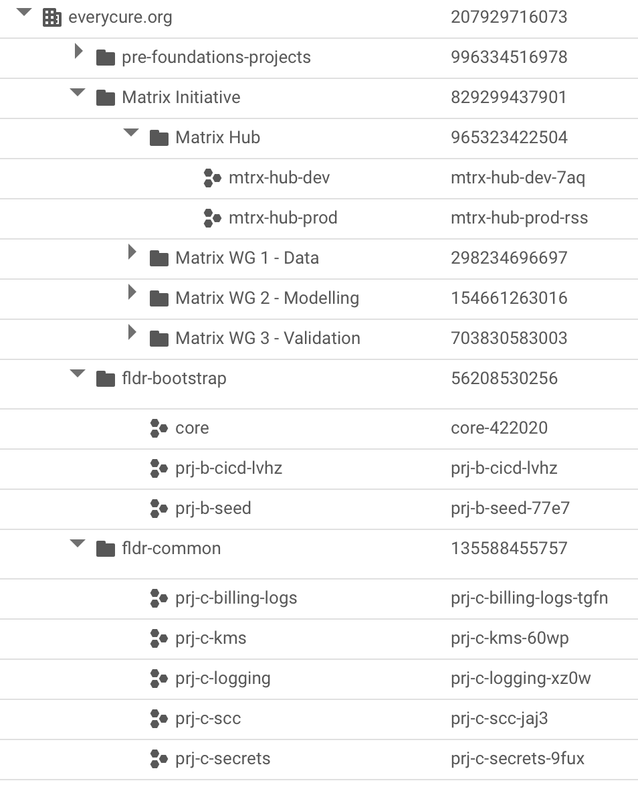

<!-- EXP with Matej
- logs of experiments through some form of exp log
- data science metrics should be logged as well (more structured) 

- how do we manage Admin rights
- org policies? 
- how to get compute / request more 
- how to monitor cost
-  -->

!!! tip "Suggested background knowledge"
  
    This section requires moderate understanding of infrastructure as code, terraform, enterprise requirements for cloud environments and concepts such as "landing zones" and networking.


To set up our Google Cloud Organization we used a combination of [terraform-example-foundation](https://github.com/terraform-google-modules/terraform-example-foundation) and our own terraform code structured through [terragrunt](https://terragrunt.gruntwork.io). 

At the core, three requirements stand out:

- **Control costs** as we scale our usage and avoid cost overruns due to accidental usage
- **Empower our teams** with great tools while defining guardrails that keep them from accidentally creating a data or security risk
- **Minimize admin bottlenecking** by leveraging infra as code which enables anyone to change propose changes rather than asking for something to be changed


## Separation of responsibility

Google recommends the below diagram for separating a foundation pipeline, infrastructure pipeline, and application pipeline. We have slightly adapted this to our needs and have created 3 layers of ownership:

- **Every Cure Core**: Our core infrastructure foundations. This holds the blueprint and creates folders and projects for any of our initiatives. This corresponds to the below bottom layer
- **MATRIX Hub**: This layer creates a compute cluster and various other resources (VMs & DBs) in the MATRIX project and follows a dev/prod split approach. This maps to the middle layer below
- **MATRIX working groups**: This layer allows any member in the MATRIX org to create resources in their GCP project as well as deploy pipelines to the shared compute cluster. This maps to the top layer in the below graphic. 


## Key architectural principles
*Our architectural principles are heavily inspired by the [enterprise foundations blueprint](https://cloud.google.com/architecture/security-foundations) and adapted to our needs. All changes from Googles recommended defaults are highlighted below:*


- [X] **Github Actions**: Infrastructure resources are managed using a GitOps model. Declarative IaC is written in Terraform and managed in a version control system for review and approval, and resources are deployed using {--Cloud Build--} {++Github Actions++} as the continuous integration and continuous deployment (CI/CD) automation tool. The pipeline also enforces policy-as-code checks to validate that resources meet expected configurations before deployment.
  - currently only for MATRIX, the Core resources are still manually applied by Pascal
- [X] **Cloud Identity**: Users and group membership are synchronized from your existing identity provider. Controls for user account lifecycle management and single sign-on (SSO) rely on the existing controls and processes of your identity provider.
- [X] **Identity and Access Management (IAM)**: Allow policies (formerly known as IAM policies) allow access to resources and are applied to groups based on job function. Users are added to the appropriate groups to receive view-only access to foundation resources. All changes to foundation resources are deployed through the CI/CD pipeline which uses privileged service account identities.
- [X] **Resource Manager**: All resources are managed under a single organization, with a resource hierarchy of folders that organizes projects by {--environments--} {++major initiatives++}. Projects are labeled with metadata for governance including cost attribution.
- [X] **Networking**: Network topologies use Shared VPC to provide network resources for workloads across multiple regions and zones, separated by environment, and managed centrally. All network paths are private. {--No outbound traffic to or inbound traffic from the public internet is permitted by default--} {++Outbound traffic via HTTPS and inbound traffic via SSH through the [identity aware proxy](https://cloud.google.com/iap/docs/concepts-overview) are permitted by default++}.
- [X] **Cloud Logging**: Aggregated log sinks are configured to collect logs relevant for security and auditing into a centralized project for long-term retention, analysis, and export to external systems.
- [X] **Cloud Monitoring**: Monitoring scoping projects are configured to view application performance metrics across multiple projects in one place.
- [X] **Organization Policy Service**: Organization policy constraints are configured to prevent various high-risk configurations.
  - basic rules are enforced at org level, these can be overriden at project level
- [X] **Secret Manager**: {--Centralized projects are created for a team responsible for managing and auditing the use of sensitive application secrets to help meet compliance requirements--} {++"Root secrets" are stored via [git-crypt](https://github.com/AGWA/git-crypt) in the repository as encrypted binaries and decryption keys are shared only between administrators. These are used to bootstrap infrastructure through IaC and secrets are then stored in GCPs secret manager automatically. ++}.
    - {++We make secrets accessible inside of kubernetes through [external secrets](https://external-secrets.io/latest/)++}
- {--**Cloud Key Management Service (Cloud KMS)**: Centralized projects are created for a team responsible for managing and auditing encryption keys to help meet compliance requirements.--}
- [X] **Security Command Center**: Threat detection and monitoring capabilities are provided using a combination of built-in security controls from Security Command Center and custom solutions that let you detect and respond to security events.


### Pending changes to the above principles list

- Currently the foundations pipeline still lives in [Google Cloud Build](https://console.cloud.google.com/cloud-build/builds;region=us-central1?project=prj-b-cicd-lvhz). This is [supposed to be moved to Github Actions](https://www.notion.so/everycure/Migrate-GCP-Foundations-Repos-over-to-Github-but-keep-Cloud-Build-CI-e729139f88654438a3776bcea30a8bc3?pvs=4)
- [Basic policies](https://cloud.google.com/architecture/security-foundations/preventative-controls#organization-policy) are enforced but the blueprint comes with a set of 

## Networking setup

We opted for a [shared VPC](https://cloud.google.com/vpc/docs/shared-vpc) setup from GCP for all our MATRIX projects. In this setup, we have a hub project that contains any shared resources (e.g. compute cluster, shared datasets) and a number of spoke projects (working groups) that connect to the hub project's VPC. Thus, the networking layer is provided from the foundations layer upwards to the initiative (e.g. MATRIX), following the principles recommended by the foundations blueprint.

The networking layer of our software engineering project is designed to strike a balance between minimal maintenance requirements and optimal control and security. To achieve this, we employ a hub-and-spoke architecture, where the central hub network provides a Virtual Private Cloud (VPC) to our spoke projects, which represent our working group projects.

To ensure segregation of development and production environments, we maintain two separate networks for each. This allows for effective isolation and management of our infrastructure.

The below graphic visualizes this hub/spoke setup


### Firewall Configuration

To facilitate secure communication between our networks and the outside world, we have defined firewall routes to permit the following traffic:

1. HTTP and HTTPS traffic for accessing web interfaces
1. SSH traffic for remote access to our instances and tunneling, only permitted on `dev`

This configuration enables secure and controlled access to our infrastructure, while maintaining the integrity of our network architecture.

### Terraform

All networking is configured in terraform and changes can be proposed through Pull Requests.

### DNS

Our root DNS is registered with Namecheap. We delegated the SOA records for
`dev.everycure.org` to the Google DNS servers which means we can control this entire
subdomain via Google DNS.  Next we defined that domain as a zone in GCP to manage records
here. Now we can create further subdomains (e.g. `docs` to host this page) in this zone.
We use this for domain ownership validation and it is also needed for SSL certificates.

The high level flow of the DNS setup is visualized below:

1. We define the DNS records via terraform as part of our infrastructure rollout
2. The DNS records propagate to the global DNS network and as users enter a domain, their
browsers make DNS lookup calls to their configured DNS server which points their browser
at the correct IP address for the given domain they try to access.


??? info "Primer video on DNS"
    If you need a primer on DNS, this short video may help:
    
    <iframe width="560" height="315" src="https://www.youtube.com/embed/UVR9lhUGAyU?si=KAdxf24jYOzasIwf" title="YouTube video player" frameborder="0" allow="accelerometer; autoplay; clipboard-write; encrypted-media; gyroscope; picture-in-picture; web-share" referrerpolicy="strict-origin-when-cross-origin" allowfullscreen></iframe>

#### Docs Page

The docs page is hosted via AppEngine. Please check the [their
documentation](https://cloud.google.com/appengine/docs/standard/securing-custom-domains-with-ssl?hl=en)
on how to set up AppEngine with SSL and DNS for a custom domain.


## GCP Organization structure

We have the following top level structure

<!-- TODO update image with latest folder structure -->
{ width=500" }

where the `fldr-` folders contain foundations blueprint artifacts (e.g. shared logging, encryption keys, bootstrap project) and the `pre-foundation-projects` contain a range of projects we had already created before setting up the blueprint.

## Project creation and seeding with terraform information

We create projects at the "core" level and provide these projects to  project
teams. 

----

## Creation log

!!! bug "debug notes"

    This section is a raw log of notes taken during the creation / execution of the blueprint and are mostly meant for reference in debugging scenarios. 

### Using the golang helper tool

The blueprint comes with a helper tool that rolls out all layers in one process. We started using this at first but then rolled back all but the first 2 layers as they were not what we needed for EC. 

- used the foundation-deployer helper to create the infrastructure
- used `core-422020` project as the "starter" project and set all permissions to the `gcp-admins@everycure.org` group with `pascal@everycure.org` as member.
- selected the simpler networking structure & went for the google cloud build based CI/CD pipeline rather than Github Actions (which was default & should be less cost constrained)
- created a `Makefile` in `infra/` repo to codify all steps used to set it up
- had some issues with getting the backend.tf to work with the helper, so had to re-run a few times to get 0-bootstrap to work
- then ran into issues with the SA not having the right permissions to edit groups
  ```
  # Request a Super Admin to Grant 'Group Admin' role in the
  # Admin Console of the Google Workspace to the Bootstrap service account:
  # sa-terraform-bootstrap@prj-b-seed-77e7.iam.gserviceaccount.com
  
  # See: https://cloud.google.com/identity/docs/how-to/setup#assigning_an_admin_role_to_the_service_account
  # for additional information
  
  # Press Enter to continue
  ```

  - found the `roleID` for the Group Administrator via [this page](https://developers.google.com/admin-sdk/directory/reference/rest/v1/roles/list?apix=true&apix_params={"customer":"C02dmw33l","maxResults":50}) to be `49856820306509826`

    ```json
    {
      "assignedTo": "111866437155274016643",
      "roleId": "49856820306509826",
      "scopeType": "CUSTOMER",
      "kind": "admin#directory#roleAssignment"
    }
    ```

- this added the SA to be able to do roleAssignments from within Cloud Build which makes the SA also a super admin in a way
- stages org & environments were created without issues through cloud build
- net failed. got [stuck on this](https://github.com/terraform-google-modules/terraform-example-foundation/issues/923)
- adding `roles/iam.serviceAccountUser` and `roles/iam.serviceAccountTokenCreator` to the `gcp-admins` group (which I am a member of) at root level fixed the issue.
- ran out of projects so wanted to remove BU2. But need to terraform destroy everything first, not just delete folder. Else it just disappears but resources remain.  
- So I commented out the resources created in BU2 first, then ran terraform apply again. Why not terraform destroy? Well because the `tf-wrapper.sh` doesn't have a destroy command.
- running the destroy commands from my machine kept giving me errors as well
    ```
    Error: Error when reading or editing BillingBudget
    "billingAccounts/01980D-0D4096-C8CEA4/budgets/c74f3114-fed7-4946-a691-92e2ab7d94c2":
    googleapi: Error 403: Your application is authenticating by using local Application
    Default Credentials. The billingbudgets.googleapis.com API requires a quota project,
    which is not set by default. To learn how to set your quota project, see
    https://cloud.google.com/docs/authentication/adc-troubleshooting/user-creds .
    ```