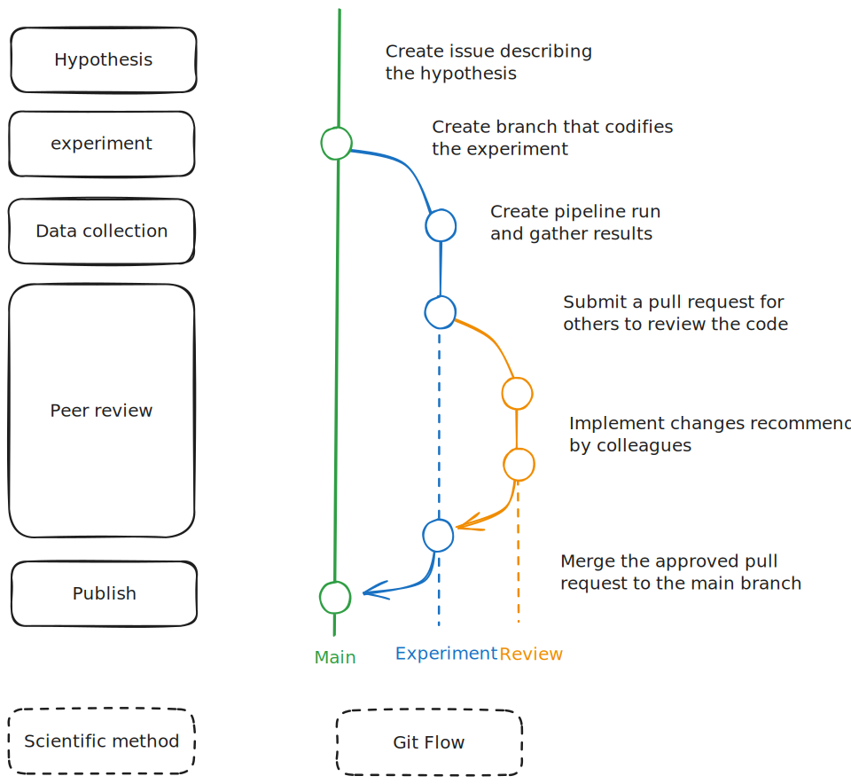

At Every Cure, we are on a mission to unlock the hidden potential of existing drugs to save lives. We believe that looking at all the existing drugs available in pharmacies today, we can find numerous new uses for these drugs to help people live better lives.

The answers are hidden in the data somewhere. We *just* have to find them. For that, we follow a fairly simple process of ingesting numerous data sources, integrating them to train models on the data that predict new high-potential drug-disease combinations.

## Our leading beliefs that defined our engineering strategy: Science, speed & learning loop

Building a system that processes a lot of data and predicts scores is actually fairly easy. But building a model that predicts *good* scores is hard. And knowing which model performs better is truly *hard.*

But we believe in a few axioms that we hope get us where we need to go:

**1) Applying the scientific method** leads to new insights that get us closer to our goal. This means reproducible analytics of peer-reviewed work, driven by hypotheses about how we can improve things, which are proven through experiments. Therefore, the scientific method is encoded directly into our Git flow.



**2) More experiments lead to more insights**. We therefore want to move from 1 all-vs-all prediction every few weeks to hundreds per day, constantly improving our predictive performance.


**3) Closing the feedback loop** leads to a self-learning system. As we predict scores, we implicitly encode hypotheses in the predictions. These hypotheses can be validated through various ways, and the insights fed back into our models, improving the next iteration. This may be anything from in-silico drug-ligand interactions to off-label compassionate use deployment for individual patients by their treating physicians.


## The system to enable us: A shared, scalable compute platform which makes fast distributed experiments easy

Now that we have our high-level strategy defined, we can go about building a system that enables us to achieve these above objectives. In the world of software engineering, there are of course millions of ways to achieve such an objective, but we also have a few non-functional constraints that we consider, such as talent availability, technology maturity, and costs.

In broad strokes, we opted for the following:

* **Public cloud** (GCP) as we do not want to manage our own hardware, nor do we have the capital to acquire it. Furthermore, potential partnerships with cloud providers may allow us to reduce our expenses here.
    
* **Kubernetes** as the abstraction layer from GCP to ensure our work is reproducible independent of the system in which it is being reproduced.
    
* **Kedro** to structure our work logically and **Argo Workflows** to orchestrate that logic on Kubernetes.
    
* **MLFlow** for experiment tracking to ensure we maintain a track record of everything we try.
    
* **Everything as Code** in a monorepo, including all experiment reports as either `md` or `ipynb` notebooks, hosted as part of our documentation to live by our value of the scientific method. Pull requests (PRs) act as the peer review process.
    

The below sketch visualizes our main technology components and shows what sits "beneath the surface" of the pipeline itself.


The **pipeline itself is completely independent of the systems on which it is executed**. It can run on a MacBook, in a Docker container, in a `docker compose` setup, or deployed as a distributed pipeline via `kubectl`. This separation of concerns allows us to run the entire pipeline in a variety of ways:

* End-to-end within 3 minutes with *fabricated data* as part of our CI pipeline, ensuring integrity of our main branch with `kedro run --env test -p test`
    
* On any machine reading the full data but storing all results locally on a single machine with `kedro run`
    
* On any machine reading & writing all data to the shared cloud systems with `kedro run -e cloud`
    
* Distributed and scaled on the Kubernetes cluster through our CI system which translates the Kedro pipeline into a workflow that can be orchestrated on the cluster.

## The primary stack

Visualized strictly as a stack, the *primary stack* be broken into 5 logical layers: ML, Pipeline, Parallelization, Data/Compute & Infrastructure. Let's dive into each of them in detail now.


### **ML Layer: OpenAI, Neo4J GDS, XGBoost, scikit-learn**

This is where most of our primary value creation takes place. We leverage OpenAI and various open source models to experiment with node embeddings, Neo4J GDS and other options for graph algorithms such as GraphSAGE, XGBoost and scikit-learn for building predictive models based on those graph embeddings and the existing KG structure.

### Pipeline Layer: Kedro

Kedro plays a central role in **structuring our pipeline**, providing a **modular** and **reproducible framework** for our data science workflows. We use Kedro to **organize our pipeline into distinct stages**: ingestion, integration, embedding, modeling, and evaluation. Each stage is composed of nodes that perform specific tasks, with data flowing between them as defined in our data catalog.

Kedro also helps us **switch between environments seamlessly** with **synthetic data and cloud-based production runs**. We've integrated custom nodes, such as our data fabricator, to generate synthetic datasets for testing and development.

The pipeline's flexibility allows us to experiment with different model configurations, including single models and ensembles, while maintaining reproducibility and scalability.

### Parallelization Layer: Spark & Ray

Our pipeline employs parallelization techniques to efficiently process large-scale data and perform complex computations. Our current parallelization strategy focuses on:

* **Data Parallelization with Apache Spark**: We leverage Apache Spark for the data preprocessing stage, particularly when handling large datasets during the ingestion and integration phases. Spark's distributed computing capabilities are a proven industry standard and help us deal with the large initial volumes of data. We leverage Kubernetes as the backend for Spark as we will describe in the next section.
    
* **Compute Parallelization with Ray**: We are planning to integrate Ray into our pipeline to provide more flexible parallelization, especially for our machine learning workflows. Ray will allow us to easily parallelize Python code and distribute ML tasks across our computational resources. We will use Ray as the interface for data scientists to work with instead of the underlying Kubernetes API, abstracting the compute layer away to logical resource concepts such as GPU count or CPU core count. This addition will drastically speed up operations like hyper-parameter tuning, ensemble model training, and inference.
    


By combining Spark for data preprocessing and Ray for ML-specific parallelization, we create a pipeline capable of handling the computational demands of large-scale drug repurposing predictions. Generally, as we progress in the pipeline, the data volume drastically shrinks but the compute requirements follow a different demand pattern. We require high amounts of compute for the graph enrichment (embeddings) and the training and inference stages while the ingestion & data integration require relatively little compute capacity.
### Data & Compute Layer: Kubernetes & BigQuery

All the layers above rely on this layer. We leverage Kubernetes as our standard API for computational orchestration and a combination of Google Cloud Storage and BigQuery for data storage.

#### Data Layer: BigQuery and GCS

Note that we are not tightly coupled to BigQuery or GCS. We've implemented custom Kedro datasets to seamlessly write to either one of them without touching the logical code at all.
```yaml
# writes this data to bigquery
embeddings.feat.edges:
  type: matrix.datasets.gcp.BigQueryTableDataset
  project_id: ${oc.env:GCP_PROJECT_ID}
  dataset: runs
  identifier: "${globals:run_name}"
  save_args:
    bigQueryTableLabel.git_sha: ${globals:git_sha}
    temporaryGcsBucket: ${globals:gcs_bucket}
  table: "edges"

# writes the data to a file system, either gcs://... or ./data/...
embeddings.feat.edges:
  type: matrix.datasets.gcp.LazySparkDataset
  file_format: parquet
  filepath: ${globals:paths.matrix_generation}/edges
```

Most of our data is stored on GCS. We leverage BigQuery for what we consider to be
"release-worthy" data, i.e. our KG and the model predictions. This allows us to leverage
the full power of BigQuery's SQL interface to query our data and give tech-savvy medical
team members access to the data they need. In the future, we may also use BigQuery as a
query interface to share our data with external partners. 

The structure of the data storage on GCS follows the pattern of `<runs>/<run_name>/<stage>/<dataset_name>`.
```
gs://<bucket>
             /runs
                  /lc-baseline-run/
                  /lc-run-baseline/
                  /run-23-aug-setup-1/
                  ...
                  /run-23-aug-setup-5/
                                     /02_intermediate/
                                     /03_primary/
                                     /04_feature/
                                     /05_model_input/
                                     /06_models/
                                     /07_model_output/
                                     /08_reporting/

```

Separately, all data in our "landing zone" or "raw data" is stored at `gs://mtrx-us-central1-hub-dev-storage/data/01_RAW/`. Public data sources (like RTX-KG2, Robokop, and Ground Truth) are stored in our public data bucket `gs://data.dev.everycure.org/data/01_RAW/`. Our release runs get stored at `gs://mtrx-us-central1-hub-dev-storage/releases/<version>`.

#### Kubernetes

**Kubernetes is the beating heart of our infrastructure**. It hosts all operational tooling, user interfaces, tools, and pipeline executions.

It gives us **GPUs when we need them** for heavy compute operations such as the embedding or model training phases of the pipeline.

It also helps us **save costs by deploying Spark on *spot instances***, instances that may be turned off at any moment by Google and thus come at a steep discount. Spark is actually very resilient against this, and the developer does not notice this at all. Think of it like dynamic pricing in the energy market, i.e., when there is cheap compute around we will consume it.

Furthermore, we run several services on individual instances, avoiding idle resources on individual VMs. When idle, our cluster is 3 nodes large & hosts about half a dozen services at the moment. When running 1 or several pipelines, we quickly scale up and down dozens of instances, tapping into potentially thousands of CPUs for a few minutes before shutting them down again.

<div data-node-type="callout">
<div data-node-type="callout-emoji">💡</div>
<div data-node-type="callout-text">This principle of compute instances is often referred to as "<a target="_blank" rel="noopener noreferrer nofollow" href="http://cloudscaling.com/blog/cloud-computing/the-history-of-pets-vs-cattle/" style="pointer-events: none">treating compute as cattle, not as pets</a>" as we really do not care at all about any individual compute instance.</div>
</div>

Below is a screenshot of our favorite Kubernetes management tool `k9s` ([GitHub](https://github.com/derailed/k9s)), an amazing CLI tool to interact with the cluster. Note that we use ArgoCD to provision our cluster, more on that later.


#### Artifact Registry

To deploy our code onto our cluster, we need to *package it into [OCI images](https://opencontainers.org/)*. We leverage GitHub Actions to build and ship our code to the *Artifact Registry* which is simply a place where we store all our images.

At this stage we have our code built, tested, packaged and an API (Kubernetes) defined on how to execute it. All we need now is raw compute and storage. This is where Google Cloud comes in.

### Infrastructure Layer: Google Cloud

Google Cloud Platform (GCP) provides us the raw capabilities we need to actually execute on all our defined procedures and systems.

They provide us with the essentials:

1. **Compute** through compute instances. Our Kubernetes cluster uses this layer to spin up *nodes*, the compute units that make up a Kubernetes cluster.
    
2. **Storage** to store all our inputs, intermediate results and output artifacts. This was described above.
    
3. **Networking** to ensure we have a perimeter of security and can expose our applications to the right people. We have a "hub and spoke" networking setup with a core cluster in our hub network and several spoke projects for sub-teams to experiment and tinker.
    
4. **Identity and Access Management** (IAM): As "Login with Google" has become so pervasive around the world, we decided to tap into this existing ecosystem. All our systems are secured with our Google identities. All web interfaces are proxied with an [Identity Aware Proxy](https://cloud.google.com/security/products/iap?hl=en), a service that ensures the user is authenticated and part of a group we define.
## Auxiliary tooling

### [MLFlow](https://mlflow.platform.dev.everycure.org)

Our Kedro pipeline integrates directly with MLflow using the [kedro-mlflow](https://github.com/Galileo-Galilei/kedro-mlflow) plugin. We're using MLflow to track pipeline runs and make them comparable, organize all our runs, track the parameters used for each run, and compare run performances. This integration makes it easy to dig into what data and parameters lead to which results.

Furthermore, MLflow allows us to store and version machine learning models, facilitating model deployment and serving. It enables collaboration among team members by providing a centralized platform for experiment tracking. The plugin automates the logging of metrics, parameters, and artifacts during pipeline execution, which is crucial for maintaining a comprehensive record of our machine learning experiments.

MLflow also offers customizable dashboards and plots for visualizing results, supporting reproducibility by capturing the entire ML lifecycle. This integration streamlines our workflow and enables us to make data-driven decisions more efficiently, aligning perfectly with our goal of maintaining a fast learning loop and open scientific method.

### [Vertex AI](https://console.cloud.google.com/vertex-ai/workbench/instances)

Vertex AI is GCP's machine learning platform that we leverage in two ways:

1. **Development Workbenches**: We utilize Vertex AI's cloud-based development environments for our data scientists and machine learning engineers. These workbenches provide a flexible, scalable platform for experimentation and development, allowing our team to work with large datasets and complex models without being constrained by local hardware limitations.

2. **API Consumption**: Vertex AI offers a suite of pre-trained models and APIs that we can potentially integrate into our pipeline. This includes services for:

   - Natural Language Processing (NLP) tasks such as entity extraction, which could be valuable for processing medical literature and identifying key concepts.
   - Large Language Models (LLMs) that can assist in various text-based tasks, from summarization to question-answering, potentially enhancing our ability to extract insights from unstructured medical data.

Vertex AI provides us with cloud-based development environments and pre-trained models, which can be useful for our development process and AI capabilities. This aligns with our goals of efficient experimentation and data analysis in the field of drug repurposing. However, we do not rely on anything here for our core pipeline.

### [GitHub Actions](https://github.com/everycure-org/matrix/actions)

GitHub Actions plays a crucial role in our CI/CD pipeline, automating various aspects of our development and deployment processes:

* **Build and Test**: Automatically builds and tests our pipeline images, ensuring code quality and functionality before deployment.
* **Documentation Deployment**: Handles the deployment of our documentation.
* **Release Management**: [Ongoing work] Creates releases of our codebase, allowing us to regularly communicate key changes to our developers and stakeholders.
* **Automated Pipeline Execution**: [Next up] We will automatically execute a pipeline run for each release, storing named and versioned results in MLflow, BigQuery, and our Neo4J instance. This automation will enhance our ability to track and compare results across different versions of our pipeline.

### Terraform/Terragrunt

Terraform and Terragrunt are essential tools in our Infrastructure as Code (IaC) strategy:

* **Infrastructure Codification**: We use Terraform to codify our infrastructure and data/compute layers. This approach allows us to version control our infrastructure, making it easier to track changes, rollback if necessary, and maintain consistency across different environments.
* **Terragrunt**: Terragrunt is a wrapper around Terraform that allows us to manage multiple Terraform configurations in a single repository. This simplifies the process of managing infrastructure as code, making it easier to maintain and update our infrastructure. Essentially, we re-use the same terraform code for multiple environments. 
* **ArgoCD Bootstrap**: Terraform, helps us bootstrap ArgoCD. This process automates the initial setup of ArgoCD in our Kubernetes cluster, ensuring a consistent and reproducible deployment of our GitOps tool.

By leveraging these tools, we ensure that our entire infrastructure is defined as code,
aligning with our principles of reproducibility and the scientific method. This approach
also facilitates easier collaboration among team members and provides a clear audit trail
of infrastructure changes over time. As an example, if someone needs a specific kind of
compute resource, instead of being dependent on the infrastructure team to provision it,
they can simply open a PR with the addition to the Terragrunt config and the change will
be reviewed and merged just like any other code change. The concept here is that people
are empowered to make changes to the infrastructure they need to make their work easier
while maintaining a high level of control and visibility.


### [ArgoCD](https://argo.platform.dev.everycure.org/workflows/)

We use ArgoCD to provision the services running on our Kubernetes cluster. This allows us to define everything running _inside_ the cluster as code. This works by Argo watching a specific Git repository for changes and then automatically provisioning the cluster according to the definitions in that repository.

We leverage the "app of apps" pattern to bootstrap our services. This means a single ArgoCD Application is created from Terraform which in turn provisions all the other applications we need.

```hcl
resource "kubernetes_manifest" "app_of_apps" {
  depends_on = [helm_release.argo]
  manifest = yamldecode(
    <<YAML
apiVersion: argoproj.io/v1alpha1
kind: Application
metadata:
  name: app-of-apps
  namespace: argocd
spec:
  destination:
    namespace: argocd
    server: "https://kubernetes.default.svc"
  source:
    path: ${var.repo_path}/app-of-apps
    repoURL: ${var.repo_url}
    targetRevision: ${var.repo_revision}
  project: default
  syncPolicy:
    syncOptions:
      - CreateNamespace=true
    automated:
      prune: true
      allowEmpty: true
YAML
  )
}
```

The above snippet is how we use terraform to bootstrap the app of apps pattern. This application then creates other applications (e.g. MLFlow) as such:

```yaml
apiVersion: argoproj.io/v1alpha1
kind: Application
metadata:
  name: mlflow
  namespace: argocd
spec:
  destination:
    namespace: mlflow
    server: {{ .Values.spec.destination.server }}
  project: default
  source:
    path: {{ .Values.spec.source.repoPath }}/mlflow
    repoURL: {{ .Values.spec.source.repoURL }}
    targetRevision: {{ .Values.spec.source.targetRevision }}
  syncPolicy:
    syncOptions:     # Sync options which modifies sync behavior
    - CreateNamespace=true # Namespace Auto-Creation ensures that namespace specified as the application destination exists in the destination cluster.
    automated: 
      prune: true

```

The branch we use for our ArgoCD configuration is `infra`. We regularly merge this back to `main` to ensure we are in sync.


## Conclusion

Every Cure's tech stack is designed to accelerate drug repurposing through a scalable,
reproducible, and scientifically rigorous approach. By leveraging cloud infrastructure,
containerization, and modern data science tools, we've created a flexible pipeline that
can rapidly iterate on experiments and scale to meet computational demands. Our emphasis
on "everything as code" and GitOps principles ensures transparency and reproducibility,
aligning with our commitment to the scientific method. This robust technological
foundation positions us to efficiently uncover new potential uses for existing drugs,
ultimately aiming to improve patient outcomes and save lives. All of this will be open-sourced
as we believe in the open-source community and the power of open science.
