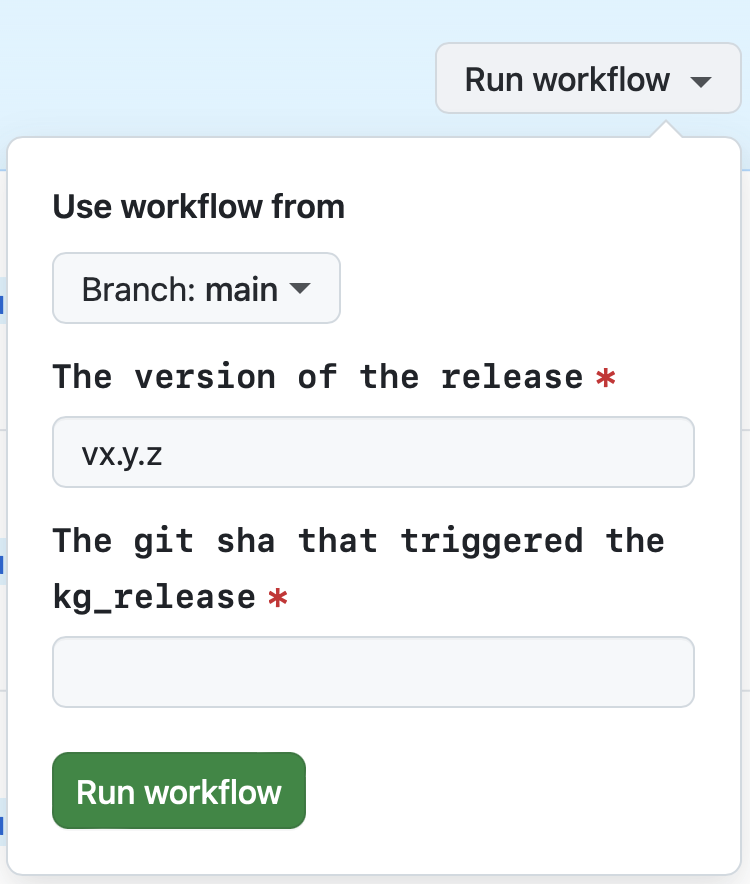
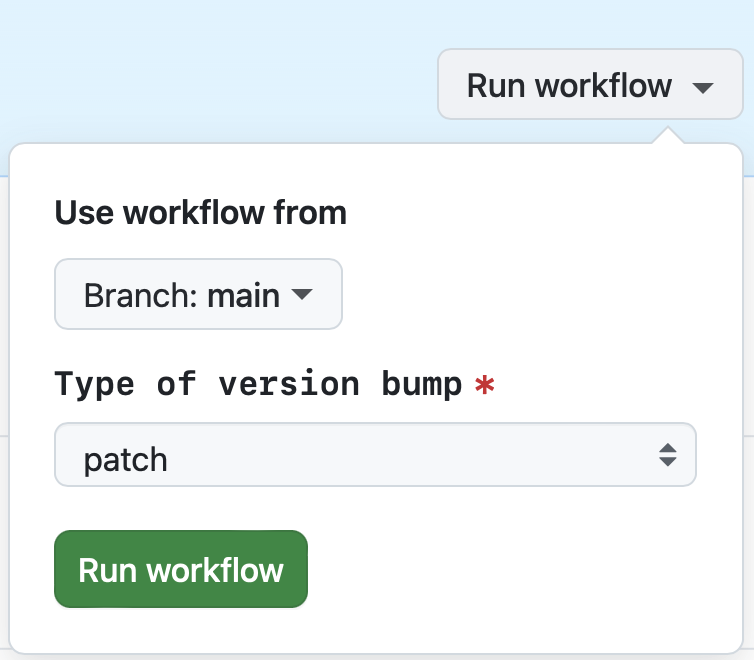

## Overview

This runbook outlines the steps to create a release in our GitHub repository, either manually or via GitHub Actions.

## Steps to Create a Release Manually

1. **Prepare the branch you will run the release from.**
    - Make sure the branch includes the desired data sources / parameters you want to use in your run.
    - The branch name needs to match the naming convention `release/v{semver}`, e.g. `release/v0.2.5`. Suffixes are allowed after a dash, i.e. `release/v0.2.5-alpha`
    - Your git state needs to be clean, i.e. no uncommitted or untracked files. This ensures someone else can run the same command and produce the same result.
    - The release version can be a patch downgrade, but not minor or major downgrade, e.g. if `v0.2.5` is the latest official release, `v0.2.3` is allowed to trigger while `v0.1.8` is forbidden.
2. **Determine which pipeline to run.**
    - A data release is created by running a kedro pipeline. You can run a dedicated pipeline called `data_release` or other pipeline, which contains it.
    - Consult the [pipeline registry](https://github.com/everycure-org/matrix/blob/main/pipelines/matrix/src/matrix/pipeline_registry.py) for the current pipeline definitions.
    - Currently, data release will be triggered if one of the following pipelines are run: `data_release`, `kg_release_and_matrix_run`, `kg_patch_and_matrix_run`. (note: `kg_patch_and_matrix_run` is triggered only in weekly patch bumps, as releasing to Neo4J is not necessary and removed from `kg_patch_and_matrix_run`)
3. **Trigger the pipeline.**
    - Activate the virtual environment, `source ./matrix/pipelines/matrix/.venv/bin/activate`
    - Build and run a kedro experiment run command, e.g.: `kedro experiment run --username <YOUR_NAME> --release-version <INTENDED_RELEASE_VERSION> --pipeline kg_release_and_matrix_run --experiment-name <YOUR_EXPERIMENT_NAME> --run-name <YOUR_RUN_NAME>`
4. **Wait for pipeline to finish.**
    - Once the pipeline finishes, a new data release PR will be created with changelog and an optional release article template (for major or minor bumps).
    - If the intended release verion is a patch bump and the release article is still expected, please follow the steps to generate the template:
        - Switch to the release branch.
        - Activate the virtual environment `source ./matrix/apps/matrix-cli/.venv/bin/activate`
        - Run the command `matrix releases template --output-file docs/src/releases/posts/<INTENDED_RELEASE_VERSION>/post.md --until <THE_GIT_SHA_THAT_TRIGGERED_THE_RELEASE>` 
5. **Review the PR that was auto-created.**
- Review the generated article template and ask contributors to adjust. The auto-generated article template only includes the PR title, so make sure the titles are named explicitly and add detailed contents if needed
    - Manually check who has contributed and list the contributors of the month to encourage contributions through PRs (code, docs, experiment reports, etc.). See the cli command below for how to best do this.
    - Upon merging the PR, the release will be publicized to the [Every Cure website](https://docs.dev.everycure.org/releases/) by another [GitHub Action](https://github.com/everycure-org/matrix/blob/main/.github/workflows/create-release-pr.yml). It will then also be listed under the [GitHub releases](https://github.com/everycure-org/matrix/releases).
6. **Create a sample release.**
    - Create a sample release as a subset of the KG release, which will be used for tests.
7. **Check the KG dashboard.**
    - The KG dashboard will be automatically updated with the new release.
    - Check the [KG dashboard](https://data.dev.everycure.org/versions/latest/evidence/) to ensure the new release is loaded correctly via the version number.
    - Give a quick look at the dashboard's summary page's numbers to make sure they are in the right range.

## Automated Release Workflow  

To streamline the release process, we use GitHub Actions for periodic **patch** and **minor** version bumps. This workflow consists of three steps:  

1. **Run Kedro kg-release via [GitHub Actions](https://github.com/everycure-org/matrix/blob/main/.github/workflows/submit-kedro-pipeline.yml).**  
    - A **weekly patch bump** and a **monthly minor bump** are scheduled to automatically trigger the Kedro pipeline submission.  

2. **Wait for pipeline to finish.**
    - Once the pipeline finishes, a new data release PR will be created with an optional release article template and changelog.

3. **Review the Auto-Created PR**  
   - **For the weekly patch bump:** The primary goal is to verify the stability of the `main` branch after a week of new commits. Once reviewed, simply close the PR, as no further action is needed.  
   - **For the monthly minor bump:** Since this results in an official release, follow these steps:  
- Review the auto-generated release article template and ask contributors to improve it. E.g. in the past, the person who takes ownership of this PR simply asked everyone on Slack to revise their PR titles, to make them more reflective of what they contribute towards Every Cure's goals.
        - Manually check who has contributed and list the contributors of the month to encourage contributions through PRs (code, docs, experiment reports, etc.). See the cli command below for how to best do this.
        - Upon merging the PR, the release will be publicized to the [Every Cure website](https://docs.dev.everycure.org/releases/) by another [GitHub Action](https://github.com/everycure-org/matrix/blob/main/.github/workflows/create-release-pr.yml). It will then also be listed under the [GitHub releases](https://github.com/everycure-org/matrix/releases).

## Commands

To list contributors, use the following command:

```bash
git log v0.1..HEAD --pretty=format:"%h %ae%n%b" | \
    awk '/^[0-9a-f]+ / {hash=$1; author=$2; print hash, author} /^Co-authored-by:/ {if (match($0, /<[^>]+>/)) print hash, substr($0, RSTART+1, RLENGTH-2)}' | \
    awk '{print $2}' | \
    sort -u
```

## FAQ

### 1. **Why are there more tags than releases**

The tag is created and pushed during the creation of the release PR from the GitHub Actions workflow. However, the [release history webpage](https://docs.dev.everycure.org/releases/release_history/) will only be updated if the PR is merged into the main branch, bringing the release information into the main branch, whose codebase is used to build the website.

### 2. **The release pipeline is finished, but I don't see the auto-generated release PR**

This issue might be caused by a failure in the GitHub Actions workflow responsible for creating the release PR.  

#### Steps to troubleshoot and re-trigger the workflow:  

1. Navigate to the [**Actions**](https://github.com/everycure-org/matrix/actions) tab in the GitHub repository.  
2. Open the [**"Create Pull Request to Verify AI Summary of Release Notes"**](https://github.com/everycure-org/matrix/actions/workflows/create-release-pr.yml) workflow.  
3. Locate the workflow run for the release you triggered (it should be the most recent one).  
4. Inside the workflow, find the step **"Print Release Version and Git SHA"**, and note down the printed **release version** and **Git SHA (gitref)**—these will be needed later for re-triggering.  
5. Report the failure for further investigation.  
6. Once the issue is resolved, re-trigger the workflow:  
   - Return to the UI in [**Step 2**](https://github.com/everycure-org/matrix/actions/workflows/create-release-pr.yml).
   - Click **"Run workflow"**.
   - Enter the **release version** and **Git SHA** noted in step 4.  
   - Click **"Run workflow"** to initiate the process again. 

   

### 3. **The scheduled time has passed, but the auto-submitted release pipeline is not running**  

This issue might be due to a failure in the GitHub Actions workflow responsible for submitting the release pipeline.  

#### Steps to troubleshoot and re-trigger the workflow:  

1. Navigate to the [**Actions**](https://github.com/everycure-org/matrix/actions) tab in the GitHub repository.  
2. Open the [**"Periodically run kedro kg-release"**](https://github.com/everycure-org/matrix/actions/workflows/submit-kedro-pipeline.yml) workflow.  
3. Locate the most recent workflow run for the scheduled release.  
4. Report the failure for further investigation.  
5. Once the issue is resolved, re-trigger the workflow:  
   - Return to the UI in [**Step 2**](https://github.com/everycure-org/matrix/actions/workflows/submit-kedro-pipeline.yml).  
   - Click **"Run workflow"**.  
   - Select the version bump type (**patch** or **minor**).  
   - Click **"Run workflow"** to restart the process.  

   

## Best Practices

- Ensure all PRs are labeled and titled correctly before generating the release article template.
- Fill in the release article template to ensure clarity and completeness.
- Acknowledge all contributors to foster a collaborative environment.

## Additional Resources

- [Semantic Versioning](https://semver.org/)
- [GitHub Releases Documentation](https://docs.github.com/en/repositories/releasing-projects-on-github/about-releases)
