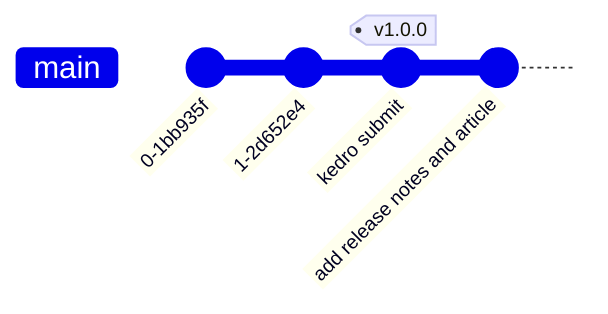

# Data versioning workflow

It's a tale of 2 orchestrators: Argo Workflow, to monitor tasks running on k8s,
and GitHub Actions, to act on the repository where this code is hosted.

## Current implementation

```mermaid
sequenceDiagram
	actor eng as Engineer
	box rgb(40,100,50, .5) ns:argo-workflows
	participant ws as Workflows Server
	end
    eng->>ws: kedro submit --pipeline data_release
    create participant dr as Data Release
  box rgb(40,50,100, .5) ns:data-release
		participant es as Event Source
		participant eb as Event Bus
		participant esen as Event Sensor
	end

    ws->>dr: start workflow
    dr->>+dr: launch pods running kedro nodes
    destroy dr
		es-xdr: 👀 Detect done (filter)!
    es->>eb: FWD 📨!
    esen->>eb: “filter”
	  note right of esen: trigger an action
```

The above combination makes the Git lineage end result look like:

## Future work

A data quality check can be implemented as a required pipeline after
data-release or as an optional one in kedro (branching off), but required for
the release process (e.g. sensor→DQ→sensor→curl).

## References

https://docs.dev.everycure.org/infrastructure/argo_workflows_locally/
https://kind.sigs.k8s.io/docs/user/quick-start  
https://argoproj.github.io/argo-events/installation/  
