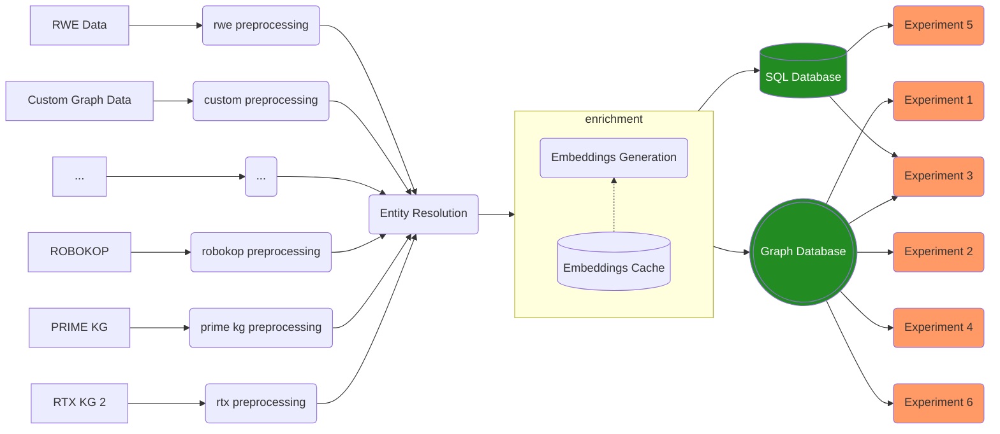

# Data access layer

!!! warning "Draft status"
    this page is very much in draft status and not to be considered an _is state_




## Accessing data

- Data will be made available between working groups through the `hub` project in GCP. This way, internal experimentation is contained within the projects of the respective working groups.
- We have 2 environments for data access: 
  - Our `dev` environment acts as a collaborative space where we all collaborate and exchange data
  - Our `prod` environment is our "reproducability" space, where we ensure the system can be reproduced end to end. Here we will also host the publicly accessible websites in the future. 

### Kedro based access

- for convenience, we have provided a set of kedro data sets which allow easy quiring of the knowledge graph


### GraphQL based access

- four more explorative data analysis, the Neo4J database can be accessed via API endpoint

### Bigquery based access

- All data in the KG is also accessible in tabular format in BigQuery for further analysis

## Data Versioning

- as we continuously explore new strategies for our modeling and data processing,
versioning our data is essentiatherefore both the tables in BigQuery as well as the
knowledge graph are available through a `tag/version` combination. In Big Query this will materialize as tables in the format of

```
primary.unified_graph_nodes__v0.2.1 #layer.table_name__semver_version
raw.rtx_kg2__v2.2.1                 #layer.table_name__semver_version
```

In Neo4J we will use several databases to separate the graphs. See [their documentation](https://neo4j.com/docs/operations-manual/current/database-administration/) for details.

## Data Lineage

- we want to be able to track back for each model that we release what date it was trained on. therefore we need to be able to track back the origin of each data source. This is where data lineage comes in. We will use a combination of kedro for the initial lineage and later on [gcp lineage](https://cloud.google.com/data-catalog/docs/concepts/about-data-lineage) for more authorative lineage.