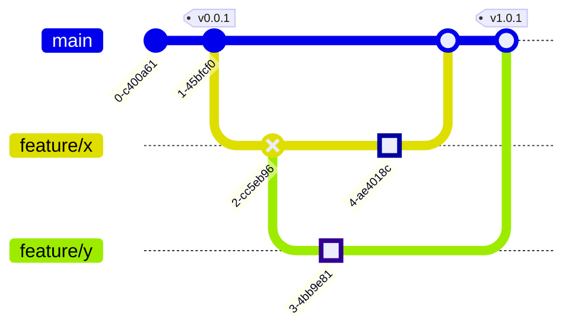
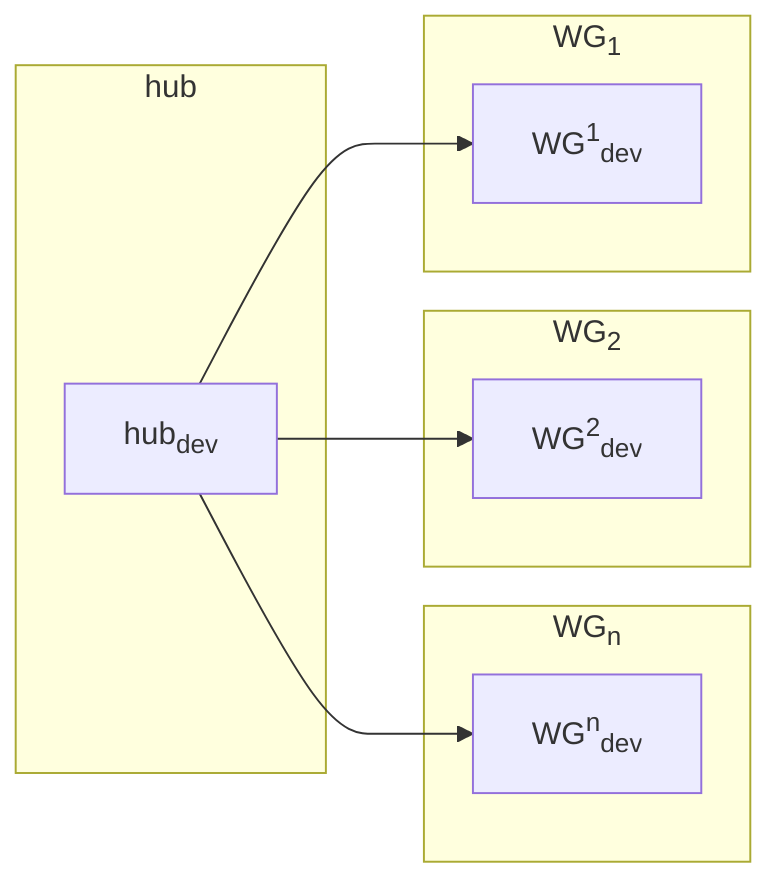

# Data API


!!! warning
    Note this information is partially outdated and will be improved soon as we pivot to a "data release" setup. More to come.
    

We publish our knowledge graph as 3 distinct artifacts:

- A Neo4J database
- 2 BigQuery tables (nodes & edges)
- 2 GCS folders containing the node & edge parquet files

These artifacts are versioned and released on a monthly basis. The knowledge graph
integrates all our data sources into one unified graph, however we keep a
`upstream_data_source` column which allows filtering and tracking the source of the data
in the graph. Note this does not offer lineage all the way back to the original academic
paper, as this is something the intermediate sources need to provide.

!!! info
    Note we have not completed our automation for artifact releases yet, therefore we currently release the artifacts manually.

## Data Model

Our knowledge-graph (KG) in Neo4J is modelled according to the [Biolink model](https://biolink.github.io/biolink-model/).

1. Nodes are used to represent instances of [`biolink classes`](https://biolink.github.io/biolink-model/#classes-visualization).
   - Node labels are used to augment nodes with their class name.
   - Biolink classes may be hierarchical, in that case we store _all_ classes of the instance.

!!! info "Nodes in Neo4J"
   
    Nodes should contain the following properties:
    
    1. `Name`: name of the node
    2. `Description`: description of the node
  
  Our data can be previewed in [BigQuery](https://console.cloud.google.com/bigquery?referrer=search&project=mtrx-hub-dev-3of&ws=!1m4!1m3!3m2!1smtrx-hub-dev-3of!2sdata_api).

2. Edges are used to represent instances of [`biolink predicates`](https://biolink.github.io/biolink-model/#predicates-visualization).
   - The edge label is used to augment edges with their predicate name.
   - For hierachical predicates, we only store the most specific predicate.
   - We omit the `biolink:` prefix in predicate names for brevity.
   - Predicates are written in [snake_case](https://en.wikipedia.org/wiki/Snake_case) format.

!!! info "Edges in Neo4J"

    Edges in the graph should contain the following properties:
  
    1. `knowledge_sources`: List of knowledge sources in [infores]( https://github.com/biolink/information-resource-registry) format.
  
    Our data can be previewed in [BigQuery](https://console.cloud.google.com/bigquery?referrer=search&project=mtrx-hub-dev-3of&ws=!1m4!1m3!3m2!1smtrx-hub-dev-3of!2sdata_api).

## Data Versioning

Due to the countless number of sources and processing techniques our integrated knowledge-graph will keep evolving over time. We've designed the data API to embrace this ever changing nature of the knowledge graph. Each artifact produced by the integration layer will be augmented with a version number. When performing analysis, we aim to refer back to the version as to enable full reproducibility of the results.

The release process of the knowledge graph (KG) will be fully driven by our version control. We use a `trunk-based` strategy, i.e.,

- Changes to the KG are initiated by submitting a [pull-request](https://docs.github.com/en/pull-requests/collaborating-with-pull-requests/proposing-changes-to-your-work-with-pull-requests/about-pull-requests) to the repository, e.g.,
    - Addition/removal of data sources
    - Changes to the processing for individual sources
    - Updates to the integration logic, e.g., entity resolution
- A pull request is only merged after it adheres to our coding standards.
    - Code is formatted using the repo's pre-commit hooks
    - Code is equipped with proper testing
    - Source of information is added to the KG to enable lineage tracking
- After a pull request is merged, [git tags](https://git-scm.com/book/en/v2/Git-Basics-Tagging) are used to trigger releases, i.e.,
    - New BigQuery tables are produced for the version
    - New Neo4J database is produced




## Artifacts

Our KG is uniquely identified according to a `release`. The release is a date string in the form of `YYYYMMDD` and refers to the date of the release. We store the output in two target systems:

- __Neo4J__: The native graph representation is stored in Neo4J.
  - We leverage distinct [Neo4J databases](https://neo4j.com/docs/operations-manual/current/database-administration/standard-databases/create-databases/) to isolate different KG versions.
  - Databases are named according to the `everycure_<release>` format.
  - Multiple versions may be live at a given moment.

- __BigQuery__: A tabular representation of the graph is stored in BigQuery.

  - The tabular representation consist of an `edges` and `nodes` table.
  - These tables are co-located in a [BigQuery Dataset](https://cloud.google.com/bigquery/docs/datasets-intro).
  - Data for different releases is materialized in distinct tables using [sharding](https://cloud.google.com/bigquery/docs/partitioned-tables#dt_partition_shard). The table names are in `<table_name>_YYYMMDD` format.


!!! info "BigQuery format"

  The tabular representation of the nodes and edges tables is obtained by storing the node/edge properties in distinct columns.
  

## Accessing data

Released artifacts will be made accessible to working-group (WG) projects through our centralized hub project. The diagram below visualises the hub and working-group specific cloud projects, these environments have been configured with permissions to allow cross-project data access. The goal of this seperation is to enable internal experimentation within the projects of the respective working groups, and to isolate costs.



### Kedro based access

We're using [Kedro](https://docs.kedro.org/en/stable/) as our data pipelining framework. Kedro provides access to read and write data through the [data catalog](https://docs.kedro.org/en/stable/data/data_catalog.html).

#### Accessing BigQuery data

Kedro does not provide an out-of-the-box BigQuery integration. We've therefore created a custom dataset to simplify the process of connecting to BigQuery.

Use the code snippet below to register the `BigQueryTableDataset` in the catalog. Upon being fed into a [Kedro node](https://docs.kedro.org/en/stable/nodes_and_pipelines/nodes.html), this dataset will yield the corresponding table in the form of a [PySpark](https://spark.apache.org/docs/latest/api/python/index.html) dataframe.

!!! Note
  Our implementation of the `BigQueryTableDataset` is essentially a wrapper of the [spark-bigquery-connector](https://github.com/GoogleCloudDataproc/spark-bigquery-connector). Optimization techniques such as predicate pushdown are automatically performed upon usage.

```yaml
# catalog.yml
example.bigquery.dataset:
    type: matrix.datasets.gcp.BigQueryTableDataset
    project_id: <hub_project_id>
    dataset: <kg_dataset_name>
    table: <table_name>
```

#### Accessing Neo4J data

!!! info "Examples pending"
    We aim to add some examples on querying the biolink graph as soon as the instance is running.

Graph data in Neo4J is accessed through another custom dataset. This dataset essentially wraps the [Neo4J Spark Connector](https://neo4j.com/docs/spark/current/).

The Neo4J dataset allows for pulling data from Neo4J in the form of a Spark dataframe, in tabular format. Given that Neo4J stores data in graph format, the dataset requires additional configuration to convert graph data into a tabular structure and visa versa. That's where the [`load_args`](https://neo4j.com/docs/spark/current/read/options/) and [`save_args`](https://neo4j.com/docs/spark/current/write/options/) come in. 

```yaml
# catalog.yml
example.neo4j.dataset:
    type: matrix.datasets.neo4j.Neo4JSparkDataset
    database: everycure-<version>
    url: <neo4j_host>
    table: <table_name>

    # Credentials
    credentials:
      authentication.type: basic
      authentication.basic.username: neo4j
      authentication.basic.password: <neo4j_password>

    # Mapping the graph to tabular structure, i.e.,
    # the following configuration retrieves all nodes
    # with the `Entity` label into a table, where each
    # row is a node from the graph, and columns represent
    # their properies.
    # https://neo4j.com/docs/spark/current/read/options/
    load_args:
      labels: :Entity
    
    # Mapping tabular structure to graph, i.e., save 
    # each row from the Spark dataframe into a distinct
    # node with the `Entity` label. Columns from the 
    # dataframe are used as node properties.
    # https://neo4j.com/docs/spark/current/write/options/
    save_args:
      labels: :Entity

```


### Cypher based access

For more exploratory data analysis, the Neo4J instance can be accessed directly via the API endpoint.

### Bigquery based access

The tabular representation of our knowledge-graph can also be accessed directly through [BigQuery Studio](https://cloud.google.com/blog/products/data-analytics/announcing-bigquery-studio).


## Future work

This is a very preliminary version of our API spec. Future refinements may include:

- Confidence scores for edges in source data
- Expanding the biolink model for RWE data
- Enriching the graph with information of the publication
- Connections to merge different ontologies
- Discuss adding `knowledge_level` and `agent_type` see [link](https://github.com/NCATSTranslator/ReasonerAPI/blob/master/ImplementationGuidance/Specifications/knowledge_level_agent_type_specification.md).
