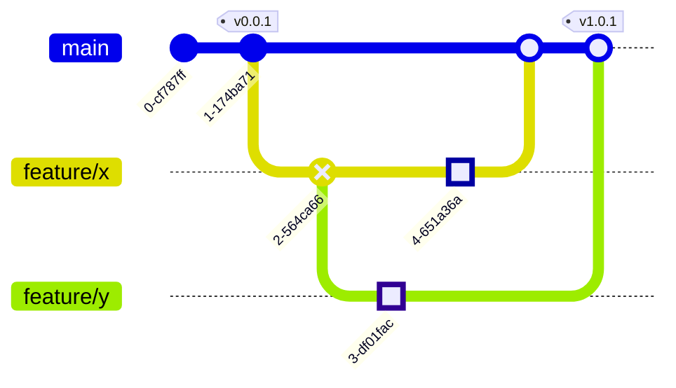
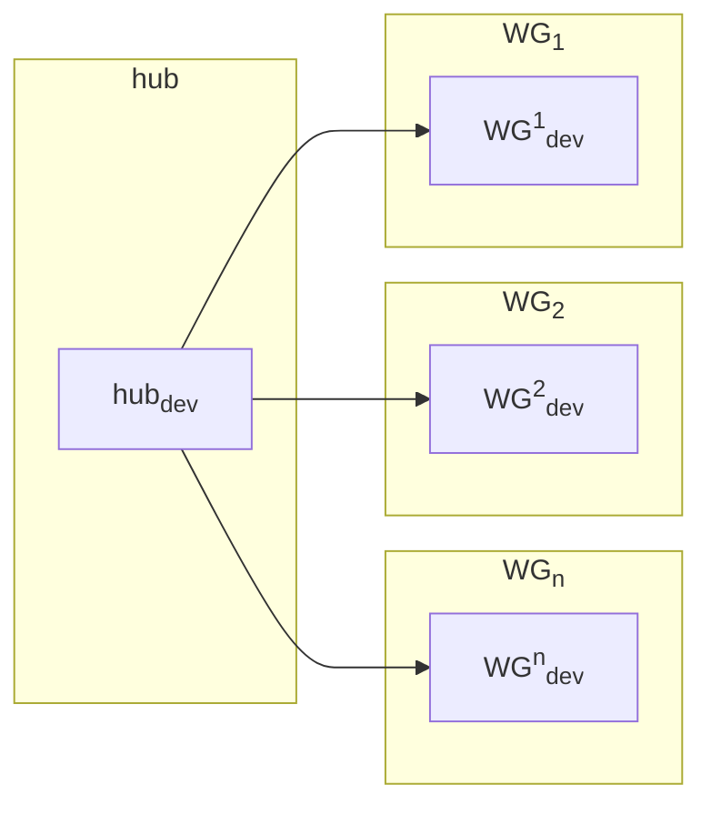

# Data API

!!! warning "Draft status"
    this page is very much in draft status and not to be considered an _is state_


Due to the countless number of sources and processing techniques our integrated knowledge-graph will keep evolving over time. We've designed the data API to embrace this ever changing nature of the knowledge graph. Each artifact produced by the integration layer will be augmented with a version number. When performing analysis, we aim to refer back to the version as to enable full reproducibility of the results.

The release process of the knowledge graph (KG) will be fully driven by our version control. We use a `trunk-based` strategy, i.e.,

- Changes to the KG are initiated by submitting a [pull-request](https://docs.github.com/en/pull-requests/collaborating-with-pull-requests/proposing-changes-to-your-work-with-pull-requests/about-pull-requests) to the repository, e.g.,
    - Addition/removal of data sources
    - Changes to the processing for individual sources
    - Updates to the integration logic, e.g., entity resolution
- A pull request is only merged after it adheres to our coding standards.
    - Code is formatted using the repo's pre-commit hooks
    - Code is equipped with proper testing
    - Source of information is added to the KG to enable lineage tracking
- After a pull request is merged, [git tags](https://git-scm.com/book/en/v2/Git-Basics-Tagging) are used to trigger releases, i.e.,
    - New BigQuery tables are produced for the version
    - New Neo4J database is produced




## Artifacts

### Neo4J Graph

Idea is to use different database instances, kg_<version>

### BigQuery tables

table_<version>

## Accessing data

Released artifacts will be made accessible to working-group (WG) projects through our centralized hub project. The diagram below visualises the hub and working-group specific cloud projects, these environments have been configured with permissions to allow cross-project data access. The goal of this seperation is to enable internal experimentation within the projects of the respective working groups, and to isolate costs.



### Kedro based access

We're using [Kedro](https://docs.kedro.org/en/stable/) as our data pipelining framework. Kedro provides access to read and write data through the [data catalog](https://docs.kedro.org/en/stable/data/data_catalog.html).

#### Accessing BigQuery data

Kedro does not provide an out-of-the-box BigQuery integration. We've therefore created a custom dataset to simplify the process of connecting to BigQuery.

Use the code snippet below to register the `BigQueryTableDataset` in the catalog. Upon being fed into a [Kedro node](https://docs.kedro.org/en/stable/nodes_and_pipelines/nodes.html), this dataset will yield the corresponding table in the form of a [PySpark](https://spark.apache.org/docs/latest/api/python/index.html) dataframe.

> NOTE: Our implementation of the `BigQueryTableDataset` is essentially a wrapper of the [spark-bigquery-connector](https://github.com/GoogleCloudDataproc/spark-bigquery-connector). Optization techniques such as predicate pushdown are automatically performed upon usage.

```yaml
# catalog.yml
example.bigquery.dataset:
    type: matrix.datasets.gcp.BigQueryTableDataset
    project_id: <hub_project_id>
    dataset: <kg_dataset_name>
    table: <table_name>
```

#### Accessing Neo4J data

!!! info "Examples pending"
    We aim to add some examples on querying the biolink graph as soon as the instance is running.

Graph data in Neo4J is accessed using a combination of a custom dataset and [decorator](https://realpython.com/primer-on-python-decorators/). Our KG is represented according to the [Biolink model](https://biolink.github.io/biolink-model/). The dataset configures the connection to the database instance, while the decorator allows for specifying the [Cypher query](https://neo4j.com/docs/getting-started/cypher-intro/) to use.

The code snippets below can be used to consume Neo4J data. The node function responsible for processing the Neo4J data should be annodated with the `cypher_query` annotation. The `query` keyword-argument of the decorator accepts:

1. Stringified cypher query
2. Lambda function that returns a cypher query
   - The lambda is invoked with all arguments of the corresponding node function, and hence can be used to interpolate the query.

> NOTE: Annotating the node function with `cypher_query` has the effect that the `data` passed into the node function contains the result of the `query` executed on the Neo4J database. This has the advantage that query and processing logic are colocated.

```yaml
# catalog.yaml
example.neo4j.dataset:
  type: matrix.datasets.neo4j.Neo4JSparkDataset
  database: <neo4j_database>
  url: <neo4j_url>
  credentials: neo4j_credentials
  save_args:
    mode: "overwrite"
```

```python
# nodes.py
from matrix.datasets.neo4j import cypher_query

@cypher_query(
    query=lambda drug_label: f""" 
        MATCH p=(n)-[r:TREATS]->() 
        WHERE n.category in ['{drug_label}'] 
        RETURN p
    """
)
def neo4j_decorated(data: DataFrame, drug_label: List[str]):
    """Function to retrieve Neo4J data.

    Args:
        data: Dataframe representing query result
        drug_label: additional arg
    """
    print(drug_label)
    data.show()
```

### GraphQL based access

For more exploratory data analysis, the Neo4J instance can be accessed directly via the API endpoint.

### Bigquery based access

The tabular representation of our knowledge-graph can also be accessed directly through [BigQuery Studio](https://cloud.google.com/blog/products/data-analytics/announcing-bigquery-studio).
<!-- 
## Data Versioning

- as we continuously explore new strategies for our modeling and data processing,
versioning our data is essentiatherefore both the tables in BigQuery as well as the
knowledge graph are available through a `tag/version` combination. In Big Query this will materialize as tables in the format of

```
primary.unified_graph_nodes__v0.2.1 #layer.table_name__semver_version
raw.rtx_kg2__v2.2.1                 #layer.table_name__semver_version
```

In Neo4J we will use several databases to separate the graphs. See [their documentation](https://neo4j.com/docs/operations-manual/current/database-administration/) for details.

## Data Lineage

- we want to be able to track back for each model that we release what date it was trained on. therefore we need to be able to track back the origin of each data source. This is where data lineage comes in. We will use a combination of kedro for the initial lineage and later on [gcp lineage](https://cloud.google.com/data-catalog/docs/concepts/about-data-lineage) for more authorative lineage. --> -->