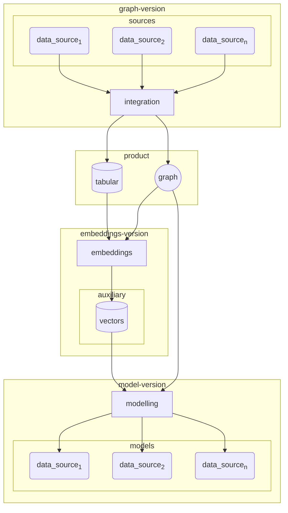
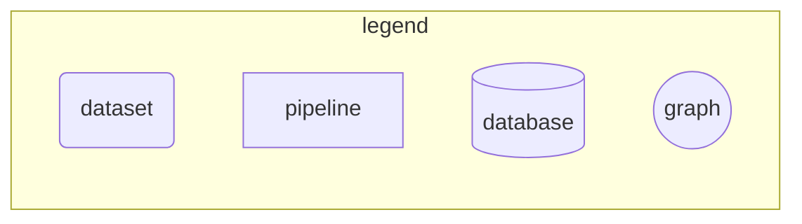

High level problem outline:





We propose a versioned approach to these datasets, i.e.,

- Graph version
- Embeddings version
- Models version

This will yield a semantic versioning string of the following format:

```
v.<graph-version>.<embeddings-version>.<modeling-version>
```


