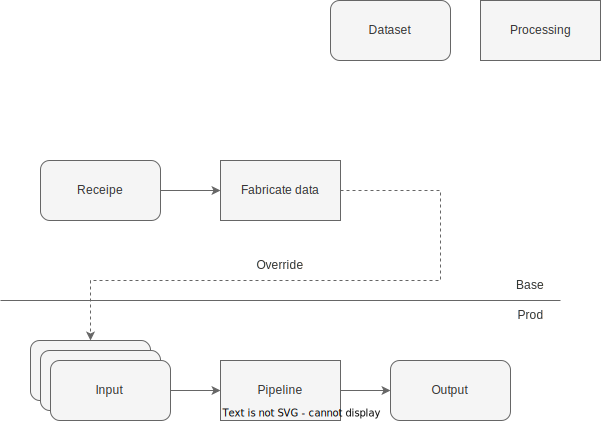
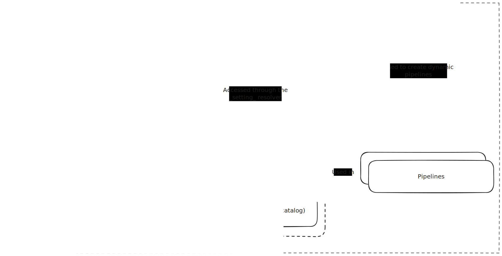
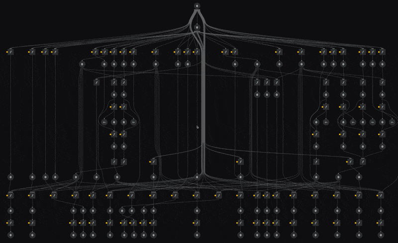

This page provides an overview of a few advanced Kedro features and customizations we've implemented in our project.

## Dataset transcoding

Our pipeline uses Spark and Pandas interchangeably. To avoid having to manually convert datasets from one type into another, Kedro supports [dataset transcoding](https://github.com/kedro-org/kedro-training/blob/master/training_docs/12_transcoding.md).

In short, this feature allows for defining multiple flavors of a dataset in the catalog, using the syntax below. The advantage of this is that Kedro is aware that `my_dataframe@spark` and `my_dataframe@pandas` refer to the same data, and hence pipeline runtime dependencies are respected.


```yaml
my_dataframe@spark:
  type: spark.SparkDataSet
  filepath: data/02_intermediate/data.parquet
  file_format: parquet

my_dataframe@pandas:
  type: pandas.ParquetDataSet
  filepath: data/02_intermediate/data.parquet
```

## Data fabrication

!!! tip
    For more information regarding the fabricator, navigate to `pipelines/matrix/packages/data_fabricator`.

Our pipeline operates on large datasets, as a result the pipeline may take several hours the complete. Unfortunately, large iteration time leads to decreased developer productivity. For this reason, we've established a data fabricator to enable test runs on synthetic data.

To seamlessly run the same codebase on both the fabricated and the production data, we leverage [Kedro configuration environments](https://docs.kedro.org/en/stable/configuration/configuration_basics.html#configuration-environments).

!!! warning
    Our pipeline is equipped with a `base` and `cloud` catalog. The `base` catalog defines the full pipeline run on synthetic data. The `cloud` catalog, on the other hand, plugs into the cloud environment.

    To avoid full re-definition of all catalog and parameter entries, we're employing a [soft merge](https://docs.kedro.org/en/stable/configuration/advanced_configuration.html#how-to-change-the-merge-strategy-used-by-omegaconfigloader) strategy. Kedro will _always_ use the `base` config. This means that if another environment is selected, e.g., `cloud`, using the `--env` flag, Kedro will override the base configuration with the entries defined in `cloud`. Our goal is to _solely_ redefine entries in the `cloud` catalog when they deviate from `base`.

The situation is depicted below, in the `base` environment our pipeline will plug into the datasets as produced by our fabricator pipeline, whereas the `cloud` environment plugs into the cloud systems. Note that these commands need to be run in `matrix/pipelines/matrix` with the virtual environment activated.

```bash
# Pipeline uses the base, i.e., local setup by default.
# The `test` pipeline runs the `fabricator` _and_ the full pipeline.
kedro run -p test -e test

# To leverage cloud systems, you can use `cloud` environment.
# Note that we should only use `cloud` environment within our cloud cluster, NOT locally.
kedro --env cloud
```



## Dependency injection

At the end of the day, data science code is very configuration heavy, and is therefore often flooded with constants. Consider the following example:

```python
def train_model(
    data: pd.DataFrame,
    features: List[str],
    target_col_name: str = "y"
) -> sklearn.base.BaseEstimator:

    # Initialise the classifier
    estimator = xgboost.XGBClassifier(tree_method="hist")

    # Index data
    mask = data["split"].eq("TRAIN")
    X_train = data.loc[mask, features]
    y_train = data.loc[mask, target_col_name]

    # Fit estimator
    return estimator.fit(X_train.values, y_train.values)
```

While the code above is easily generalizable, its highly coupled to the `xgboost.XGBClassifier` object. We leverage the [dependency injection](https://www.geeksforgeeks.org/dependency-injectiondi-design-pattern/) pattern to declare the `xgboost.XGBClassifier` as configuration, and pass it into the function as opposed to constructing it within. See the example below:

```yaml
# Contents of the parameter file, were indicating that
# `estimator` should be an object of the type `sklearn.base.BaseEstimator`
# that should be instantiated with the `tree_method` construction arg.
estimator:
    object: xgboost.XGBClassifier
    tree_method: hist
```

```python
# inject_object() recorgnizes configuration in the above format,
# and ensures that the decorated function receives the instantiated 
# objects.
from matrix.core import inject_object

@inject_object()
def train_model(
    data: pd.DataFrame,
    features: List[str],
    estimator: sklearn.base.BaseEstimator, # Estimator is now an argument
    target_col_name: str = "y",
) -> sklearn.base.BaseEstimator:

    # Index data
    mask = data["split"].eq("TRAIN")
    X_train = data.loc[mask, features]
    y_train = data.loc[mask, target_col_name]

    # Fit estimator
    return estimator.fit(X_train.values, y_train.values)
```

```python
def create_pipeline(**kwargs) -> Pipeline:
    return pipeline(
        [
            node(
                func=train_model,
                inputs=[
                    ...
                    "params:estimator", # Pass in the parameter
                    ...
                ],
                ...
            ),
            ...
        ]
```

The dependency injection pattern is an excellent technique to clean configuration heavy code, and ensure maximum re-usability.

## Dynamic pipelines

!!! note 
    This is an advanced topic, and can be skipped during the oboarding.

!!! tip 
    Kedro pipelines are usually limited to static layouts. However, often you find yourself in a position where you want to instaniate the same pipeline _multiple times_. Dynamic pipelines are used to control the layout of the pipeline dynamically. We recommend checking out the [Dynamic Pipelines](https://getindata.com/blog/kedro-dynamic-pipelines/) blogpost. This pipelining strategy heavily relies on Kedro's [dataset factories](https://docs.kedro.org/en/stable/data/kedro_dataset_factories.html) feature.

Dynamic pipelines in Kedro allow us to do exactly this, it is a workaround that enables us to control the layout of the pipeline dynamically. We're doing that through the `settings.py` file. This file essentially provides a higher-order configuration mechanism, that can be used to create more complex pipelines.




### Example: Single pipeline to produce multiple models


Given the experimental nature of our project, we aim to produce different model flavours. For instance, a model with static hyper-parameters, a model that is hyper-parameter tuned, and an ensemble of hyper-parameter tuned models, etc.

We're defining a single pipeline skeleton, which is instantiated multiple times, with different parameters. The power here lies in the fact that our compute infrastructure now executes all these nodes in isolation from each other, allowing us to train dozens of models in parallel without having to think about compute infrastructure. We simply execute the pipeline and compute instances get provisioned and removed dynamically as we need them, greatly reducing our compute operational and maintenance overhead. 



The above visualisation comes from [kedro viz](https://github.com/kedro-org/kedro-viz) which we greatly recommend trying out to get a sense of the entire pipeline. 


[^1]: Kedro allows for fine-grained control over pipeline execution, through the [kedro run](https://docs.kedro.org/en/stable/nodes_and_pipelines/run_a_pipeline.html) command.

## Disabling hooks through environment variables

Kedro hooks are powerful tools that allow us to execute code before and after various pipeline events. However, during local development or debugging, you might want to disable certain hooks (like MLflow logging) without modifying the code. We've implemented a flexible mechanism to disable hooks using environment variables.

### How it works

1. Hooks are defined in `settings.py` as a dictionary:
```python
hooks = {
    "node_timer": matrix_hooks.NodeTimerHooks(),
    "mlflow": MlflowHook(),
    "mlflow_kedro": matrix_hooks.MLFlowHooks(),
    "spark": matrix_hooks.SparkHooks(),
}
```

2. The `determine_hooks_to_execute()` utility function checks for environment variables that start with `KEDRO_HOOKS_DISABLE_` followed by the uppercase hook name. If such an environment variable exists, the corresponding hook is disabled.

### Usage examples

To disable specific hooks, set the corresponding environment variable before running your Kedro pipeline, e.g. in the [`.env` file](./local-setup.md):

```bash
# Disable multiple hooks
KEDRO_HOOKS_DISABLE_MLFLOW=1
KEDRO_HOOKS_DISABLE_NODE_TIMER=1

# Run your pipeline
kedro run
```

This is particularly useful when:
- Running locally without needing MLflow tracking
- Reducing overhead during development
- Running the pipeline in environments where certain services are unavailable (e.g. Google Colabs)

!!! note
    The value of the environment variable doesn't matter - its mere presence is enough to disable the hook. You can use any value like `1`, `true`, or even an empty string.

## End of the tutorial

This is the end of our onboarding tutorial. We hope you've learned the basics of our project, and are ready to contribute!
If you want to learn about some specific activities, please check the [walkthroughs](./walkthroughs/kedro_notebook_example.ipynb) section.


[Specific walkthroughs :material-skip-next:](./walkthroughs/kedro_notebook_example.ipynb){ .md-button .md-button--primary }
