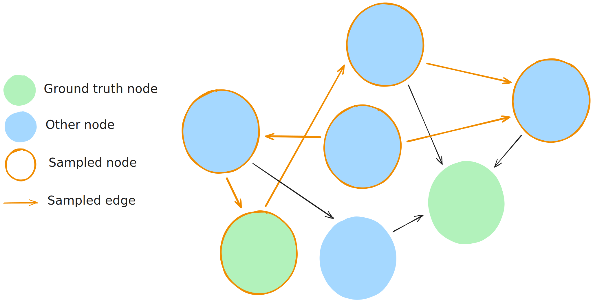

---
title: Sample environment guide
--- 

# Sample environment guide

## Overview

The sample environment allows to run parts of the pipeline with a smaller dataset, sampled from the original data. This sample is stored in GCS. You can run the pipeline with this sample data locally or in kubernetes.

!!! info "The engineering team provides these samples for users to run the sampling pipeline"
    

Two pipelines are defined in the `sample` environment:
- `create_sample`: Creates the sample data, (over)writing it in GCS.
- `test_sample`: Runs the pipeline from the embeddings step onwards with the sample data stored in GCS.

## Run with sample data locally

Local tests using sample are done in the `sample` environment. They will pull the latest sample 

```bash
kedro run -e sample -p test_sample
```

## Run with sample data in kubernetes 

```bash
kedro submit -e sample -p test_sample
```

## Update sample data

You can update sample data by running the `create_sample` pipeline locally. This will create a sample of the nodes and edges produced by a release of the integration layer. The release version can be found, and changed, in the `sample/globals.yml` file.

Make sure to use your own service account key file to get write access to the GCS bucket.

!!! warning
    There is only one version of the sample data in GCS. Updating it means deleting the previous sample.

```bash
kedro run -e sample -p create_sample
```

# Sampling strategies

The sampling strategy is defined in the [parameters.yml](https://github.com/everycure-org/matrix/blob/main/pipelines/matrix/conf/base/create_sample/parameters.yaml) of the `create_sample` pipeline. This defines which child class of `Sampler` to inject in the code, the implementation can be found in the [samplers.py](https://github.com/everycure-org/matrix/blob/main/pipelines/matrix/src/matrix/pipelines/create_sample/samplers.py) file.

## GroundTruthRandomSampler logic 

### Sample scale 

With the fllowing parameters and input data, we are getting around 20k nodes and 75k edges in the output sample.

| Parameter | Value | Description |
|-----------|--------|-------------|
| knowledge_graph_nodes_sample_ratio ∈ [0,1] | 0.005 | Ratio of nodes to randomly sample from the knowledge graph |
| ground_truth_edges_sample_ratio ∈ [0,1] | 0.01 | Ratio of edges to randomly sample from ground truth edges |
| seed | 42 | Random seed for reproducible sampling |

The input data contained 3.7M nodes, 18.8M edges and 53k ground truth edges.

### Sampling logic

1. Sample pairs of nodes from the ground truth edges respective of the `ground_truth_edges_sample_ratio` parameter.
2. Sample nodes from the knowledge graph respective of the `knowledge_graph_nodes_sample_ratio` parameter.
3. Define the sampled nodes as the union of the ground truth nodes and the knowledge graph nodes.
4. Define the sampled edges as all the edges between the sampled nodes.

