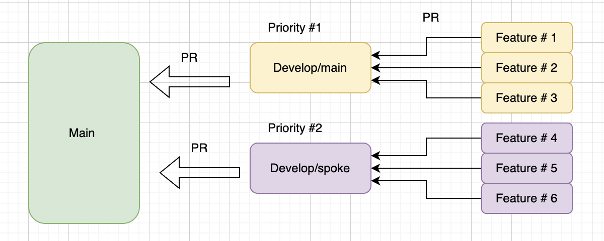
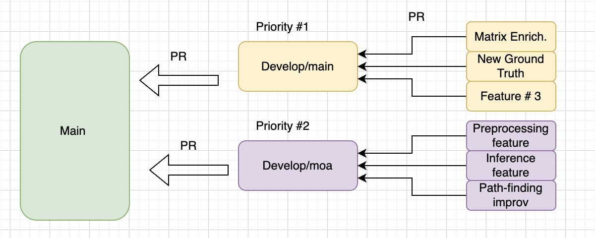

# Branch Management - Matrix Repository

## Background 
We are developing our MATRIX codebase really quickly and it's evolving quickly, with more than 24 regulary contributors. Whilst we already adhere to good coding standards when it comes to development - we undergo code reviews, have CI/CD in place, document our work - there have been many occassions when bugs 'sneaked into' our codebase, essentially because not all bugs can be detected via CI. Majority of those bugs can be only detected by running MATRIX pipeline e2e on full, real data. However we can't run e2e for each feature/PR as filechanges can be of different nature and scale. Therefore at the moment we accept occassionally introducing bugs which sometimes take a day and other times - weeks, to debug.

## Motivation

We want to reach a point where our main is stable and production ready. This means:
* One can re-branch from main any time and be sure that code there is 100% correct
* During development, one can refer to main as 'ground truth'


This is important because:
* Broken main slows development for everyone:
* We need to be able to execute e2e runs when we have a request, either from medical team or from stakeholders
* When we open-source, broken CI or faulty product is discouraging for external contributors + bad for reputation 

In order to achieve a stable main, we need to add an additional layer which will protect a main 

## Introducing Develop layer
_Note this is one of many branch management approaches we can take but I think its the most appropriate. See here for example [overivew](https://medium.com/@sreekanth.thummala/choosing-the-right-git-branching-strategy-a-comparative-analysis-f5e635443423)_


Develop Layer acts as an intermediate staging area between feature and main.
### Core Concepts

1. **Two-Tier Branch Structure**
   - `main`: Production-ready, stable code
   - `develop`: Integration branch for feature testing
   - Feature branches: Individual development work

2. **Branch Flow**   ```
   feature/* -> develop -> main   ```
   - Feature branches are created from `develop`
   - Features are merged back into `develop`
   - Only fully tested, stable code moves from `develop` to `main`. If the PR is relatively large as many features were collected overtime, we can write a descriptive overview of the PR which will help us tracking.

### Working with Develop Branch

1. **Feature Development**
   - Create feature branches from `develop`
   - Complete development and initial testing
   - Submit PR to `develop` (not main)

2. **Integration Testing**
   - Features accumulate in `develop`
   - E2E testing runs on `develop`
   - Issues found are fixed before main merge

3. **Main Branch Updates**
   - `develop` to `main` moves happen only after:
     - Successful E2E testing
     - Code review approval
     - No known issues

### Triage in the develop layer

While we should aim to have a single develop branch which we essentially treat as our waiting room for 'main', we don't need to keep it static and in some cases, it might make sense to make a separate branch (e.g. develop/main and develop/spoke) when large changes take place. For instance in the following image

Here, most features have been merged to `develop/main` branch which is now our priority branch - it is waiting to be merged into main once e2e completes and brief code review has been conducted. 

However in the meantime, some other developers fully integrated SPOKE e2e (incl modelling and some extra features MATRIX doesnt have yet) which are quite conflicting with features in `develop/main`. IN such case, it might make sense to create a temporary `develop/spoke` which will be a priority #2 branch. To merge `develop/spoke` into main, we need to wait for `develop/main` to be merged into main, fix potential conflicts, and then can kick off e2e run on develop/spoke. 

This might seem redundant/allowing for potential bottlenecks however if we change our way of working so that we don't create massive PRs but focus on small ones, this is quite streamlined and avoids potential bugs. Additionally, we might decide that we do not want spoke model and data in our final MATRIX product as it doesnt bring additional value - then we can just leave this branch as it is in in the develop layer and come back to it for potential experiments. 

Consider another example:



Implementation of MOA into main has taken a long time. One way to streamline the process is ot create a develop/moa branch and rather than doing all development on this branch, create series of smaller PRs which are then merged into develop/moa. As this might conflict with other developers, it is not worth to do the same type of 'grouping' in develop/main

## Advantages of Develop Layer
* Quality gate before code reaches main
* Allows for e2e testing
* Flexibility for parallel development 
* Maintains main branch stability

## Drawbacks of Develop Layer
* Our main will get updated less frequently (time-to-production increase)
* Additional overhead for PR reviews 
* Number of PRs will increase 

## FAQ 

_My feature is related to a sprint goal. Will it get completed only once it's merged to main?_
* It depends on your goal. If the goNo; once your feature is in develop, it means it has been peer-reviewed and is If your Once your feature is merged with develop, 

_The develop/branch will get large?_
* In some cases the develop branch will get inevitably large however all faetures going into develop/branch will need to meet the same requirements and same code review as the features need right now.
