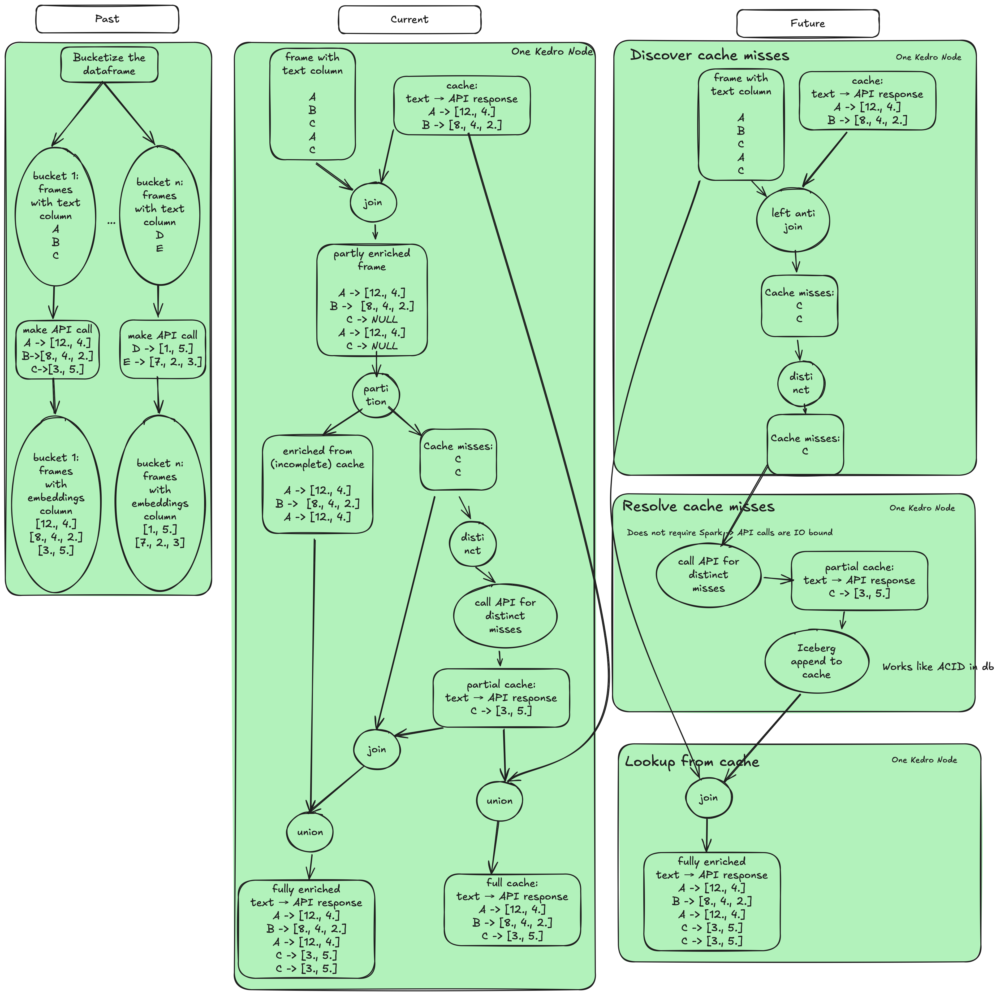

# Caching Approaches for Embeddings Enrichment

This document describes three different approaches for caching embeddings enrichment, as illustrated in the diagram.

## 1. **Past Approach**
### Overview
Previously, the process involved bucketizing the input DataFrame and making API calls for each bucket separately. The enriched results were stored and then used for further processing.

### Steps
1. The input DataFrame was split into multiple buckets based on the text column.
2. Each bucket was processed by making API calls to fetch embeddings.
3. The results were stored and later merged into a final enriched dataset.
4. This approach had inefficiencies due to redundant API calls and lack of proper caching.

## 2. **Current Approach**
### Overview
The current approach optimizes the caching mechanism using a Spark DataFrame and partitions the dataset based on scope and model. This reduces redundant API calls and improves efficiency.

### Steps
1. **Frame with text column:** The input DataFrame contains text values that need enrichment.
2. **Cache lookup:** A join operation is performed with the existing cache to retrieve precomputed embeddings.
3. **Partly enriched frame:** Some rows are enriched from the cache, while others remain NULL (cache misses).
4. **Cache miss handling:**
   - The distinct cache misses are identified.
   - API calls are made only for these missing entries.
5. **Cache update:** The newly retrieved embeddings are merged into the cache.
6. **Final enrichment:** The dataset is fully enriched using both cached and newly computed embeddings.

## 3. **Future Approach**
### Overview
The future approach further optimizes the caching process by introducing a structured method for cache lookup and updating using Iceberg tables, reducing redundant Spark operations.

### Steps
1. **Discover Cache Misses:**
   - Perform a **left anti join** to identify missing entries in the cache.
   - Extract distinct missing values.
2. **Resolve Cache Misses:**
   - API calls are made only for distinct misses.
   - The results are stored in a structured Iceberg table (append-only mode, similar to an ACID database).
3. **Lookup from Cache:**
   - A final join operation retrieves embeddings from the optimized cache, ensuring minimal API calls and efficient processing.

## **Key Improvements in the Future Approach**
- **Separation of concerns:** Cache miss detection and API calls are handled independently.
- **Optimized storage:** Iceberg tables provide efficient appends and lookups, reducing processing time.
- **Minimal Spark overhead:** Since API calls are IO-bound, they no longer block Spark operations.

## Conclusion
The transition from the past to the future approach represents a significant optimization in caching embeddings. By structuring the cache lookup and update processes, the system ensures efficiency, scalability, and minimal redundant API calls.