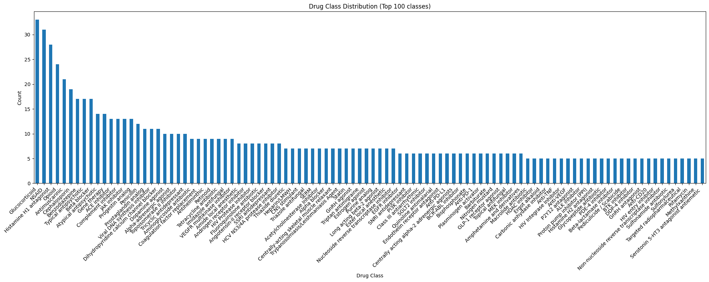

# EC Drug List

<!-- NOTE: This file was partially generated using AI assistance. -->

## Overview

The EC Drug List is a manually curated list of drug entities used by the MATRIX project for drug repurposing predictions. The EC Drug List provides stable identifiers for drugs throughout the MATRIX pipeline, to ensure that drug repurposing opportunities are stably tracked over time, and crosslinks to external IDs (CURIEs) using the NCATS Node Normalizer and Name Resolver services. For reference, the list contains **~1,800 drugs** with metadata including approval status, drug class flags, therapeutic annotations, and ATC classifications.

Key characteristics of the EC Drug List:

- **Consolidated to drug active ingredients**: The list only includes single active drug ingredients, and consolidates different salt forms, and formulations of the same drug. Combination therapies are listed as individual ingredients. Similar drugs (e.g., drugs and prodrugs) may be aggregated into a single entry, as noted in the `aggregated_with` column
- **Regulatory approved drugs**: The list is collated based on treatment guidelines in the US and UK, and may expand to broader geographies in the future.
- **Therapeutic drugs only**: The list only includes drugs with therapeutic uses, and excludes non-therapeutic approved drugs e.g., diagnostics, vaccines, allergens
- **Curated annotations**: The list includes manually curated annotations for therapeutic area, drug function, drug target, and drug class to enable analysis and display features

## Location on GCS

The EC Drug List is stored in the public GCS bucket and can be accessed at the following path ([here on GCS](<https://console.cloud.google.com/storage/browser/data.dev.everycure.org/data/01_RAW/drug_list?pageState=(%22StorageObjectListTable%22:(%22f%22:%22%255B%255D%22))&inv=1&invt=Ab3Ejg&project=mtrx-hub-dev-3of>)):

```
gs://data.dev.everycure.org/data/01_RAW/drug_list/{version}/ec-drug-list.tsv
```

You can also find them in the `datasets` repository [here](https://github.com/everycure-org/datasets/tree/main/datasets/drug_list)
New versions of the drug list are released through the [core-entities GitHub repository](https://github.com/everycure-org/core-entities/releases). Check the releases page for the latest version and update the version number in the MATRIX configuration (`pipelines/matrix/conf/base/globals.yml`). EC Data Products team follow a versioning system where users should always use at least the current minor release to ensure compatibility with other systems:

- PATCH (v0.1.0 → v0.1.1): Fixed incorrect data, corrected values (including changes in translator_id) or added a column
- MINOR (v0.1.1 → v0.2.0): Changes in spine (EC_ID) or translator_id (Name Resolver or Node Normalizer)
- MAJOR (v0.2.0 → v1.0.0): Removed columns, changed data types, restructured

## How the List is Generated

The EC Drug List is manually curated and maintained by the Every Cure team with the following principles:

1. **Drug collation**: Drugs are listed by curators as they go through treatment guidelines, consolidating entries to the active ingredient level in a protected Google Sheet. At the request of the EC Medical Team, additional aggregations of multiple similar drugs into as single entry are done in some edge cases to avoid repeated effort of reviewing redundant pairs (e.g., drugs and prodrugs). Where this is the case, it is noted in the `aggregated_with` column
2. **Manual annotations**: Manually curated columns are appended to the list in the Google Sheet. See [below](#features-of-the-List) which columns in the list are manual annotations
3. **Stable identifier assignment**: The Google Sheet is ingested into Core Entities and each drug receives a unique EC identifier (format: `EC:XXXXX`) that will not be removed or modified over time, only superseded if necessary
4. **Multi-source identifier mapping**: Each EC identifier is mapped to multiple identifier systems:
   - **Translator IDs** (CURIEs): Used to join with knowledge graphs in the MATRIX pipeline (e.g., CHEBI, UNII, DRUGBANK). The drug name or synonym is first put through NCATS Name Resolver to return a CURIE, then normalized with NCATS Node Normalizer to be consistent with the MATRIX KG-based pipeline
   - **DrugBank IDs**: Links to the DrugBank database for additional drug information, this is done through direct string-matching of the drug name or synonym
5. **Additional feature generation**: Using the mappings above, additional features are programmatically generated for each drug, see [below](#features-of-the-List) which columns in the list are programmatically generated

### Data Validation

The EC Drug List undergoes validation during the ingestion pipeline with Pandera schema checks for:

- **Unique EC identifiers**: Each `id` must be unique across the list
- **Unique translator IDs**: Each `translator_id` must be unique across the list
- **Unique DrugBank ID**: Each `drugbank_id` must be unique across the list
- **Format validation**: EC identifiers must follow the `EC:` prefix format
- **Boolean flag validation**: Therapeutic flag fields must contain valid boolean values
- **String format validation**: Names and synonyms must be capitalized

### Integration with MATRIX Pipeline

The drug list is integrated into the MATRIX pipeline through the ingestion stage:

- **Primary identifier**: EC identifiers serve as the primary key for tracking drugs through the pipeline
- **CURIE mapping**: Translator IDs enable mapping to nodes in various knowledge graphs (RTX-KG2, SPOKE, Robokop, PrimeKG, etc.). Currently only one ID is provided for each drug, but we may expand this to an array of CURIEs in the future.
- **Normalization stability**: EC identifiers do not change during the normalization process, preventing conflicts in downstream systems like Orchard
- **Dual identifier tracking**: Both EC and translator IDs are maintained through matrix generation to support both curation and knowledge graph operations

For more details on the migration decision and its impact on the MATRIX pipeline, see the [Drug List Migration ADR](../architecture_decision_records/drug-list-migration.md).

## Features of the List

The EC Drug List is provided as a tab-separated values (TSV) file and parquet file with the following columns:

| Column                 | Type          | Description                                                                                                                                    | Agent type   |
| ---------------------- | ------------- | ---------------------------------------------------------------------------------------------------------------------------------------------- | ------------ |
| `id`                   | String        | Unique EC identifier for the drug (format: `EC:XXXXX`). This is the primary key and remains stable over time.                                  | Manual       |
| `name`                 | String        | Human-readable name of the drug                                                                                                                | Manual       |
| `translator_id`        | String        | CURIE identifier used for mapping to knowledge graph nodes (e.g., `CHEBI:421707`, `UNII:AVK0I6HY2U`)                                           | Programmatic |
| `drugbank_id`          | String        | DrugBank database identifier (e.g., `DB01048`)                                                                                                 | Programmatic |
| `synonyms`             | Array[String] | Alternative human-readable names of the drug                                                                                                   | Manual       |
| `aggregated_with`      | Array[String] | Similar drugs that have been aggregated with this drug entity to avoid repeated effort of reviewing redundant pairs (e.g., drugs and prodrugs) | Manual       |
| `drug_class`           | String        | Classification of drugs based on mechanism or similar use in clinical practice (e.g., `ACE inhibitor`, `Statin`). See below for more details   | Manual       |
| `therapeutic_area`     | String        | Primary therapeutic area of diseases drug is used to treat                                                                                     | Manual       |
| `drug_function`        | String        | Physiological function of the drug (e.g., `Antiinflammatory`, `Immune checkpoint inhibitor`)                                                   | Manual       |
| `drug_target`          | String        | Primary mechanism of action/molecular target(s) of the drug                                                                                    | Manual       |
| `approved_usa`         | Categorical   | Indicates whether the drug is FDA-approved in the United States (`APPROVED`, `NOT_APPROVED`, `DISCONTINUED`)                                   | Manual       |
| `is_antipsychotic`     | Boolean       | Flag indicating if the drug is classified as an antipsychotic medication                                                                       | Manual       |
| `is_sedative`          | Boolean       | Flag indicating if the drug is classified as a sedative medication                                                                             | Manual       |
| `is_antimicrobial`     | Boolean       | Flag indicating if the drug is classified as an antimicrobial agent                                                                            | Manual       |
| `is_glucose_regulator` | Boolean       | Flag indicating if the drug regulates glucose levels                                                                                           | Manual       |
| `is_chemotherapy`      | Boolean       | Flag indicating if the drug is a traditional cytotoxic chemotherapy treatment                                                                  | Manual       |
| `is_steroid`           | Boolean       | Flag indicating if the drug is a steroid medication                                                                                            | Manual       |
| `is_analgesic`         | Boolean       | Flag indicating if the drug is primarily an analgesic medication                                                                               | Manual       |
| `is_cardiovascular`    | Boolean       | Flag indicating if the drug is used to treat cardiovascular conditions                                                                         | Manual       |
| `is_cell_therapy`      | Boolean       | Flag indicating if the drug is a cell or gene therapy                                                                                          | Manual       |
| `smiles`               | String        | Simplified Molecular Input Line Entry System (SMILES) representation of the chemical structure                                                 | Programmatic |
| `atc_main`             | String        | ATC main code (abbreviated form)                                                                                                               | Programmatic |
| `atc_level_1`          | String        | ATC level 1 code - anatomical main group (e.g., `H` for systemic hormonal preparations)                                                        | Programmatic |
| `atc_level_2`          | String        | ATC level 2 code - therapeutic subgroup (e.g., `H03` for thyroid therapy)                                                                      | Programmatic |
| `atc_level_3`          | String        | ATC level 3 code - pharmacological subgroup (e.g., `H03A` for thyroid preparations)                                                            | Programmatic |
| `atc_level_4`          | String        | ATC level 4 code - chemical subgroup (e.g., `H03AA` for thyroid hormones)                                                                      | Programmatic |
| `atc_level_5`          | String        | ATC level 5 code - chemical substance (e.g., `H03AA01` for levothyroxine sodium)                                                               | Programmatic |
| `l1_label`             | String        | Human-readable label for ATC level 1 (e.g., "systemic hormonal preparations, excl. sex hormones and insulins")                                 | Programmatic |
| `l2_label`             | String        | Human-readable label for ATC level 2 (e.g., "thyroid therapy")                                                                                 | Programmatic |
| `l3_label`             | String        | Human-readable label for ATC level 3 (e.g., "thyroid preparations")                                                                            | Programmatic |
| `l4_label`             | String        | Human-readable label for ATC level 4 (e.g., "thyroid hormones")                                                                                | Programmatic |
| `l5_label`             | String        | Human-readable label for ATC level 5 (e.g., "levothyroxine sodium")                                                                            | Programmatic |
| `deleted`              | Boolean       | Flag indicating if the drug has been deprecated from the list                                                                                  | Manual       |
| `deleted_reason`       | String        | Description of rationale for the drug being deprecated                                                                                         | Manual       |
| `new_id`               | String        | EC identifier of drug that should supercede deleted drug (if any) (format: `EC:XXXXX`)                                                         | Manual       |

### Understanding the ATC Classification System

The [Anatomical Therapeutic Chemical (ATC) Classification System](https://www.who.int/tools/atc-ddd-toolkit/atc-classification) is a hierarchical system maintained by the World Health Organization (WHO) for classifying drugs. The EC Drug List includes all 5 levels of this classification:

- **Level 1**: Anatomical main group (single letter, e.g., `H` = systemic hormonal preparations)
- **Level 2**: Therapeutic subgroup (3 characters, e.g., `H03` = thyroid therapy)
- **Level 3**: Pharmacological subgroup (4 characters, e.g., `H03A` = thyroid preparations)
- **Level 4**: Chemical subgroup (5 characters, e.g., `H03AA` = thyroid hormones)
- **Level 5**: Chemical substance (7 characters, e.g., `H03AA01` = levothyroxine sodium)

Each level is provided with both the code and a human-readable label for easier interpretation and analysis.

### Curated Annotation Columns

The EC Drug List includes manually curated annotation columns that provide additional context for each drug:

- **drug_class**: Classification of the drug type (e.g., `Antiinflammatory`, `Immune checkpoint inhibitor`). This field is populated for all drugs.
- **therapeutic_area**: Primary therapeutic areas where the drug is used (e.g., "Cardiology", "Neurology"). This field is populated for all drugs in the list. Where a drug is commonly used in multiple therapeutic areas, these are separated with `|` (e.g., `Targeted cancer therapy | Dermatology`)

  <details>
  <summary>Click to view all 26 therapeutic area options (not including combinations of therapeutic areas)</summary>

  - Antidote
  - Antimicrobial
  - Cardiovascular
  - Cell therapy
  - Chemotherapy adjunct
  - CNS
  - Dermatology
  - Endocrine
  - Gastrointestinal
  - Gene therapy
  - Genitourinary
  - Hematology
  - Immune
  - Metabolic
  - Misc
  - MSK
  - Obstetrics
  - Ophthalmic
  - PNS
  - Renal
  - Respiratory
  - Sex hormone
  - Supplement
  - Targeted cancer therapy
  - Traditional cancer therapy
  - Urological

  </details>

- **drug_function**: Functional classification describing the drug's mechanism or role (e.g., "Kinase inhibitor", "Receptor antagonist", "Enzyme replacement"). This field is populated for most drugs with a small proportion of `NULL` for edge cases.
- **drug_target**: Primary molecular target(s) of the drug (e.g., "COX-1 and COX-2 inhibitor", "MEK inhibitor"). This field is populated for most drugs, with a small proportion of `NULL` for edge cases.

These annotations enable more sophisticated filtering, grouping, and analysis of drugs within the MATRIX pipeline and support various display and visualization features in downstream applications.

#### Drug class distribution

The drug class column is designed to group drugs that share a mechanism of action/drug target, to enable navigation and linking between similar drugs. At present there are ~680 unique drug classes, with ~50% drug classes containing a single drug (i.e., n=1 classes). For n=1 drug classes, these are largely named after the drug itself (e.g., `drug_name` = "Pizotifen", `drug_class` = "Pizotifen").

Drug class is defined orthogonally to the `therapeutic_area` column, as drugs with a similar mechanism can be applied in different clinical settings (e.g., `Retinoid` drugs in `Targeted cancer therapy`, `Dermatology`, and `MSK` therapeutic areas)

The plot below shows the distribution for the top 100 largest drug classes in the drugs list :



### Therapeutic Classification Flags

The drug list includes nine boolean flags that identify drugs belonging to specific therapeutic categories of interest for drug repurposing research:

- **is_antipsychotic**: Drugs used to treat psychotic disorders
- **is_sedative**: Drugs with sedative or hypnotic effects
- **is_antimicrobial**: Antibacterial, antiviral, antifungal, and antiparasitic agents
- **is_glucose_regulator**: Drugs affecting glucose metabolism (antidiabetic agents, insulin, etc.)
- **is_chemotherapy**: Drugs used as traditional cytotoxic chemotherapies
- **is_steroid**: Corticosteroids which are often used to manage a wide array of symptoms
- **is_analgesic**: Drugs primarily used for pain relief
- **is_cardiovascular**: Drugs used to treat cardiovascular conditions
- **is_cell_therapy**: Cell or gene therapy products

These flags enable rapid filtering and analysis of specific drug categories within the MATRIX pipeline and are particularly useful for identifying potential safety concerns or drug-drug interactions.

## Related Resources

- [Disease List Documentation](drug_disease_lists.md) - Information about the companion EC Disease List
- [Drug List Migration ADR](../architecture_decision_records/drug-list-migration.md) - Technical decision record for the migration to manual curation
- [Core Entities GitHub Repository](https://github.com/everycure-org/core-entities/releases) - Source and release location for the drug list
