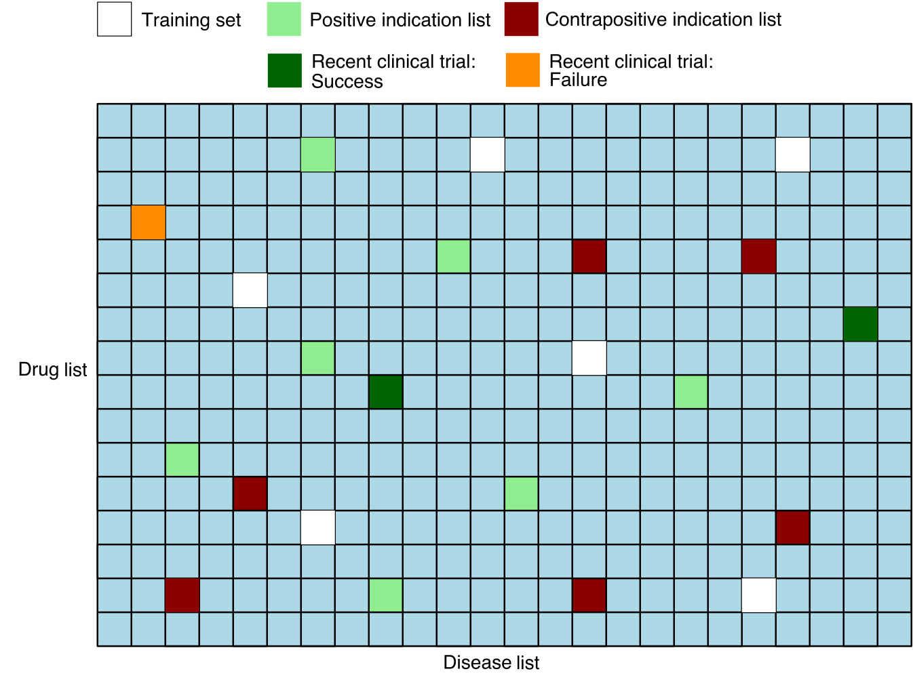

# Deep dive: Evaluation suite

The evaluation pipeline is a crucial component of our drug repurposing system, designed to assess the performance and reliability of our predictive models. 
This pipeline employs a variety of metrics and techniques to provide a comprehensive understanding of how well our models are performing in identifying potential new drug-disease associations.

In this deep dive, we give a detailed overview of the evaluation suite. 

## Overview of the suite

Our drug repurposing models have several use cases, including:

1. Matrix-wide ranking: Prioritising millions of drug-disease pairs across the entire matrix, containing all possible combinations of drugs and diseases from curated lists. This is the primary use case for the MATRIX platform.

2. Disease-specific ranking: For a given disease, ranking drugs based on their likelihood scores of being effective treatments.

Additionally, it's crucial that our models don't assign high scores to drug-disease pairs that appear promising but would likely fail in clinical trials. This helps prevent wasted resources on unsuccessful clinical studies.

To address these different aspects of model performance, we use three classes of evaluation metrics, each computed in distinct ways.
The following table summarises the evaluation metrics that comprise the current version of our evaluation suite. 

| Full-matrix ranking | Disease specific ranking | Ground truth classification|
|--------------|-------------|----------|
| How likely are positive drug-disease pairs to appear near the top of the matrix output? | How well does the model rank drugs for a specific disease? | How accurately can the model distinguish between known positive and negative drug-disease pairs? |
| Recall@n, AUROC | Hit@k, MRR | Accuracy, F1 score |
| Computed using the full matrix | Computed using diseases in the known positive test set  | Computed using the set of known positive and negative pairs |

Additionally, our evaluation pipeline now also includes model stability metrics which compare the stability of output between models trained on different k-folds of the data (as these are now a part of our pipeline by default). These metrics address issues such as: how stable is the output between different runss/folds.

## Time-split validation and recent clinical trials data

Time-split validation is a technique where we divide our dataset based on a temporal cutoff, using older data for training and newer data for testing, to simulate real-world scenarios and assess our model's ability to predict future drug-disease associations.

We implement time-split validation in our pipeline by using an additional ground truth test set coming from the results of recent clinical trials. 

## Off-label validation

Off-label validation is a technique where we evaluate our model's performance on a dataset of known off-label drug uses - cases where drugs are prescribed for conditions different from their original FDA-approved indications. This provides valuable insights into our model's ability to generalize to drug-disease associations that may follow different patterns than traditional approved uses. We implement off-label validation by using a separate test set derived from PrimeKG

The off-label validation metrics are computed using the same methodology as our other test sets, however they only contain positive ground truth (as there are no 'negative' off label uses).

## The performance metrics in detail

The input to the evaluation pipeline consists of the matrix pairs dataset with the following information:
- Flags for pairs in the standard ground truth positive and negative test sets 
- Separate flags  for test set pairs corresponding to results of recent clinical trials
- Treat scores for each pair 

In addition, we remove from the matrix any known positive or known negative pairs that were used by the model during training, so that these are not used in the computation of the metrics.

> __Key philosophy.__ In order to compute ranking metrics, we must synthesise negative pairs since only a small portion of negative pairs are known. To do this, we exploit the fact that the vast majority of drug disease pairs are negatives. However, synthesising negative pairs by random sampling can lead to unexpected and undesirable effects on the data distribution, as well as introducing noise. For example, the distribution for geodesic distance may be altered (see Yang et. al. ). Therefore, our ranking metrics are computed using pairs dataset that are as close as possible to what the model will see while performing its downstream task.

### Full matrix ranking metrics

These metrics focus on how well the model ranks the set of pairs comprising the matrix. 

#### Recall@n

The *Recall@n* metric is defined as the proportion of ground truth test pairs that appear among the top $n$ ranked pairs in the matrix. Mathematically, for a set of ground truth pairs $GT$ in the test set, it may be written as 

$$
\text{Recall@n} = \frac{|\{(d,i) \in GT : \text{rank}(d,i) \leq n\}|}{|GT|}
$$

where the $\text{rank}(d,i)$ is defined as the rank of a drug $d$ and a disease $i$ among all possible pairs in the matrix and $|\cdot|$ denotes the cardinality (size) of a set. 

We have three variations of the full matrix Recall@n metric corresponding to different choices for the ground truth set $GT$: 

1.  The *standard version* uses the standard ground truth positive test set

2.  The *clinical trials version* uses successful recent clinical trials

3. The *negatives version* which uses the ground truth negative test set. Unlike the others, we want this one to be as small possible

#### AUROC (Area Under the Receiver Operating Characteristic curve)

The AUROC metric evaluates the model's ability to distinguish between positive and negative pairs across all possible ranking thresholds. Formally, it is defined as the area under the ROC curve (see [Wikipedia: Receiver operating characteristic](https://en.wikipedia.org/wiki/Receiver_operating_characteristic)). 

The following equivalent characterisation allows us to efficiently compute the AUROC metric in the codebase,

$$
\text{AUROC} = 1 - \text{MQR} 
$$

where $\text{MQR}$ denotes the *mean quantile rank against non-positives* among ground truth test pairs $GT$. Details are given in the appendix below.

MQR is a measure between 0 and 1 with lower values indicating better ranking performance, whereas for the AUROC higher values are better

> *Example.* If the AUROC is 0.9, then the MQR is 0.1. Therefore, on average we expect a positive drug-disease pair to rank among the top 10% of matrix pairs, not including other known positives. 

### Disease-specific ranking metrics

These metrics focus on how well the model ranks drugs for individual diseases, particularly those diseases that appear in our ground truth positive set.

For a given disease $i$, the *disease-specific rank* $\text{rank}_i(d)$ of a drug $d$ is defined as the rank of the drug $d$ among all drugs. As well as training pairs we omit any other known positives from the ranking.

We have two versions of disease-specific ranking metrics corresponding to different choices for the set of ground truth pairs $GT$:

1.  The *standard version* uses the standard ground truth positive test set

2.  The *clinical trials version* uses successful recent clinical trials

#### Hit@k

The Hit@k metric measures the proportion ground truth positive pairs with disease specific rank not exceeding $k$. Mathematically, it is written as 

$$
\text{Hit}@k = \frac{1}{|GT|} \sum_{(d,i) \in GT} [\text{rank}_i(d) \leq k] 
$$

where $[\text{rank}_i(d) \leq k]$ is equal to 1 if $\text{rank}_i(d) \leq k$ and 0 otherwise. 

#### MRR (Mean Reciprocal Rank)

MRR is the average inverse rank of the pairs in the ground truth pairs set. Mathematically, it is defined as 

$$
\text{MRR} = \frac{1}{|GT|} \sum_{(d,i) \in GT}\frac{1}{\text{rank}_i(d)} 
$$

The MRR ranges from 0 to 1, with higher values indicating better performance.

### Ground truth classification metrics

These metrics assess the model's ability to distinguish between known positive and negative drug-disease pairs, treating the task as a binary classification problem. 

We have two versions corresponding to different choices of test dataset:

1. The *standard version* uses the standard sets of ground-truth positives (labelled as "treat") and negatives (labelled as "not treat").

2. The *clinical trials version* uses a dataset of successful recent clinical trial (labelled as "treat") and failed one (labelled as "not treat").  

#### Accuracy

Accuracy is the proportion of pairs in the dataset that are correctly classified. We fix the threshold to 0.5, that is, the model classifies a drug-disease pair to be "treat" if the treat score is > 0.5 and otherwise "not treat". 

#### F1 Score

The F1 score is designed to take into account class imbalances and is defined as the harmonic mean of precision and recall (see [Wikipedia: F1 score](https://en.wikipedia.org/wiki/F1_score)). 

#### Precision-Recall curve 

The precision-recall curve is a standard figure which plots precision against recall across all possible thresholds for a classifier.
A larger area under the curve corresponds to a better classifier.  

### Entropy@n metrics

Frequent flyers refers to a phenomenon whereby certain drugs or diseases have disproportionally high average treat scores and therefore dominate the top of the matrix output. 
Prevalence of drug or disease frequent flyers are measured by the __Drug-Entropy@n__ and __Disease-Entropy@n__ metrics, which directly measure the _variety of drugs and diseases appearing in the top n_. 

Both metrics are between 0 and 1, with *higher* values indicating a larger *variety* therefore a *smaller* prevalence of frequent flyers. 

More precisely, we define Drug-Entropy@n as follows. Disease-Entropy@n is defined analogously. 

_Definition._ Let $D$ be the set of drugs of interest. Let $\text{count}_n(d)$ be the number of times drug $d \in D$ appears in the top $n$ pairs. 

Then the Drug-Entropy@n score is defined at the entropy of the discrete probability distribution 

$$
p(d) = \frac{\text{count}_n(d)}{n}, \qquad d \in D.
$$ 

To ensure the metric is between 0 and 1, we set the base of the entropy to the number of unique drugs $|D|$. This is written as

$$
\text{Drug-Entropy}\text{@n} = - \sum_{d \in D} p(d) \log_{|D|} p(d).
$$

### Comparison and stability metrics

These metrics allow us to compare two ranked lists of drug-disease pairs and also do use ground truth data. 
There are two applications: 

  - Comparing predictions between multiple models
  - Comparing predictions between folds of a single model.

All of these metrics are computed for the top $k$ of ranked lists for a given $k$. 

#### Commonality@k 

Commonality at k essentially tells us about overlap of pairs in the top $k$ of two lists. Let $S_k$ denote the number of common drug-disease pairs in the top $k$ of both lists.
Then Commonality@k is defined as follows:

$$
\text{Commonality}@k = \frac{S_k}{k}. 
$$

#### Spearman's rank at k

[Spearman's rank correlation coefficient](https://en.wikipedia.org/wiki/Spearman%27s_rank_correlation_coefficient) is a measure of rank correlation, assessing statistical similarity between the rankings of two lists. It can range from -1 (inverse correlation) to +1 (direct correlation). 

Note that to calculate Spearman's rank at k, we first need to only extract pairs which are overlapping between the two lists and only those are used for spearman's rank calculation. To complement the correlation score itself, we also compute the p-value for the null hypothesis that the two lists are uncorrelated.

#### Hypergeometric test at k

The [hypergeometric test](https://en.wikipedia.org/wiki/Hypergeometric_distribution#Hypergeometric_test) uses the hypergeometric distribution to determine if drug-disease ranking is occurring by chance. It calculates the probability of observing the exact order of drug-disease pairs purely by chance given the k. This test assesses the over-representation of success in the sample, with p-value as a result which indicates if the observed overlap is likely due to chance.

Just like in case of Spearman's rank at k, we first need to only extract pairs which are overlapping between the two lists and only those are used for hypergeometric test calculation. 

#### Rank-commonality at k 

Rank-commonality at k is a custom stability metric we implemented which takes into account both commonality at k and Spearman's rank at k by calculating their geometric mean. 

Consider the following equation:

$$
\text{RC}_{k} = \frac{C_{k} \times S_{k}}{C_{k} + |S_{k}|}
$$

where $C_{k}$ is the commonality at k and $S_{k}$ is the absolute value of Spearman's rank at k (for details on these, see sections below). Note that Rank-Commonality at K metric should be only interpreted together with p-value associated with Spearman's rank at K. 

## References

- Yang, Yang, Ryan N. Lichtenwalter, and Nitesh V. Chawla. "Evaluating link prediction methods." Knowledge and Information Systems 45 (2015): 751-782.

