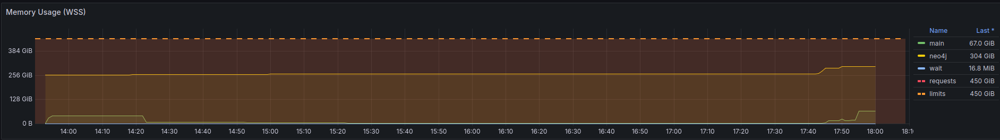

# Memory debugging for Embeddings node

## Provisioning correct machine types

Initially, we noticed the machine type was not being allocated. This due to the ephemeral storage requirements not being satisfied by any of the nodes.

> To solve this, we have now added a volume to each node as a **Persistent Volume Claim (PVC)**. This size of this volume is calculated from the `ephemeral_storage_limit`. 

The volume code:

```yaml
podSpecPatch: |
  volumes:
      - name: scratch
        ephemeral:
          volumeClaimTemplate:
            spec:
              accessModes: ["ReadWriteOnce"]
              resources:
                requests:
                  storage: "{{inputs.parameters.ephemeral_storage_limit}}Gi"
    
```

And to mount this volume we do:

```yaml
volumeMounts
  - name: scratch
    mountPath: /scratch
```

To make sure that the volumes are deleted after a pod succeeds/fails/error, we have set the 

```yaml
spec:
  podGC:
    strategy: OnPodCompletion
```

This ensures that the cleanup happens automatically.

## Bumping memory spec

Next, we noticed the Neo4J container going OOM. It turned out this was due to the hardcoded values in the Neo4J container, essentially capping it's resources.

> ✅ This was solved by using the memory requirements as specified in the pod's limits when setting up the environment variables for the Neo4J container.


```yaml
# Neo4J container
env:
    ...
    - name: NEO4J_dbms_memory_heap_initial__size
      value: "100G"
    - name: NEO4J_dbms_memory_heap_max__size
      value: "120G"
```

As the next step, we set the above NEO4J settings same as the pod's memory request. This resulted in the main container stuck at "Waiting for neo4j to be ready..." with the Pod's status "OOM Killed".
To fix this, we applied 70% of the pod's memory request as the neo4j heap size settings, which solved this problem.

`"{{= sprig.int(inputs.parameters.memory_limit) * 0.7 }}G"`

Moreover, we noticed a similar problem in the Spark configuration, where the the Spark configuration was hardcoded to a specific value.

> ⛔️ This still requires a fix, in the ideal case we would expect the resources defined in the node to correctly propagate.

```yaml
# spark.yaml
...
spark.driver.memory: 30g
```

## Setting memory spec for Kedro container

Next, we've bumped the requests for Spark in the main container to 50Gb. This resulted in an OOM memory, presumably because Spark had been configured to use all the pods' memory, and when the Kedro/Python process started to use RAM, the container was killed.

```yaml
spark.driver.memory: 50g
```

It's therefore important to leave a buffer between the memory configured for Spark, and the total memory allocated to the container.

```yaml
    # Argo workflow template
    ...
    name: neo4j
    podSpecPatch: |
      containers:
        - name: main
          resources:
            requests:
              memory: 50Gi
            limits:
              memory: 50Gi
```

## Follow-ups

1. Ensure Spark Memory can be configured using environment variable

   See [PR 1185](https://github.com/everycure-org/matrix/pull/1185)

2. Deep dive into Neo4J Spark connector to learn why so much memory is used

   From [the run that was triggered this
   morning](https://argo.platform.dev.everycure.org/workflows/argo-workflows/debug-integrated-embeddings-ac71c0f1?tab=workflow&uid=a9999975-9e1e-483b-a737-58ccb7b84227)
   after our team discussion, it doesn't look out of the order:
    The Spark process uses about
   42GiB memory. Not insane for a dataset, that is being loaded as a single
   partition. The Neo4J docs make the right claims and warnings about wanting
   to write edges using multiple workers. An attempt at this can be made, in
   order to lower the memory requirements, but I think it's less of a priority
   seeing that the bottleneck is the graphsage algorithm which requires the
   bulk of the resources.

   Note that a simple alternative may actually be to not use the Spark
   connector at all, but load it in batches, only reading partitions as needed.
   In pseudocode:

   ```
   for batch in batches(edges.toLocalIterator(prefetch=False), n=5k):
       load_edges_in_neo4j(batch)
   ```

   That would keep the memory Spark uses down to the smallest partition, which
   you can make arbitrarily small in the previous kedro node.

3. (After few runs) investigate memory profile and right size the nodes
