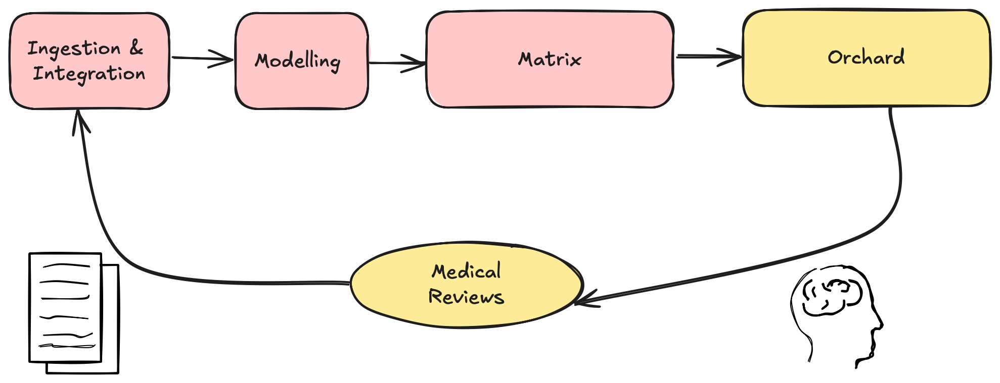
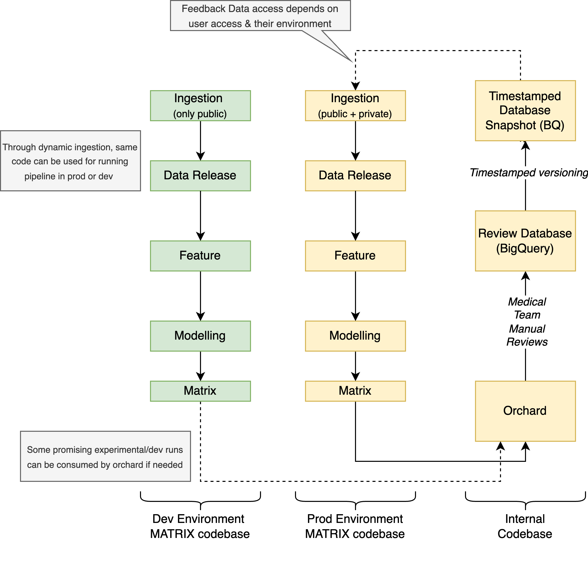

# Human Feedback Loop

!!! info "Work in Progress"
    Note that this section is still work in progress as we add more feedback loop features

One of the strengths of Matrix pipeline is its ability to improve over time based on expert feedback on its Matrix predictions. We refer to this process as **human feedback loop**.

Our feedback loop is enabled by **Orchard**, our internal web platform that allows for medical researchers to review drug-disease pairs. It enables systematic learning from reviews to improve predictions and discover potential weak spots of our modelling system. This feedback is invaluable for development of robust ML system for drug repurposing. The mechanism of the feedback loop is described in the image below:

Orchard ingests MATRIX output and exposes it to our medical team which is then leaving detailed review on the pairs at their own pace. This feedback is then going through Orchard backend and gets exposed in the BigQuery Database. We are then creating a BigQuery Views which are versioned by timestamps, allowing for static control of data which gets ingested into the matrix pipeline. This view is ready for ingestion by Matrix pipeline.

As shown, both Orchard and feedback dataset are private at the moment - meaning that only internal developers with suitable access can use it (which is also the case for other proprietary datasets in our systems). Thanks to our dynamic ingestion system, where we specify which datasets are private or public, we can dynamically without disrupting the flow of the pipeline. Meaning that external contributors can successfully run the matrix pipeline without feedback data (and other proprietary datasets) while internal contributors can leverage feedback data just by specifying their environment setup in the `.env` file.

The feedback dataset is currently utilized in the following parts of the pipeline:
 
 * Matrix Generation - to flag which MATRIX pairs were reviewed by our medical team
 
 * Model Training (work in progress)

[Flagging Reviews in Matrix :material-skip-previous:](./review_flags.md){ .md-button .md-button--secondary })