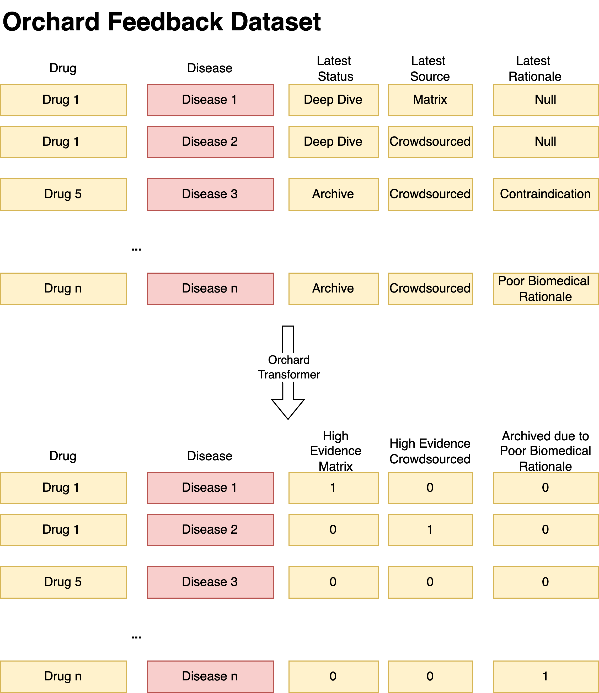
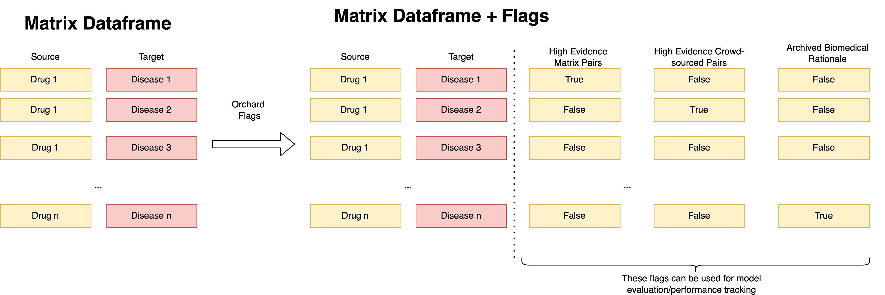

# Flagging Review Pairs

!!! info "Work in Progress"
    Note that this section is still work in progress

One of the first use cases for the feedback data within matrix is to use it as an evaluation dataset

We want to extrac the following granular attributes from orchard feedback dataset:

* **Archive Biomedical Reviews** - archived pairs which were archived by medical professional due to 'Poor Biomedical Rationale'. This can serve as a negative metric.
* **Matrix High Evidence Pairs** - promising pairs found using matrix pipeline which are supported by high level of earchived by evidence by medical professional. These can serve as positive metric (however we need to take into account potential model bias)
* **Crowd-sourced High Evidence Pairs** - promising pairs found through crowd-sourcing which are supported by high level of evidence by medical professional and have high likelihood to be pursued by Every Cure. These can serve as positive metric that's unseen/independent of matrix 
* **Matrix Mid Evidence Pairs** - promising pairs found through crowd-sourcing which are supported by high level of evidence by medical professional however are still discussed on whether they are worth pursuing by Every Cure. These can serve as positive metric (however we need to take into account potential model bias).
* **Crowd-sourced Mid Evidence Pairs**- promising pairs found through crowd-sourcing which are supported by high level of evidence by medical professional however are still discussed on whether they are worth pursuing by Every Cure. These can serve as positive metric that's independent of matrix.

Each Flag is generated on a conditional basis, using parameters and conditional logic specified in [orchard parameters](https://github.com/everycure-org/matrix/blob/main/pipelines/matrix/conf/base/integration/parameters.yml) . The schematic diagram below shows the process of how some pairs with `Deep Dive` status become `High Evidence Pairs`.

These attributes can be used for model performance monitoring and evaluation. Once these flags are extracted in the integration layer, the identifiers will undergo normalization and then can be ready for mapping to the matrix. The mapping is done similarly how we do it for other evaluation datasets (e.g. clinical trials dataset or standard test set) - for each pair in the matrix, we cross-check whether it's present in the normalized orchard dataset and if that's the case - we generate appropriate flag in the `matrix_generation` pipeline.

