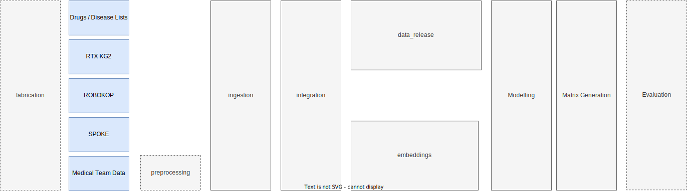

# MATRIX

The matrix pipeline is our main codebase in the Every Cure organization. Its goal is the generation of high accuracy predictions of drug-disease pairs in an "all vs all" approach. For this, we ingest and integrate a number of data sources, build models and make predictions on the ingested data. Of course there is a lot more to this but the below illustration aims to sketch the high level flow of the pipeline.

<!--  -->




### Preprocessing

The current pre-processing pipeline is highly preliminary and is used to ingest experimental nodes and edges proposed by our medical team. The pipeline is integrated with a Google
sheet for rapid hypothesis testing.

### Ingestion

The ingestion pipeline ingests all input data into the workspace of the pipeline. Data from different sources is assigned metadata for lineage tracking.

We've established a lightweight data versioning system to ensure we can easily revert to
an older version of the input data if required. All of our data should be stored in
Google Cloud Storage (GCS) under the following path:

```
gs://<bucket>/kedro/data/releases/<release_version>/datasets/...
```

And each run (anything downstream of the KG) that is based on a release stores its data in the following path:

```
gs://<bucket>/kedro/data/releases/<release_version>/runs/<run_name>/datasets/...
```

Next, our pipeline globals provide an explicit listing of the versions that should be used during pipeline run, for instance:

```yaml
# globals.yml
versions:
  sources:
    rtx-kg2: v2.7.3
    another-kg: v.1.3.5
    ... # Other data source versions here
```

Finally, catalog entries should be defined to ensure the correct linkage of the catalog entry to the version.

```yaml
# catalog.yml
integration.raw.rtx_kg2.edges:
  filepath: ${globals:paths.raw}/rtx_kg2/${globals:data_sources.rtx_kg2.version}/edges.tsv
  ... # Remaining configuration here
```

Note specifically the use of `globals:data_sources.rtx-kg2` in the definition of the catalog entry. Whenever new data becomes available, code changes are limited to bumping the `versions.sources.<source>` entry in the globals.

!!! info
    To date our pipeline only ingests 3rd party data from the RTX-KG2 and ROBOKOP sources.

### Integration

The integration stage aims to produce our internal knowledge-graph, in [biolink](https://biolink.github.io/biolink-model/) format. As we ingest data from different sources, entity resolution becomes a prevalent topic. The integration step consolidates entities across sources to avoid data duplication in the knowledge graph.

There are 4 main steps in the integration pipeline:

1. **Normalize** the source data to a common format.
2. **Synonimize** the nodes, to ensure that nodes that describe the same concept have the same ID
3. **Union & Deduplicate**: Brings all KGs together and deduplicates nodes and edges
4. **Filtering**: Applies a series of filtering steps to remove nodes and edges based on custom "business logic"


#### Normalizing data from sources

Our pipeline aims to streamline the process of normalization and integration though a `transformer`. This is an interface that should be implemented for the source to be integrated succesfully. 

```pyton
class GraphTransformer(ABC):
    @abstractmethod
    def transform_nodes(self, nodes_df: DataFrame, **kwargs) -> DataFrame:
      """
      Function to transform nodes into the common format.

      Args:
        nodes_df: dataframe with nodes
      Returns:
        Nodes in standarized format
      """
      ...

    @abstractmethod
    def transform_edges(self, edges_df: DataFrame, **kwargs) -> DataFrame:
      """
      Function to transform edges into the common format.

      Args:
        edges_df: dataframe with edges
      Returns:
        Edges in standarized format
      """
      ...
```

Once implemented, register the transformer into the `parameters` of the integration pipeline.

```yaml
# Params 
integration:
  sources:
    <source>:
      transformer:
        object: matrix.pipelines.integration.<source>.<source>Transformer
```

Last but not least, finish up by registering the normalizer into `settings.py`. This last step ensures that our dynamic pipeline is updated to setup pipelining for your source.

```python
DYNAMIC_PIPELINES_MAPPING = {
    "integration": [
        {"name": "<souce>"},
        ...
    ]
}
```

### Embeddings

Our embeddings pipeline computes vectorized representations of the entities in the knowledge graph in two stages:

1. Node Attribute Embedding Computation - We use GenAI models (e.g. OpenAI's `text-embedding-3-small` embedding API, and domain specific models such as PubMedBERT), for efficient node embedding, leveraging batch processing to reduce runtime and integrating error handling for API limits. 
2. Topological Embedding Computation - We have implemented options for GraphSAGE, and Node2Vec algorithms for computation of topological embeddings. Dimensionality reduction (e.g. PCA) has been modularized to enable flexible experimentation. 

!!! info
    Our graph database, i.e., [Neo4J](https://neo4j.com/docs/graph-data-science/current/algorithms/) comes with out-of-the-box functionality to compute both node and topological embeddings in-situ. The Kedro pipeline orchestrates the computation of these. However, we aim to move away from this and compute the node embeddings in a separate sub-pipeline, leveraging open source libraries such as Ray and the Hugging Face transformer library to have more control and flexibility over our node embeddings (and to parallelize the computation with many GPUs).


### Modelling 

The modelling pipeline trains prediction models using drug-disease pairs and knowledge graph embeddings. 

Key steps implemented include: 

1. *Prepare ground truth dataset*. Load ground truth positive and negative drug-disease pairs. Perform test-train split using a stratified approach which includes the ability to stratify by drug. This enhances the training-test split, ensuring that the test set is representative of the training set. We also implement k-fold cross-validation where by several different train-test splits, referred to as "folds", are created. We also create a "full" split, where the entirety of the ground truth data is used for training the final model.


2. *Synthesise additional training data*. Synthesise additional drug-disease pairs for training using an appropriate sampling strategy.  This is an important step as it allows for the training of models that are not only representative of the training data but also generalise to new, unseen data.

3. *Configure Model*. Multiple model configurations have been implemented (e.g. XGBoost, Random Forest, Ensemble Models), supporting different model types and training strategies with resampled synthesised training data. 

4. *Perform hyperparameter tuning*. Optimise model hyperparameters to maximise performance according to a chosen objective function.  This has been optimized across model types through configuration files rather than hard-coded values, enabling experimentation with different hyperparameters for different models.

### Matrix Generation 

The matrix generation pipeline scores all drug-disease pairs using trained models. The process includes flags for known positives and negatives, exclusion of training data for unbiased scoring, and outputs are enriched with metadata and statistics, all exported in an Excel-ready format.

Note that the matrix generation is performed for each fold, as well as the full split.

### Evaluation

The evaluation pipeline computes various metrics in order to assess the performance of the models trained in the previous stages. This now supports a broader suite of metrics with enhanced reporting capabilities, including accuracy, F1 Score, Recall@n, AUROC, Hit@k, and MRR. Evaluations are performed using drug-disease pair scores from the matrix generation step, ensuring computational efficiency by avoiding repeated inference.

Computed metrics generally fall into three categories:

1. **Full-matrix ranking metrics**: These metrics focus on how well the model ranks the full set of drug-disease pairs comprising the matrix (e.g. AUROC, MRR).
2. **Disease-specific ranking metrics**: These metrics assess ranking precision for each specific disease (e.g. Hit@k).
3. **Ground truth classification metrics**: These metrics examine the model's ability to distinguish between known positive and known negative drug-disease pairs (e.g. accuracy, F1 score).

To further enhance the pipeline, we have implemented **time-split validation** using clinical trial data curated after the publication date of our knowledge graph. This approach ensures that model predictions are assessed on future data, simulating real-world application scenarios and testing the model's predictive power on unseen, temporally shifted information. By evaluating with post-publication clinical trial data, this process validates the model's effectiveness and stability in longitudinal, real-world contexts.

The evaluation pipeline utilises k-fold cross-validation, where by the metrics are computed for each fold, and then aggregated across folds for a more robust estimate of the model's performance.

Additionally, to address biases, we have been experimenting with matrix transformation and normalization techniques to counteract the effect of "frequent flyer" diseases and drugs—those that appear frequently and can skew results. By normalizing these high-occurrence entities, we are able to reduce their disproportionate influence on the model, allowing for a more balanced representation across all drug-disease pairs.

More details on the metrics computed in each category can be found in the [evaluation deep-dive](../data_science/evaluation_deep_dive.md)

### Inference (requests)

Our inference pipeline can be used for running ad-hoc on-demand predictions for specific drugs, diseases, or drug-disease pairs requested by the medical team or other stakeholders.  This uses versioned (in the .env file) drug and disease lists and relies on either single or several trained models stored as artifacts in MLFlow. This ensures consistency with the training data version for reliable and reproducible predictions. 


You can find the sheet [here](https://docs.google.com/spreadsheets/d/1CioSCCQxUdACn1NfWU9XRyC-9j_ERc2hmZzaDd8XgcQ/edit?gid=0#gid=0). At the moment we don't execute this as a part of the default pipeline. Also note that in order to use the trained models which are stored in the MLFlow (i.e. models trained using e2e pipeline) you will need to execute the inference pipeline from `cloud` environment.

### Release

Our release pipeline currently builds the final integrated Neo4J data product for consumption. We do not execute this as part of the default pipeline run but with a separate `-p data_release` execution as we do not want to release every pipeline data output.

!!! info
    If you wish to populate your local Neo4J instance with the output data for a release, populate the `RUN_NAME` in your `.env` file and run `kedro run -p data_release --from-env cloud -t neo4j`.

