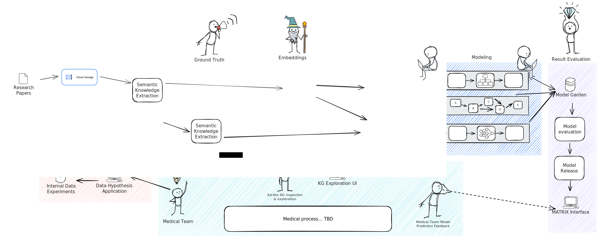

# MATRIX

The matrix pipeline is our main codebase in the Every Cure organization. Its goal is the generation of high accuracy predictions of drug-disease pairs in an "all vs all" approach. For this, we ingest and integrate a number of data sources, build models and make predictions on the ingested data. Of course there is a lot more to this but the below illustration aims to sketch the high level flow of the pipeline.

<!--  -->

