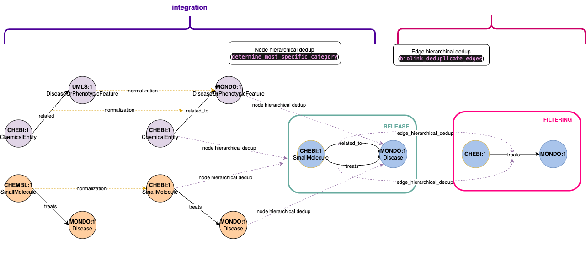

The filtering pipeline step enables selective processing of the knowledge graph by focusing on specific subsets of nodes and edges. Common use cases include:

- Focusing on specific node or edge types
- Including only data from particular sources
- Removing redundant or unwanted data

The filters are defined [here](https://github.com/everycure-org/matrix/blob/main/pipelines/matrix/src/matrix/pipelines/filtering/filters.py) and the parameters [here](https://github.com/everycure-org/matrix/blob/main/pipelines/matrix/conf/base/filtering/parameters.yml)

Every filter is a class that inherits from the abstract base class `Filter()`. Each filter must implement an `apply()` method that takes a PySpark DataFrame as input and returns a filtered DataFrame. Filters can accept any number of arguments in their constructor to configure their behavior.


To create a new filter, implement a new function and reference it in the parameters file. Here's an example:

```python
class MyCustomFilter(Filter):
    """Filter that implements custom filtering logic.
    
    This filter demonstrates how to create a new filter by inheriting from the base Filter class.
    """

    def __init__(self, column: str, threshold: float):
        """Initialize the filter with configuration parameters.
        
        Args:
            column: Name of the column to filter on
            threshold: Value to compare against
        """
        self.column = column
        self.threshold = threshold

    def apply(self, df: ps.DataFrame) -> ps.DataFrame:
        """Apply the custom filtering logic.
        
        Args:
            df: Input DataFrame to filter
            
        Returns:
            Filtered DataFrame
        """
        return df.filter(sf.col(self.column) > self.threshold)
```

To use this filter, you would add it to your parameters file:

```yaml
filtering:
  node_filters:
    my_custom_filter:
      _object: matrix.pipelines.filtering.filters.MyCustomFilter
      column: score
      threshold: 0.5
```


All filters defined under `node_filters` or `edge_filters` will be applied during processing.

#### Note - filters outside the pipeline

- Some filtering operations are performed outside the dedicated filtering pipeline, specifically during the integration phase before knowledge graph release. These filters represent core transformations that should be applied consistently across all graph releases.
- For instance, node deduplication is handled in the integration pipeline. When multiple nodes share the same identifier but have different types (e.g., a node appearing as both `ChemicalEntity` and `SmallMolecule`), we consolidate them into a single node.
- Edge deduplication, however, follows a different approach. We implement hierarchical deduplication where more specific relationships take precedence over general ones. For example, given two edges `A - related_to -> B` and `A - treats -> B`, we retain the more specific `treats` relationship. Since this is an opinionated design choice that may require experimentation, we've moved edge deduplication to the filtering pipeline, allowing for easier testing of alternative deduplication strategies post-release.




