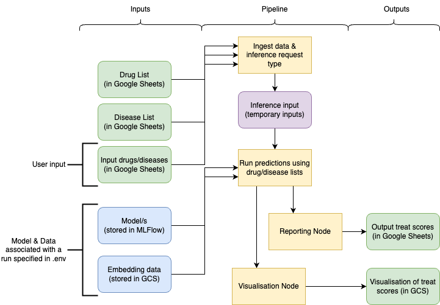

Our inference pipeline can be used for running ad-hoc on-demand predictions for specific drugs, diseases, or drug-disease pairs requested by the medical team or other stakeholders.  This uses versioned (in the .env file) drug and disease lists and relies on either single or several trained models stored as artifacts in MLFlow. This ensures consistency with the training data version for reliable and reproducible predictions. 

You can find the sheet [here](https://docs.google.com/spreadsheets/d/1CioSCCQxUdACn1NfWU9XRyC-9j_ERc2hmZzaDd8XgcQ/edit?gid=0#gid=0). At the moment we don't execute this as a part of the default pipeline. Also note that in order to use the trained models which are stored in the MLFlow (i.e. models trained using e2e pipeline) you will need to execute the inference pipeline from `cloud` environment.

### Release

Our release pipeline currently builds the final integrated Neo4J data product for consumption. We do not execute this as part of the default pipeline run but with a separate `-p data_release` execution as we do not want to release every pipeline data output.

!!! info
    If you wish to populate your local Neo4J instance with the output data for a release, populate the `RUN_NAME` in your `.env` file and run `kedro run -p data_release --from-env cloud -t neo4j`.

