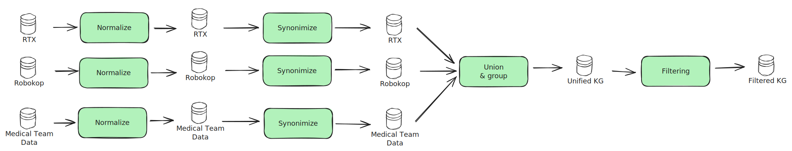

### Integration

The integration stage aims to produce our internal knowledge-graph, in [biolink](https://biolink.github.io/biolink-model/) format. As we ingest data from different sources, entity resolution becomes a prevalent topic. The integration step consolidates entities across sources to avoid data duplication in the knowledge graph.

There are 4 main steps in the integration pipeline:

1. **Normalize** the source data to a common format.
2. **Synonimize** the nodes, to ensure that nodes that describe the same concept have the same ID
3. **Union & Deduplicate**: Brings all KGs together and deduplicates nodes and edges
4. **Filtering**: Applies a series of filtering steps, for example, node deduplication. For any custom filtering of the graph, see the filtering pipeline.





#### Normalizing data from sources

Our pipeline aims to streamline the process of normalization and integration though a `transformer`. This is an interface that should be implemented for the source to be integrated succesfully. 

```pyton
class GraphTransformer(ABC):
    @abstractmethod
    def transform_nodes(self, nodes_df: DataFrame, **kwargs) -> DataFrame:
      """
      Function to transform nodes into the common format.

      Args:
        nodes_df: dataframe with nodes
      Returns:
        Nodes in standarized format
      """
      ...

    @abstractmethod
    def transform_edges(self, edges_df: DataFrame, **kwargs) -> DataFrame:
      """
      Function to transform edges into the common format.

      Args:
        edges_df: dataframe with edges
      Returns:
        Edges in standarized format
      """
      ...
```

Once implemented, register the transformer into the `parameters` of the integration pipeline.

```yaml
# Params 
integration:
  sources:
    <source>:
      transformer:
        object: matrix.pipelines.integration.<source>.<source>Transformer
```

Last but not least, finish up by registering the normalizer into `settings.py`. This last step ensures that our dynamic pipeline is updated to setup pipelining for your source.

```python
DYNAMIC_PIPELINES_MAPPING = {
    "integration": [
        {"name": "<souce>"},
        ...
    ]
}
```
