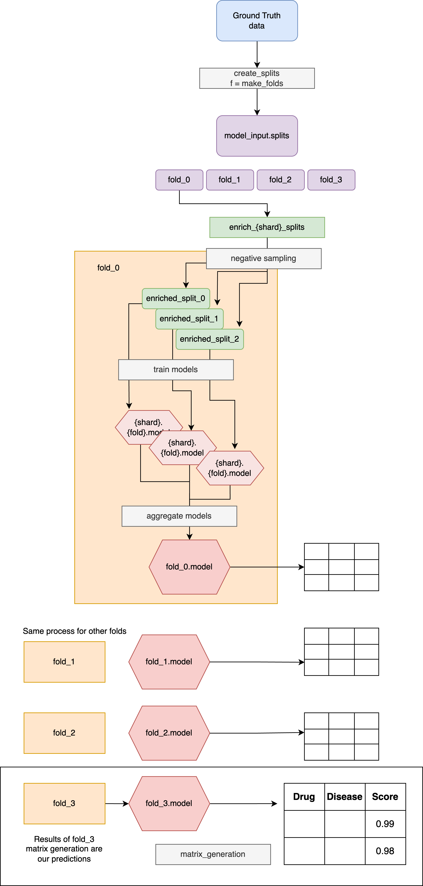

The modelling pipeline trains drug-disease treatment prediction models using indication/contraindication data and knowledge graph embeddings.

## Overview

The modelling pipeline implements a robust cross-validation strategy with ensemble learning to predict whether a drug treats a disease. The pipeline classifies three categories of drug-disease relationships:

- **Treat**: Positive relationships where a drug treats disease, represented by known indications. 
- **Not Treat**: Negative relationship, represented by known contraindications.
- **Unknown**: Negative relationship, represented by random drug-disease pairs where the drug is not related to the disease.

For every drug disease pair, we compute scores for all 3 classes. The scores add up to 1. 

$$\text{treat_score} + \text{not_treat_score} + \text{unknown_score} = 1$$

### Pipeline overview
The modelling pipeline follows a systematic approach to train robust prediction models. This is described as follows where we fix several concrete hyperparameters for simplicity.

1. **Cross-Validation Setup**:
    - Folds 0, 1, 2: Training folds with different test/train splits (90%/10%) for known positives and negatives
    - Fold 3: Full training data fold (no test split) for final model production

2. **Shard Generation**: For each fold, create 3 shards with different randomly sampled negative examples

3. **Model Training**: Train individual classifiers on each fold-shard combination using the transformed feature data

4. **Ensemble Creation**: Combine predictions from all shards within each fold using aggregation functions to produce one ensemble model per fold

5. **Production Model**: Use the Fold 3 ensemble model (trained on full dataset) for final matrix generation and inference

You can find further details for each step below.

## Pipeline steps

### 1. Cross-Validation Setup

The pipeline uses a cross-validation approach with multiple folds. We can adjust the number of folds in the [settings](https://github.com/everycure-org/matrix/blob/main/pipelines/matrix/src/matrix/settings.py#L46).

- **Folds 0 to n-1**: Training folds used for model evaluation 
    - Each fold contains different train/test splits from the ground truth data
    - Used to assess model performance and prevent overfitting
- **Fold n**: Full training data fold used for final model training
    - Contains all available training data (no test split)

!!! info
     Note that it is always the last fold that is trained on the full data, For example, in case of a 3-fold model, `fold_0`, `fold_1` and `fold_2` represent the 3 cross-validation training folds. `fold_3` is the model used to generate results that are shared with the Medical Team.
     If we used 5 cross-validation folds, `fold_5` would be the fold we use to generate the full results. 

#### Ground Truth Data

The pipeline pulls in ground truth data from the release containing known positive and negative examples. Please see the data documentation for more information.
<!-- Add link when it exists -->

#### Split Generation
The `make_folds` function creates cross-validation splits using a defined splitter (e.g. Disease split, [StratifiedShuffleSplit](https://scikit-learn.org/stable/modules/generated/sklearn.model_selection.StratifiedShuffleSplit.html)).

For example, for a 3 fold model using a 90/10 train/test split:

- Generates train/test splits for folds 0-2 using the specified splitter strategy
    - Train 90%
    - Test 10%
- Creates a full training dataset for fold 3 (no test split)
- Each split maintains the distribution of positive and negative examples

!!! note
    The train/test proportions (90%/10%) can be adjusted in the configuration [settings](https://github.com/everycure-org/matrix/blob/main/pipelines/matrix/conf/base/modelling/parameters/defaults.yml#L27).

#### Hyperparameter Optimization Process

For any fold, the pipeline follows this hyperparameter optimization strategy:

1. **Split Training Data**: Further split the training data into strict train and validation sets
2. **Hyperparameter Search**: Find optimal hyperparameters by training on strict train and evaluating on validation
3. **Final Training**: Train the model with optimal hyperparameters on the full training set

### 2. Shard Generation - Negative Sampling Implementation

The pipeline implements a negative sampling approach to create training data for the "unknown" class.

We create $n$ shards as defined in the [settings](https://github.com/everycure-org/matrix/blob/main/pipelines/matrix/src/matrix/settings.py#L63), each with a different randomly sampled set of negative examples. Multiple shards help reduce the impact of random sampling bias on model performance.

Negative sampling is implemented by:

1. Taking a known positive drug-disease pair
2. Extracting either the drug or disease node from the pair
3. Replacing it with a randomly sampled node from the respective drug or disease pool
4. The drug and disease pools are defined in the [configuration](https://github.com/everycure-org/matrix/blob/main/pipelines/matrix/conf/base/modelling/parameters/defaults.yml#L47)

This approach ensures that the negative samples maintain realistic drug and disease entities while creating pairs that are unlikely to have treatment relationships.

!!! note
    Negative samples serve as the sole source of data for the "unknown class". They are essential to ensure that the training dataset represents the vast majority of pairs, which are unrelated to each other. 
### 3. Model Training

For each shard in each fold, the pipeline trains a classifier on the transformed feature data. The pipeline supports any scikit-learn [BaseEstimator](https://scikit-learn.org/stable/modules/generated/sklearn.base.BaseEstimator.html) object including Random Forest, XGBoost, and Fully Connected Neural Networks (FCNN).

### 4. Ensemble Creation

After training individual shard models, the pipeline creates ensemble models:

- Combines predictions from all shards within each fold using the specified aggregation function
- Creates a single classifier object representing the ensemble for each fold
- Applies the ensemble model to generate predictions on the test data

