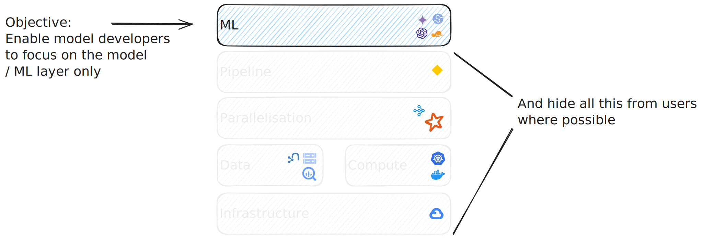

# New modelling workbenches for Matrix

!!! example "Proposal Document"
    This document is not yet describing completed work. Thus, it is meant as a proposal document and is open for discussion.

   
## Objective

We had the objective of creating a workbench, which makes it easier for people to
contribute to the MATRIX project without needing to fully understand the different
technology layers leveraged.



## Approach

We decided to decouple the baseline pipeline from the experimental model development. This way, people can experiment with new modelling approaches without needing to fully understand the baseline pipeline.

If we find a new model significantly outperforms the baseline, we will help integrate it into the baseline pipeline.


## Overview

This documentation is intended for data scientists and model developers who want to focus
on building models using Every Cure's data, without needing to dive into the core data
integration and modeling pipelines.

> If you prefer working with notebooks and specific datasets to build models, rather than
> contributing to the main pipeline development, this guide will help you get started.

---

## 🛠️ Resources We Provide

### 📊 Data Access

- **Knowledge Graph**: Access to our biomedical knowledge graph and associated datasets through:
    - BigQuery 
    - Direct file access via Google Cloud Storage
- **Data Pipeline**: 
    - Regular data updates and versioning
    - Comprehensive documentation on data schemas and available fields

### ☁️ Infrastructure

- **Development Environment**:
    - Dedicated Vertex AI workbench instances
    - Pre-configured development environments
- **Compute Resources**:
    - Ability to schedule notebooks on larger compute resources
    - GPU access for model training and evaluation
- **Storage & Validation**:
    - Cloud storage for model/data artifacts
    - Systematic validation pipeline for model predictions (manual process)

---

## 🎯 Prerequisites and Expectations

### 💻 Technical Skills Required
- **Core Competencies**:
    - Linux command line and basic system operations
    - Git version control
    - Python programming and data science libraries
- **Cloud Knowledge**:
    - Basic GCP familiarity or willingness to learn
    - Self-learning using available resources

### 📝 Best Practices
- **Documentation Requirements**:
    - Clear methodology descriptions
    - Experiment documentation (both successes and failures)
    - Regular progress updates
    - Comprehensive code comments

!!! note
    We are developing a more structured framework for experiment tracking, result reporting, and knowledge sharing. This will be implemented in future updates to streamline the experimentation process.

---

## 🚀 Getting Started

### Setting Up Your Workbench

1. Create a pull request to [this
   file](https://github.com/everycure-org/matrix/blob/infra/infra/deployments/wg2/workbenches.yaml),
   adding your name and email to the list of users for which we create a workbench. Please
   create the PR _to the infra branch_ and not main.
2. After the PR was merged, navigate to [this
   page](https://console.cloud.google.com/vertex-ai/workbench/instances?inv=1&invt=AboxFQ&project=mtrx-wg2-modeling-dev-9yj)
   which lists all workbenches we have provisioned for you and others.
3. Click "Open Jupyterlab" to open the workbench with your name on it. Note you may not
   be able to access others' workbenches as we will work towards restricting access to avoid
   any credentials being exposed.

> Your workbench comes pre-installed with the correct version of java, python, uv and all necessary dependencies.

---

## 📊 Accessing the Data 

### Option 1: BigQuery Integration

You can use the Google BigQuery integration in the workbench as [documented by Google here](https://cloud.google.com/vertex-ai/docs/workbench/instances/bigquery).

Example query:
```sql
%%bigquery nodes_upstream_sources_count
SELECT upstream_data_source, count(*) as count 
FROM `mtrx-hub-dev-3of.release_v0_3_0.nodes_unified` 
GROUP BY upstream_data_source
```

!!! warning
    Our data is very large and the BigQuery queries can take a while to run. Also pandas is not the greatest tool for the job when it comes to big data. See below for alternatives to get the full data.

!!! tip
    Feel free to change the release version to see the data for different releases.
    
    If you want to see the list of all releases easily, you can easily see them in [BigQuery](https://console.cloud.google.com/bigquery?inv=1&invt=Abo2vQ&project=mtrx-hub-dev-3of&ws=!1m0).
    


### Option 2: Matrix Repository

1. :white_check_mark: clone repo
2. :white_check_mark: cd to `matrix/pipelines/matrix` and follow the [installation instructions](../../getting_started/first_steps/local-setup.md)
3. Open the notebook `example_notebook.ipynb` and follow the instructions in the notebook.


## 🔌 SSHing into a Vertex AI workbench

This is how you to connect to a Vertex AI workbench from your VSCode or Cursor code editor.

1. Install the Remote - SSH extension. 
2. Open your SSH config file. An easy way to do this is:
    1. Press Cmd-Shift-p (on Mac) to open the command palette  
    2. Select "SSH-Remote: Open SSH Configuration File" command
    3. Select your SSH file, which should be listed. For instance, the directory of mine is "Users.alexei/.ssh/config"
3. Modify the config file as follows, making the appropriate changes to the config file:
    
    ```coffeescript
    Host alexei-dev-workbench
        # Paste Instance ID from VM instance details here
        HostName compute.XXXXXXXXXXXXX
        # paste username
        # Same username as if you connected via gcloud command directly, e.g.
        # $> gcloud compute ssh --zone "us-central1-a" "alexei-dev-workbench" --tunnel-through-iap --project "<project_id>"
        User alexei_everycure_org
        IdentityFile /Users/alexei/.ssh/google_compute_engine
        # change machine name, project ID & maybe zone
        ProxyCommand /opt/homebrew/opt/python@3.12/bin/python3.12 /opt/homebrew/Caskroom/google-cloud-sdk/520.0.0/google-cloud-sdk/lib/gcloud.py compute start-iap-tunnel 'alexei-dev-workbench' %p --listen-on-stdin --project <project_id> --zone us-central1-a
        CheckHostIP no
        HashKnownHosts no
        # same as above for Hostname
        HostKeyAlias compute.XXXXXXXXXXX
        IdentitiesOnly yes
        StrictHostKeyChecking no
    ```
    
    Note that this is specific to Mac, hence the homebrew directories for the packages for the ProxyCommand. For this to work, you need to check that the Python and google-cloud-sdk version you have installed matches up to those listed in the config. If you find that there is no directory `google-cloud-sdk` in `/opt/homebrew/Caskroom,` run the command `brew install google-cloud-sdk` . 
    
4. Run the command "Remote-SSH: connect to a Host" in the command palette. You should see the host specified in the config file in my case alexei-dev-workbench. Select it. 
5. Congratulations, you should be connected to your machine!
Couple notes:
    1. The `home`  directory contains two user directories `jupyter` and `<your User name>`. You will not have rights make modifications in the `jupyter`  directory so work in the other one. 
    2. To work with Jupyter notebooks, you have to find the Jupyter extension in the Marketplace and "Install in SSH:  <your host name>".
<!-- 
FUTURE: May build this out better in the future. Then we can document how we built this, potentially in a separate page.
---

## 🔧 Technical Infrastructure

### Core Components

1. **Vertex AI Workbenches**: 
    - Individual workbenches per data scientist (Terraform managed)
    - Dedicated service accounts
    - VPC network connectivity
    - Post-startup configuration script

2. **Resource Management System**:
    - PubSub topic: `ds-workbench-machine-state-events`
    - CPU utilization monitoring:
        - Threshold: 10% for 3 hours
        - Automated notifications
    - Cloud Function for alert processing
### Alert System Flow

1. Continuous CPU utilization monitoring
2. Alert triggering based on thresholds
3. PubSub notification delivery
4. Cloud Function processing and logging

### Infrastructure as Code

- **Components**:
    - Reusable workbench modules
    - Declarative monitoring policies
    - Cloud Pub/Sub notification system
    - Python-based alert processing

- **Benefits**:
    - Resource usage optimization
    - Consistent configurations
    - Scalable infrastructure
    - Version-controlled changes

 -->