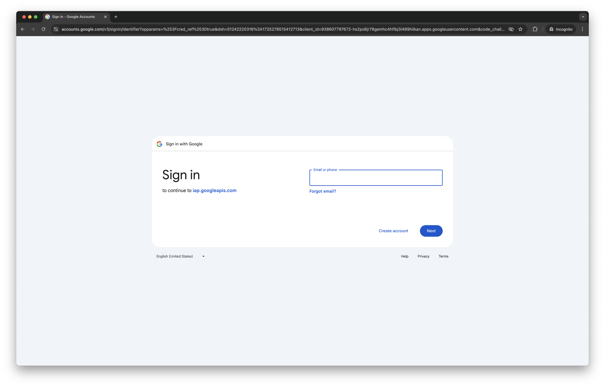
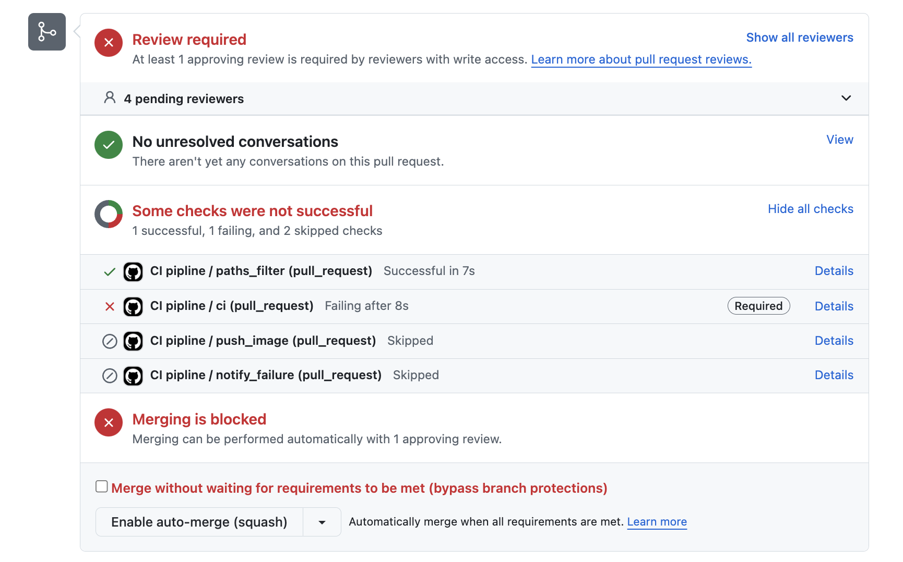

# `v0.2`: Parallel pipeline execution leading to first results for Long Covid research

In this release, we've made significant strides in developing our drug repurposing
pipeline, enhancing its functionality, scalability, and accessibility. For a detailed list of contributions broken down by contributor check our [GitHub Release Page](https://github.com/everycure-org/matrix/releases/tag/v0.2)

<!-- more -->

## Key Achievements

### 1. Long COVID e2e run

We've completed an end-to-end run focused on Long COVID, generating top-performing drug predictions for 9 distinct LC subtypes. This marks a significant milestone in our ability to produce actionable insights for specific disease areas. This involved:

- Designing a flow to incorporate non-KG custom data sources (e.g., input from our Medical team)
- Ingesting data from out medical team into the pipeline
- Integrating the Medical team data into our Knowledge Graph

### 2. Knowledge Graph Enhancements

We've released the first versions of our curated [disease list](https://github.com/everycure-org/matrix-disease-list/releases/tag/2024-07-25) and [drug list](https://github.com/everycure-org/matrix-drug-list/releases/tag/v1.0.3), which will become the axes of our all drug vs all disease predictive matrix.

### 3. Access to cluster services

We've enabled public access to the services running on our cluster, protected by SSO and fine grained access policies.

### 3. Infrastructure and Performance Improvements

Neo4J proved to be a bottleneck in our ability to scale pipeline runs. Executing multiple runs of our pipeline concurrently was not feasible, due to a single run of the pipeline using most of the memory. To overcome this, we've implemented the following changes:

- We've turned Neo4J into an ephemeral compute unit scoped to the lifecycle of our pipeline
- We've implemented a node fusing algorithm that fuses together multiple Kedro nodes into a single Argo Workflows step on execution on the cluster. This allows multiple kedro nodes to be executed on the same Argo Workflow node

The screenshots below illustrate this behavior, where multiple steps in the pipeline are grouped together, allowing then to use the same instance of the ephemeral Neo4J instance.

The view below shows our Kedro viz graph, each step of the topological embedding computation stage is represented as a distinct Kedro node, the highlighted selection shows fusing intent.

The view below shows the fusing result, there is a single step in the Workflow for topological embeddings. This step executes multiple Kedro nodes on a Neo4J enabled machine.

### 4. Collaboration and Data Integration

To avoid constant circulation of Excel files across machines, we've introduced a `GoogleSheetsDataset` dataset. The dataset allows for reading and writing to a live google sheet, facilitating seamless collaboration between our medical and technical teams.

Using this sheet, we've developed a preprocessing pipeline to ingest experimental nodes and edges proposed by our Medical team, enabling rapid hypothesis testing.

### 5. Model and Embedding Enhancements

Embeddings are critical to the accuracy of our results, and we've performed several experiments to improve our modelling:

 - Conducted several experiments to optimize parameters for our GraphSage model, including updates to learning rates and iteration counts.
- Implemented and tested various Actor-Critic networks for MOA prediction and shortest path finding in our Knowledge Graph.
- Initiated benchmarking of LLM embeddings for potential integration into our pipeline.

### 6. Documentation and Onboarding

We've continued working on our documentation to streamline the onboarding of future team members.

- Added a comprehensive introduction to our technology stack in the [Infrastructure section](../../../infrastructure/index.md) of our documentation.
- Streamlined the onboarding process with improved guides and issue templates as well as video tutorials.

### 7.  Technical Enhancements

We've improved our CI/CD pipeline with enforced integration tests on every PR. Pull requests can now only be merged when all tests have run successfully.

We've implemented BigQuery table tagging with Git SHA for improved data lineage.

This release represents a significant step forward in our ability to process, analyze,
and derive insights from complex medical data at scale. We're now better positioned to
tackle challenging repurposing scenarios and collaborate effectively across teams.

