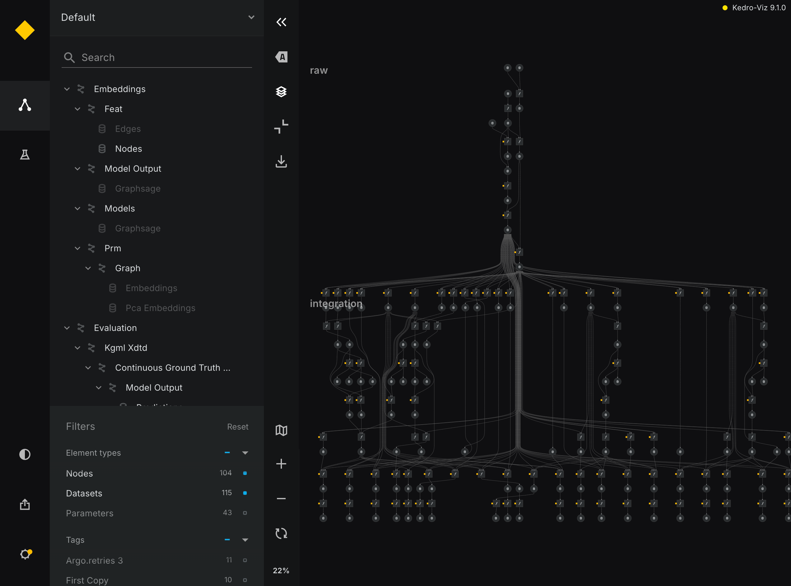
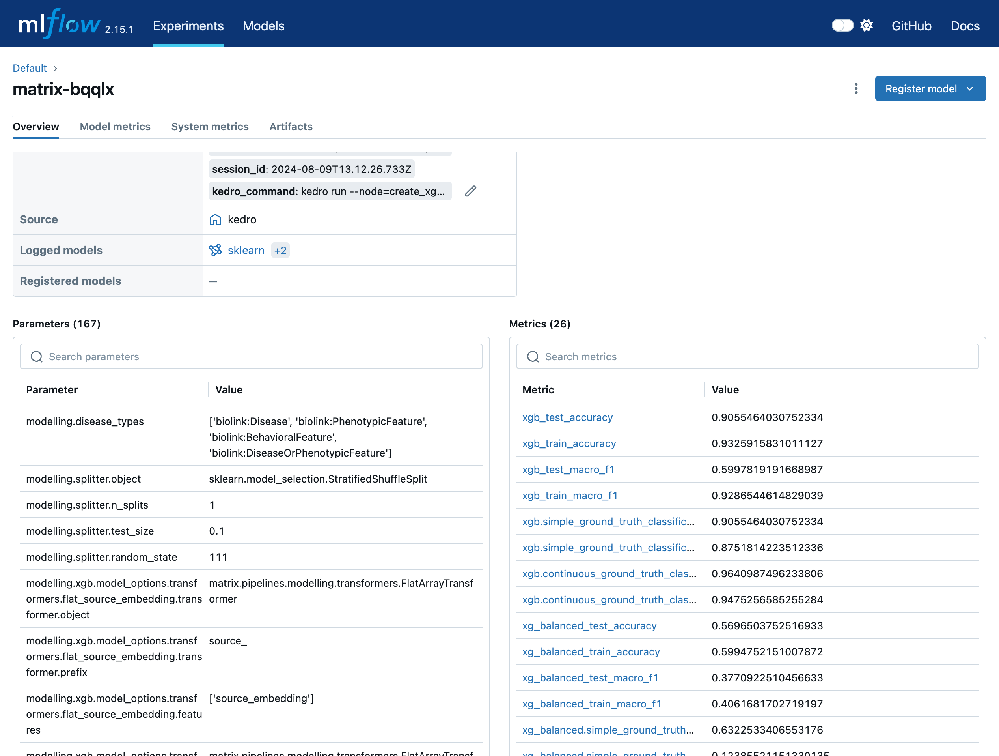
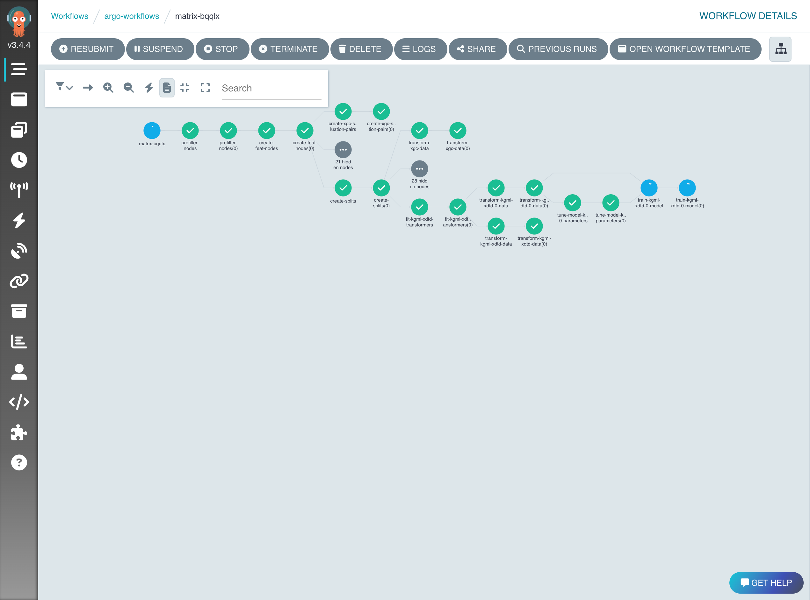
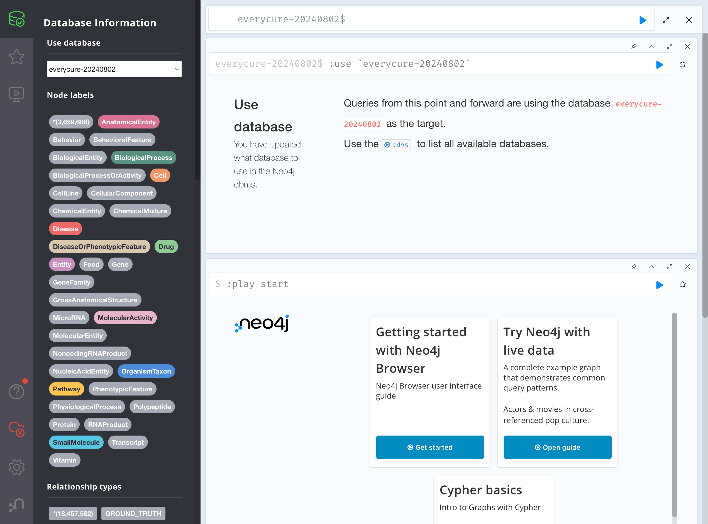
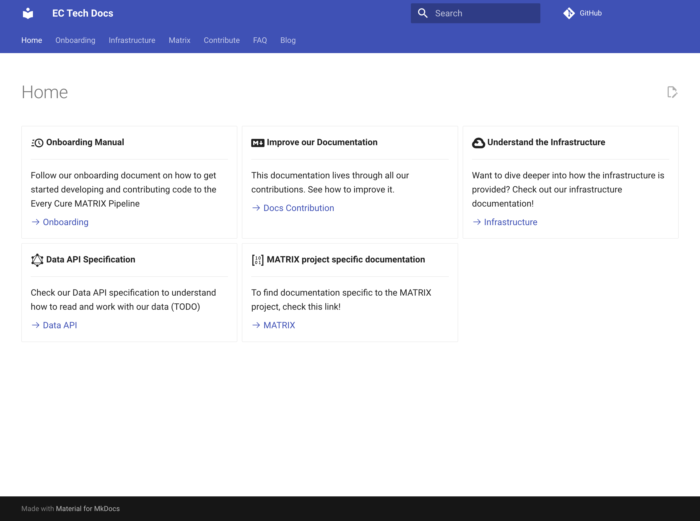

# `v0.1` Release: Functional End to End Pipeline running on GCP

We are excited to announce the release of our first functional end-to-end pipeline, built on Google Cloud Platform (GCP) using Kedro. Going forward, we aim for a monthly release cadence.

<!-- more -->

For a complete summary of our progress, please check out the [release on GitHub](https://github.com/everycure-org/matrix/releases/tag/v0.1)

!!! note "First Release"
    This is our first mini release, preparing for a monthly release cadence. Below is a summary of our achievements to date.

### Key Achievements

### 1. Pipeline Development

We have established a modular pipeline using Kedro, enabling multi-model execution in a single run. This includes:

- An ingestion pipeline for data sources like RTX-KG2
- An integration pipeline for creating our internal knowledge graph. (_Note this currently does very little, as we have not yet added any additional KGs which require integration._)
- An embeddings pipeline for node and topological embeddings using OpenAI and GraphSAGE
- A modeling pipeline with hyperparameter tuning and ensemble capabilities
- Setup of three execution modes: cluster, local, and test data-based
- An evaluation pipeline to assess model performance

### 2. Infrastructure

Our infrastructure is built on Google Cloud Platform (GCP) and Kubernetes, providing a scalable and flexible environment for our computations. Key components include:

- Deployment of a Neo4J database for graph storage and querying
- Integration of MLflow for experiment tracking and model versioning
- Implementation of Argo Workflows for orchestrating complex pipeline runs
- A Kubernetes based infrastructure foundation to host all of the above codified in code to make it fully reproducible

### 3. Data Management

We've implemented versioning for all datasets in our pipeline, including Neo4J, ensuring reproducibility and traceability of our experiments.

### 4. Documentation and Onboarding

To facilitate collaboration and knowledge sharing, we have:

- Created documentation pages with technical onboarding guides
- Developed status diagrams to visualize pipeline components
- Established conventions for code organization and naming

### 5. Collaboration tooling 

We have an active Slack channel and a GitHub repository with over 10 PRs open and 78 merged and over 60 work items tracked on GitHub issues. This will become more relevant as we prepare
for our Open Source which is planned for later this year.

## Technical Deep Dive

For developers and data scientists joining the project, here are some key technical aspects to be aware of:

1. Kedro Framework: We use Kedro for building modular, maintainable, and reproducible data science code. Our pipeline is structured into various stages (ingestion, integration, embeddings, modeling, evaluation) as seen in `src/matrix/pipeline_registry.py`.
2. Data Catalog: Our data inputs and outputs are managed through Kedro's data catalog, defined in YAML files under the `conf/base` directory. This provides a centralized way to manage dataset configurations.
3. Embeddings: We use a combination of OpenAI's API for initial embeddings and GraphSAGE for topological embeddings. The implementation can be found in `src/matrix/pipelines/embeddings/nodes.py`.
4. Modeling: Our modeling pipeline supports multiple model types and hyperparameter tuning. The core logic is in `src/matrix/pipelines/modelling/nodes.py`.
5. Evaluation: We've implemented various evaluation metrics for assessing model performance, found in `src/matrix/pipelines/evaluation/evaluation.py`.
6. Infrastructure as Code: Our GCP and Kubernetes infrastructure is managed using Terraform and Terragrunt, with configurations in the `infra` directory.

## Next Steps

As we move forward, we plan to:

1. Initiate monthly releases to track our progress more systematically, in sync with our sprint cadence
2. Continue refining our pipeline components and infrastructure, with a focus on getting a set of baseline models up and running
3. Make various services running in our cluster accessible via a web interface (e.g. Neo4J, Argo Workflows, MLflow)
3. Integrate our prioritized KGs to enable experimentation on the impact of different KGs on model performance
4. Expand our documentation to facilitate easier onboarding and collaboration
5. Prepare for open-sourcing our repository in the coming months
